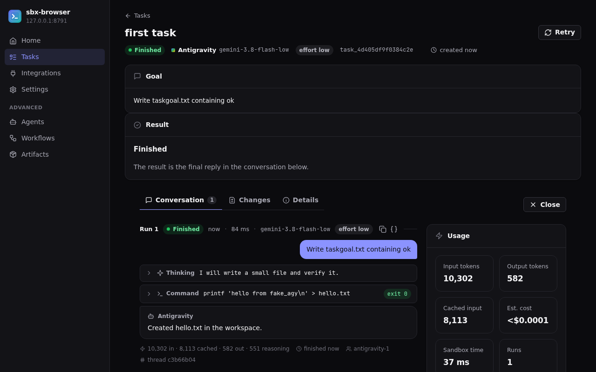

# sbx-browser

**Describe a task; an official coding-agent CLI does it in an isolated
[Modal](https://modal.com) Sandbox — on your own workspace.**

One `POST /v1/tasks` call resolves your repository, picks a provider account
with a free slot, and starts a run you can watch live, follow up on, and
deliver as a branch or pull request with a review-gated merge. Codex, Devin,
Antigravity, Grok and OpenCode are supported — each task runs the provider's
own CLI under your subscription.

> **Status: `v0.1.1`, public alpha.** Self-hosted, bring-your-own-everything.
> The `/v1` API may still change before 1.0.



**What it is not:** a hosted service or a model API. Everything runs in
*your* Modal workspace under *your* provider accounts; sbx-browser never
resells or proxies subscription quota.

## Quick start

You need Python ≥ 3.12, [uv](https://docs.astral.sh/uv/), git, a Modal
account, and one provider CLI logged in locally.

```bash
git clone https://github.com/soren-labs/sbx-browser.git && cd sbx-browser
uv sync
uv run modal token new                   # authenticate your Modal workspace
uv run sbx init --providers codex        # check toolchain, write config
uv run sbx auth login --provider codex   # capture the provider login
uv run sbx deploy                        # secrets → dicts → images → app → /v1 probe
uv run sbx doctor                        # verify the deployment end to end
uv run sbx open                          # open the web console, already signed in
```

`sbx deploy` prints your control-plane URL and writes an admin API key to
`~/.local/state/sbx/bootstrap.key` (mode 0600). Then:

```bash
export SBX_BASE_URL=<printed by sbx deploy>
export SBX_API_KEY=$(cat "${XDG_STATE_HOME:-$HOME/.local/state}/sbx/bootstrap.key")
```

```python
from sbx.sdk import SbxClient

client = SbxClient()  # reads SBX_BASE_URL + SBX_API_KEY
created = client.tasks.create(
    "Add a /health endpoint with a test",
    source={"repo": "https://github.com/owner/repo"},
    delivery={"pull_request": {}},
)
task = client.tasks.wait(created.task.id)  # finished / error / …
client.tasks.deliver(created.task.id)  # push the branch, open the PR
```

To try everything locally with no cloud account at all:

```bash
make console-dev   # real local control plane + fake provider CLIs + console
```

## Documentation

The documentation website lives in [`docs-site/`](docs-site/) (Astro
Starlight; the REST reference is generated from the runtime OpenAPI spec).
Build with `make docs-build`, check with `make docs-check`, preview with
`make docs-dev`.

- **Quick start** — [getting-started/](docs-site/src/content/docs/getting-started/)
- **Guides** — tasks, repositories & delivery, console, accounts, streaming,
  workflows — [guides/](docs-site/src/content/docs/guides/)
- **Concepts** — task, run, revision, provider, account —
  [concepts/](docs-site/src/content/docs/concepts/)
- **API & SDK reference** — [reference/](docs-site/src/content/docs/reference/)
- **Integrations** — provider matrix, GitHub access —
  [integrations/](docs-site/src/content/docs/integrations/)
- **Self-hosting** — deploy, configuration, edge, security —
  [self-hosting/](docs-site/src/content/docs/self-hosting/)
- **Troubleshooting** — [troubleshooting/](docs-site/src/content/docs/troubleshooting/)
- **For agents** — `llms.txt` and `openapi.json` —
  [agents/](docs-site/src/content/docs/agents/)

The error-code table in `reference/errors.md` is generated from
`control/api_v1/error_catalog.py`; refresh it with `make docs-sync-errors`
(CI fails if it drifts).

## Development

```bash
make lint          # ruff check + format check
make test          # unit + integration — no cloud credentials needed
make test-e2e      # Playwright: console vs a real local control plane
make docs-dev      # documentation site with hot reload
```

See [CONTRIBUTING.md](CONTRIBUTING.md) for the dev loop and test rules.
Interface contracts (filesystem, events, runner CLI, `/v1` OpenAPI) are frozen
per release in [`docs/contracts/`](docs/contracts/README.md).

## License & security

License selection is **pending owner decision** — see [LICENSE](LICENSE) (a
placeholder, not a grant). Report vulnerabilities privately per
[SECURITY.md](SECURITY.md); never post credentials, tokens or credential
blobs in issues or pull requests.
