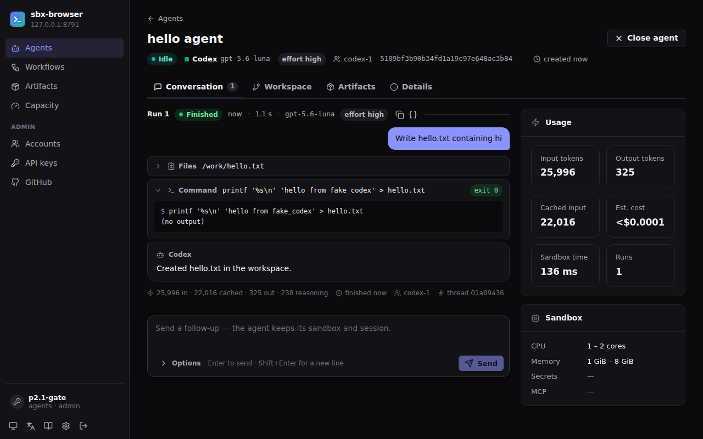

# sbx-browser

**Run official coding-agent CLIs as an API — on your own Modal workspace.**

One `POST /v1/agents` call starts an isolated [Modal](https://modal.com)
Sandbox running the provider CLI you already pay for — Codex, Devin,
Antigravity, Grok or OpenCode — and gives you multi-turn runs, live event
streams, durable results, git/PR workflows and a web console to drive it all.

> **Status: `v0.1.1`, public alpha.** Self-hosted, bring-your-own-everything.
> The `/v1` API may still change before 1.0.



## What you get

- **One API for many agent CLIs.** Agents are long-lived sandboxes; each
  follow-up run resumes the provider's native session.
- **Live and durable.** Canonical events stream over SSE (resumable with
  `Last-Event-ID`); run outcomes, structured errors and usage persist after
  the sandbox is gone.
- **Repository workflows.** Pin an exact base commit, publish a work branch,
  open a PR, pin a review to an exact sha, merge only after that review.
- **Handoffs and artifacts.** Snapshot a workspace into a checksum-verified
  package and hand it to another agent — no shared remote needed.
- **Account pools.** Several subscriptions per provider, slot limits, LRU
  scheduling, cooldown and failover.
- **Workflows.** Tag agents with a `workflow_id`; any client with the same
  key can recover or clean up the whole group.
- **A real console.** Create agents, watch runs, review and publish changes,
  manage accounts, keys and GitHub access — in English or Chinese.

**What it is not:** a hosted service or a model API. Everything runs in
*your* Modal workspace under *your* provider accounts; sbx-browser never
resells or proxies subscription quota — tasks run inside each provider's own
CLI, under that provider's terms.

## Documentation

The documentation website lives in [`docs-site/`](docs-site/) (Astro
Starlight, with the REST reference generated from the frozen OpenAPI
contract). Build it with `make docs-build`, or preview it with
`make docs-dev`. Good entry points:

- **Start here** — introduction, quick start, core concepts
  ([`getting-started/`](docs-site/src/content/docs/getting-started/))
- **Guides** — web console, agents & runs, streaming, repositories & git,
  handoffs & artifacts, workflows, structured output, accounts, GitHub
  ([`guides/`](docs-site/src/content/docs/guides/))
- **Operate** — deploy, configuration, upgrade, edge, security,
  troubleshooting ([`operations/`](docs-site/src/content/docs/operations/))
- **Reference** — errors, events, Python client, CLI, limits, and the REST
  API from [`docs/contracts/api-v1.yaml`](docs/contracts/api-v1.yaml)
  ([`reference/`](docs-site/src/content/docs/reference/))

## Quick start

You need Python ≥ 3.12, [uv](https://docs.astral.sh/uv/), git, a Modal
account, and at least one provider CLI logged in on your machine.

```bash
git clone https://github.com/soren-labs/sbx-browser.git && cd sbx-browser
uv sync
uv run modal token new                   # authenticate your Modal workspace
uv run sbx init --providers codex        # check toolchain, write ~/.config/sbx/config.toml
uv run sbx credentials --verify          # find local provider logins, run their auth checks
modal secret create sbx-codex-auth CODEX_AUTH_JSON="$(cat ~/.codex/auth.json)"
uv run sbx deploy                        # secrets → dicts → images → app → /v1 probe
uv run sbx doctor                        # verify the deployment end to end
uv run sbx smoke --provider codex        # one real agent run, then cleanup
```

Other providers import their login as an account instead of the shared codex
Secret — the quick start in the docs has the exact commands. `sbx deploy`
prints your control-plane URL and writes an admin API key to
`~/.local/state/sbx/bootstrap.key` (mode 0600; the control plane stores only
its sha256).

```bash
export SBX_BASE_URL=<printed by sbx deploy>
export SBX_API_KEY=$(cat "${XDG_STATE_HOME:-$HOME/.local/state}/sbx/bootstrap.key")

curl -X POST "$SBX_BASE_URL/v1/agents" \
  -H "Authorization: Bearer $SBX_API_KEY" -H "Content-Type: application/json" \
  -d '{"prompt": {"text": "Add a /health endpoint with a test"}, "agent": {"provider": "codex"}}'
```

Or with the dependency-free Python client in [`examples/`](examples/):

```python
from examples.sbx_client import SbxClient

client = SbxClient()  # reads SBX_BASE_URL + SBX_API_KEY
created = client.create("Add a /health endpoint with a test", provider="codex")
agent, run = created["agent"], created["run"]
for event in client.watch(agent["id"], run["id"]):  # SSE, resumes on drop
    print(event.type)
final = client.wait(agent["id"], run["id"])  # durable terminal status
client.followup(agent["id"], "Now run the tests")
client.close_agent(agent["id"])
```

## The web console

[`web/`](web/) is a build-less console for the `/v1` API. Serve it on the same
origin as `/v1` — the optional Cloudflare Worker in
[`deploy/sbx-edge`](deploy/sbx-edge/) does exactly that — then connect with an
`sbx_` key. To try it locally with no cloud account at all:

```bash
make console-dev   # real control plane (local backend) + fake provider CLIs
```

## Providers

| Provider | Status | Multi-turn via |
| --- | --- | --- |
| codex | **Stable** | `codex exec resume` |
| devin | Experimental | ACP session |
| antigravity | Experimental | `--conversation` |
| grok | Experimental | `--resume` |
| opencode | Experimental | `--session` |

*Stable* means a passing real-account end-to-end run on the release tag;
*Experimental* providers are fully wired with partial real-account evidence.
Claude is not supported. CLI versions, credential files and evidence are in
the providers section of the docs.

## Development

```bash
make lint          # ruff check + format check
make test          # unit + integration — no cloud credentials needed
make test-e2e      # Playwright: console vs a real local control plane
make docs-dev      # documentation site with hot reload
```

See [CONTRIBUTING.md](CONTRIBUTING.md) for the dev loop and test rules.
Interface contracts (filesystem, events, runner CLI, `/v1` OpenAPI) are frozen
per release in [`docs/contracts/`](docs/contracts/README.md).

## License & security

License selection is **pending owner decision** — see [LICENSE](LICENSE) (a
placeholder, not a grant). Report vulnerabilities privately per
[SECURITY.md](SECURITY.md); never post credentials, tokens or credential
blobs in issues or pull requests.
