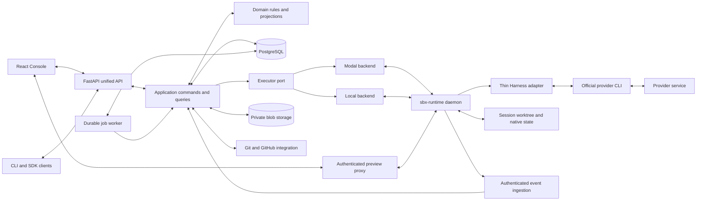

# Amp-inspired unified SBX architecture

**Status: proposal for discussion; intentionally not ready to merge.** Research date: 2026-10-05. SBX baseline: [`83317cd8b90b487a01a534ac7c440154efac2d03`](https://github.com/soren-labs/sbx-browser/commit/83317cd8b90b487a01a534ac7c440154efac2d03). This directory contains research and architectural decisions only. It does not amend the frozen contracts or implement a new product.

## Recommendation

Rebuild SBX around **Projects and durable Sessions**, with a modular monolith control plane, PostgreSQL business state, and one supervised runtime per active session filesystem. Separate three concepts throughout the product and implementation:

1. **Session**: the durable unit of conversation, work, results, and context.
2. **Executor**: the place that hosts its runtime and filesystem. Modal remains the production executor; a local backend exercises the same boundary without cloud credentials.
3. **Harness**: the official provider CLI that performs agent reasoning and tool use. SBX prepares, invokes, observes, and stops it. SBX does not implement an agent reasoning loop.

A Session survives the death or replacement of an Executor. A Session selects a Harness independently of compute. Native CLI conversation identity is an internal binding, not SBX identity. A Project defines reusable repository and environment settings, not a running machine or a conversation.

This is a clean-slate target. Task, Agent, Run, V1State, and the `/v1`–`/v2` facade layering disappear after cutover. Existing code informs requirements, failure scenarios, and reusable infrastructure; it does not constrain the new domain model. Old API compatibility is not a goal.

## Why Amp is the reference

Amp's public [Threads](https://ampcode.com/docs/threads) and [Projects](https://ampcode.com/docs/projects) docs support a product centered on ongoing work and reusable codebase settings. [Orbs](https://ampcode.com/docs/orbs) provide a separate execution environment with changes, files, and a terminal. These are useful product abstractions for SBX. The claim that the products address nearly the same problem is a working product hypothesis, not evidence that their internals match.

Public [Agent-to-Agent docs](https://ampcode.com/docs/orbs/agent-to-agent) describe separate conversations and working copies with explicit communication and file transfer. [Puck docs](https://ampcode.com/docs/puck) describe starting and steering other agents. SBX should borrow these product boundaries through generic delegation, while using official CLIs to perform both coding and coordination.

The public repos expose selected infrastructure, extensions, and applications. They do **not** establish Amp's complete core implementation, production database schema, event ingestion design, or Orb infrastructure. The relational model, event authority, runtime protocol, job leases, and package boundaries below are **SBX design decisions**. [Research inventory](research.md) distinguishes code evidence, docs evidence, and inference, including licenses and immutable source references.

## Target system

Arrows express proposed dependencies and data paths, not current implementation facts. Console mutations go through the control plane. Durable events are served by the API; terminal and preview traffic use narrow short-lived grants through a proxy. CLI processes never receive Modal administration credentials or the control-plane database/encryption keys.

Deployment stays small: an API process and a job worker from the same Python application, one PostgreSQL database, private blob storage, and Modal sandboxes. Initially these can run on the existing hosted server, with the same-origin edge proxy. No message broker, Kubernetes cluster, separate workflow service, or model gateway is required.

## What changes for users

Create a Project once with a repository, setup/resume hooks, services, execution defaults, and Ship policy. Start a Session there, or start a projectless research Session. Choose an executor class and an available official CLI/model. Send follow-ups to the same Session regardless of whether its sandbox is awake. The UI separately shows conversation activity, compute availability, saved changes, and shipping progress.

Review a **specific ChangeSet**, using a child Session with an isolated working copy and a validated result. Ship that immutable ChangeSet by pushing a branch or opening/updating a PR. A failed push does not mark a successful turn failed. A missing checkpoint does not erase conversation history. A cancelled turn cannot trigger automatic shipping.

Minimal onboarding remains email/password plus manual Modal token, GitHub token, and OpenCode Zen key. Codex/ChatGPT is optional. OAuth can later become another connector credential acquisition method. The proposal uses [PR #164](https://github.com/soren-labs/sbx-browser/pull/164) only as separate directional evidence, not a dependency or an implemented baseline capability.

## Decisions to review

| Decision | Consequence |
| --- | --- |
| Session is the only durable work identity | Delete Task-to-Agent bindings and facade status aggregation. |
| Project settings are versioned inputs | New Sessions pin resolved settings; editing a Project does not silently mutate active work. |
| One supervised `sbx-runtime` protocol | Move filesystem/process supervision into the sandbox, away from control-plane shell snippets. |
| Official CLI Harness remains authoritative for agent behavior | No model API loop, proprietary Amp mode implementation, or synthetic provider context restoration. |
| Append-only session events plus transactionally updated typed projections | One durable replay cursor; reads never dispatch, settle, or create reviews. |
| Separate Turn, Execution attempt, and Executor lease | Business outcome, process attempt, and machine lifetime no longer share a state machine. |
| Immutable ChangeSet plus independent Delivery | Preserve exact review pins and restart-safe shipping; remove Workspace/Revision delivery mirrors. |
| Delegation is a relationship between ordinary Sessions | Coding, review, testing, and coordination use the same spawn/message/wait/result/cancel primitives. |
| One durable job/lease mechanism | Startup, reconcile, snapshot, delivery, validation, and cleanup use the same retry and ownership rules. |
| PostgreSQL typed entities with bounded extension JSON | Replace namespace blobs and hand-built indexes without inventing a distributed event platform. |

## Reading order

| Document | Purpose |
| --- | --- |
| [research.md](research.md) | Sources, exact Amp SHAs, licenses, claim ledger, and evidence limits. |
| [comparison.md](comparison.md) | Current SBX findings, abstraction mapping, and complexity that disappears. |
| [domain-and-components.md](domain-and-components.md) | Entity definitions, runtime and Harness protocols, Projects, changes, delegation, and services. |
| [state-and-persistence.md](state-and-persistence.md) | Event authority, state transitions, concurrency, jobs, recovery, connections, and relational model. |
| [api-and-console.md](api-and-console.md) | Unified resource hierarchy, product surfaces, and browser state ownership. |
| [repository.md](repository.md) | Full proposed source tree, dependency boundaries, and current module disposition. |
| [migration.md](migration.md) | Architectural seams, bounded cutover, rollback, and deletion gates. |
| [decisions.md](decisions.md) | Decision log, rejected alternatives, risks, and required feasibility evidence. |
| [validation.md](validation.md) | Docs-only checks, source/link provenance, diagram syntax and isolated baseline test results. |

## Scope and success criteria

The proposal covers the target architecture, not implementation tickets, endpoint code, SQL, final UI visuals, provider credential experiments, or changes to #164. It does not promise that every CLI supports every feature or that Modal restores memory/process state. Filesystem/native-state checkpointing and restarted declared services are the conservative baseline.

The design succeeds when one Session ID and one durable event stream explain accepted messages, CLI attempts, restored filesystems, child work, captured changes, and delivery outcomes after a restart. There must be one mutation authority per resource, one credential ownership path, and one background work mechanism. Every legacy architecture retained during migration needs an explicit retirement gate.
