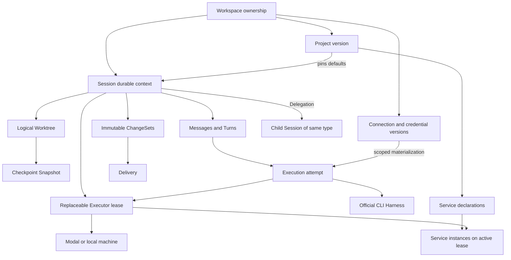
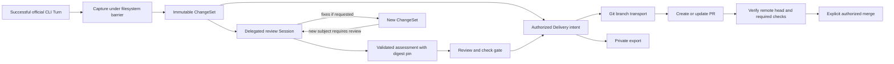
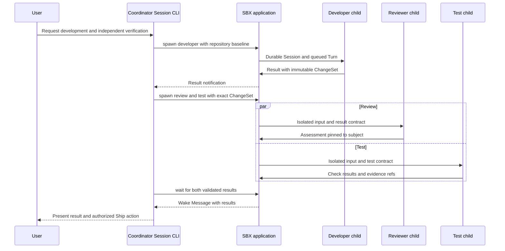

# Target domain and component architecture

All definitions in this document are proposed SBX architecture (**I** in the [evidence scheme](research.md)). Amp concepts inform the boundaries; they do not prove these implementation choices. State authority and tables are specified in [state-and-persistence.md](state-and-persistence.md).

## 1. Minimum domain vocabulary

Use **Workspace** only for the ownership scope and **Worktree** for the session filesystem. This removes the current ambiguity between a team, repository declaration, sandbox root, checkout, and environment cache.

| Entity / value | Definition and reason for independent identity | Boundary and cardinality |
| --- | --- | --- |
| User | Product principal with verified email/password and login sessions. Needed independently of third-party accounts. | Membership grants access to Workspaces; password and product API key records belong to identity. |
| Workspace | Ownership and authorization scope. Initially each user gets a personal Workspace. | Projects, Sessions, Connections, and blobs have exactly one Workspace; team membership is deferred, not an implicit share of personal credentials. |
| Project | Versioned reusable codebase/environment/defaults definition. | Zero or one Project per Session. Primary repository, base ref, setup/resume policy, service declarations, and Ship policy are Project values. |
| Connection | Named external authority, such as a user's Modal account, GitHub token, Zen inference account, or Codex login. | Workspace-scoped plus creator/allowed-principal binding. Multiple connections of the same kind are allowed. Capability and health observations belong here. |
| Credential version | Encrypted material with a replace/revoke/refresh lifecycle separate from public Connection metadata. | Private child of Connection; never a public resource returning plaintext. Explicit project environment secrets use the same vault mechanics in secret bindings. |
| Session | Durable conversation and work identity with pinned creation inputs. | Owns Messages, Turns, Events, Worktree, ChangeSets; has at most one active Executor lease. Same type for coding, review, research, testing, and coordinator sessions. |
| Message | Durable authored communication with role, author, attachments, and routing semantics. | Within a Session. User/coordinator messages may request a Turn; notifications and tool results need not. Agent output is assembled from event-backed message parts. |
| Turn | Accepted request to perform one unit of agent work and its validated result. | Ordered within a Session, at most one active. References triggering Message, selected Harness/model, output contract, and optional retry-of Turn. |
| Execution | One attempt to perform a Turn through a specific runtime and Harness. | A Turn can have several preparation attempts, but no concurrent CLI attempts. Records runtime/image/CLI versions and evidence, separate from logical Turn state. |
| Executor lease | Allocation of a machine/runtime to a Session with a fencing epoch and expiry. | A Session has many historical leases, one active maximum. Can serve multiple successive Turns, terminal sessions, and previews. |
| Worktree | Logical session filesystem identity, generation, repository baseline, and latest durable checkpoint. | One per Session, including projectless directories. Live paths and process state are executor-local observations. |
| Snapshot | Immutable storage manifest for a Project environment cache or Session checkpoint. | Kind, owner, source/config digests, native-state manifest, image/runtime compatibility, and blob/backend references. No portable assumption about Modal snapshot refs. |
| ChangeSet | Immutable captured work product, separately readable after compute teardown. | References Session, source Turn if any, base/head/content digest, files, and patch/bundle blob. Can exist without Git. |
| Delivery | Durable intent and outcome to export/ship one fixed ChangeSet to a chosen target. | Many per ChangeSet; explicit policy revision, authorization, branch/PR refs, retry state, and remote head evidence. |
| Delegation | Relationship and assignment between a parent and child Session, with pinned inputs and result contract. | One spawning parent per child; cross-session communication is explicit. Review is a role/policy over this entity, not another execution subsystem. |
| Service instance | Observed realization of a service declaration on a Worktree/Executor lease. | Durable intent/status projection; process handle, port mapping, health, and bounded logs are executor-local. Preview link is a projection, not another work identity. |
| Job | Durable internal command continuation, reconciliation, or scheduled work. | Private operations entity with dedupe, claim, retry, and fence. Never a second Session/Turn or user-visible workflow task. |

**Event** is an immutable journal record with identity and sequence, not an independently mutable aggregate. **Harness** and **Executor backend** are versioned code/configuration capabilities, not per-session database aggregates. **Repository**, **EnvironmentSpec**, **ShipPolicy**, **ResultContract**, and **ReviewAssessment** are typed values. **Blob** is a private storage manifest shared by attachments, snapshots, and ChangeSets; it has no business lifecycle beyond retention/integrity. A review assessment is a validated Delegation result containing verdict, findings, checks, and exact subject digest; storing/querying it does not justify a Review service or Review state machine.

There is no first-class Task, Agent, Run, Artifact-package wrapper, Revision-plus-delivery wrapper, Browser, DAG node, or Puck-specific actor. Future Automation definitions would create Messages/Jobs; their executions remain Turns.

## 2. Invariants that replace facade layering

- Durable Session identity never equals sandbox ID, native CLI thread ID, PR number, or API version. A Session is not terminal merely because its latest Turn finished.
- Worktree identity persists across Executor leases. Losing compute is an execution availability event. Losing unsaved filesystem state is an explicit recovery limitation, not a successful completion.
- A Session pins one Harness and its native context lineage. Model/effort changes are allowed only when that CLI/version supports them and are recorded per Turn. Switching Harness creates a new linked Session with explicit context/ChangeSet handoff; SBX cannot promise to translate hidden provider memory.
- At most one mutating CLI Turn runs against a Worktree. Sibling sessions have isolated working copies. Snapshot capture, patch application, and file editing require the same exclusive filesystem barrier.
- A Message accepted in the database remains accepted during provisioning, suspension, or a network drop. A new follow-up queues behind running work. Initial policy is serial execution; "steer in place" is exposed only if a CLI has a verified capability.
- A successful Turn, a saved checkpoint, a ready ChangeSet, an approving child result, and a delivered PR are separate facts. None is inferred solely from the others.
- Every external effect records authorization, resource identity, and an idempotency key before execution. A worker thread or browser connection is never mutation authority.

## 3. Control plane components

Keep Python/FastAPI and React/TypeScript. The control plane is a modular monolith with these responsibilities:

| Component | Owns | Does not own |
| --- | --- | --- |
| Identity/access | Email login, product API keys, Workspace membership, request principal, scoped resource lookup. | Provider CLI authentication. |
| Projects | Versioned repository/environment/defaults resolution, setup cache identity. | Conversation state or live process handles. |
| Connections/vault | Credential lifecycle, safe status/capability observations, explicit selection and scoped materialization. | Choosing unowned ambient credentials. |
| Sessions | Accepted commands, ordered Turns/Messages, projections, cancellation/retry/result rules. | Provider arguments or sandbox shell code. |
| Execution | Admission, CLI attempt lifecycle, compute allocation/recovery, capacity accounting. | Agent reasoning or Git shipping rules. |
| Changes | Capture intent, immutable ChangeSet manifests, diffs, application/import checks. | PR-as-session identity or automatic merge decisions. |
| Delivery | Authorized transport effects, remote verification, review/check gates, explicit merge policy. | Running review agents in a separate engine. |
| Delegation | Parent-child links, messages, wait subscriptions, typed result validation, budgets. | Planning DAGs or replacing CLI tools. |
| Services | Desired service configuration, preview grants, health projections. | Browser-specific agent semantics. |
| Jobs | Claim/fence/retry/schedule mechanics and handlers invoking application commands. | Business rules duplicated in cron loops. |

API handlers authenticate, validate typed input, and call application commands/queries. Queries read projections without changing domain state. Application transactions update entities/events/jobs atomically; effect handlers execute slow I/O outside transactions. Runtime events enter through one authenticated ingestion application boundary. Cross-module behavior calls application interfaces rather than importing router functions or manipulating another service's private lock.

## 4. Executor port: location and lifetime

Executor backends implement allocation/lookup, readiness/health, private runtime transport, snapshot storage/restore, authenticated port exposure, and termination. Inputs include ownership, explicit compute Connection reference, resource class, image digest, runtime protocol range, operation ID, and fencing epoch. Outputs include an opaque backend handle and capability evidence.

The backend does not choose a model, create a Turn, normalize CLI events, or ship Git changes. Modal clients are constructed from the selected owner's context. Local testing runs the same runtime protocol with fake official CLI processes in an isolated HOME/XDG environment. The local backend is a test/development executor, not a security boundary for arbitrary hosted users.

Conservative Modal contract: restore files and compatible native CLI state from a credential-scrubbed checkpoint, start a fresh runtime, and restart declared services. Processes, PTY connections, memory, sockets, and external side effects do not survive by implication. Resource/backend changes are new leases and may require rebuilding an environment; backend-native snapshots need not be transferable. A portable Worktree/ChangeSet export is a separate representation.

## 5. One official CLI Harness protocol

This is an internal interface owned by `runtime/harnesses/`, replacing the frozen `AgentAdapter` **only in a later authorized implementation**. This proposal does not edit that contract. The process supervisor owns common lifecycle behavior; adapters own provider syntax and protocol interpretation. JSONL, ACP, or an official provider local server are transports to the official CLI, not alternate SBX harnesses.

| Operation / record | Required behavior |
| --- | --- |
| `describe` | Provider ID; executable/distribution/version/digest; adapter version; support tier; transport; compatible native-state versions; capability flags with unsupported/unknown reasons. |
| `prepare` | Given a selected credential lease, isolated HOME/XDG roots, Worktree path, policy, and model settings, materialize only allowlisted provider config/credentials. Validate path containment, permissions, provider match, and supported options. |
| `start_turn` / `resume_turn` | Build native invocation or ACP request from Turn/Execution IDs, prompt/attachments, settings, and opaque native context binding. Start through the common supervisor. Do not fetch models directly to reason about the user request. |
| `observe` / `normalize` | Convert native frames into SBX message/tool/usage/native-binding observations. Stable item IDs, partial vs complete distinction, bounded output, redaction, recognized-no-op vs malformed framing. Unknown valid frames do not automatically fail work. |
| `classify_outcome` | Combine process exit, terminal provider frames, transport failure, timeout/cancellation, and output-contract evaluation. Keep task failure distinct from credential health. Missing usage is null/unknown, not synthetic zero. |
| `native_context` | Report provider's opaque session/thread identity plus required state locations and compatibility fingerprint. A resume mismatch is an explicit context error, never a silently created replacement thread. |
| `discover` | Auth health and available models/capabilities, through CLI commands where supported. A connector can supply safe catalog metadata when the CLI lacks discovery; it must not substitute direct model invocation for a Turn. Records observation time and scope. |
| `cancel` | Use native cancellation where supported plus supervisor process-group termination with bounded grace/kill. Report confirmed stop or unknown outcome; do not equate sending SIGTERM with completion. |
| `export_refreshed_credentials` | Optional capability, disabled for static keys. Allowlisted fields only, private channel, base-version compare-and-swap, no log/event output. Provider-specific refresh ownership must be declared before enabling. |
| `release` | Scrub credential mounts/config caches and ephemeral input; preserve approved non-secret native context for checkpointing. Report cleanup failures explicitly. |

Capabilities include structured event transport, native resume, interruption/steering, cancellation, attachments, output-schema support, MCP configuration, model discovery, effort values, refresh ownership, and portable native-state checkpointing. Support is determined per installed CLI version and observed connection capabilities; having a module in the repo is not sufficient. Codex/OpenCode are practical early lanes; Devin may need its official ACP transport. Claude remains opt-in until its real credential/Modal gate succeeds; current main's unregistered adapter is not production support. Grok/Antigravity distribution constraints remain explicit.

Shared runtime supervision handles subprocess groups, stdin according to native transport, deadlines, stream framing, spooling, path bounds, sanitized errors, event envelopes, and attempt dedupe. It must not force all CLIs to imitate Codex internals. Preserve provider extensions privately when useful, without making a Codex-shaped `item` the universal domain object. Error categories: credential-invalid, permission-denied, rate-limited, quota-exhausted, unsupported-option, context-unavailable/mismatch, malformed-stream, process-failed, runtime-unavailable, timeout, cancelled, and outcome-unknown. Retry advice is distinct from health impact.

SBX capabilities are truthful: native tool names and observed arguments/results can be displayed; undisclosed reasoning, tool calls, or exact token accounting cannot be invented. Reasoning output is optional and subject to provider/product policy.

## 6. Stable in-sandbox `sbx-runtime`

**Yes: evolve the existing read-only runtime SSE service into a stable supervised daemon**, rather than continuing ad-hoc `exec runner ...`, tail, and filesystem inspection from every control-plane module. The daemon is execution infrastructure, not an agent harness. It runs one Session Worktree on one lease. It can host one CLI process per Turn, multiple supervised project services, and terminal sessions. The agent CLI owns its internal reasoning/tool loop.

| Protocol area | High-level surface | Mutation owner and durability |
| --- | --- | --- |
| Handshake | Runtime/image/Harness versions, protocol major/minor, capabilities, lease epoch, ready/health evidence. | Execution application binds a lease only after compatibility checks. |
| Turn operations | Prepare/start/resume/status/cancel by operation ID and Execution ID; terminal evidence and native context. | Control plane authorizes; daemon dedupes and supervises. Local accepted/start/result journal fsyncs across reconnects. |
| Event transfer | Read/subscribe from runtime epoch + local sequence; batch ingestion acknowledgments; retention/backpressure. | Runtime spools redacted observations; control plane assigns durable Session sequence. |
| Files | Bounded list/read/upload/edit with root-relative paths, symlink containment, size caps, content preconditions. | API permission + Worktree mutation barrier; runtime validates actual paths. Live reads are observations. |
| Changes | Git status/diff and immutable capture/export/apply with base/content digests. | Changes application owns manifests; runtime does filesystem work under a barrier. |
| Terminal/process | Create/attach/resize/input/close PTY; process-group listing/status/logs/termination. | Scoped grants; live connection/process handles are ephemeral. Meaningful start/stop facts can enter Activity. |
| Services/ports | Ensure/start/stop/status/health/log tail; register declared port targets. | Desired definitions from Project/Session; daemon supervises, backend/proxy exposes. |
| Snapshot preparation | Quiesce mutations, stop/scrub secret-bearing processes as needed, export native non-secret state, flush events, return manifest/barrier token, restore readiness. | Execution application commits Snapshot before releasing old lease; backend owns capture/restore. |
| Health | Heartbeat, active execution, spool watermark, disk capacity, process state, compatibility. | Execution jobs update observations. No domain verdict based on heartbeat alone. |

Control-plane-to-runtime requests carry a short-lived lease-bound capability and operation identity. Browser grants are narrower (read files, attach terminal, preview) and cannot start Turns, retrieve credentials, or invoke arbitrary management operations. For initial deployment route through the authenticated control-plane/edge proxy; do not preserve dual authoritative direct/relay event streams. Never put bearer secrets in preview URL query strings or durable events.

Normal mutations require the current fencing epoch and valid grant. Runtime serializes Worktree barriers, blocks new starts during snapshotting, and invalidates stale leases. Transport versioning is allowed; business API V1/V2 layering is not. Breaking runtime versions use explicit handshake rejection and image rollouts, not heuristic fallback to shell calls.

The daemon's spool and outcomes are **runtime evidence**, not a trusted attestation that arbitrary sandbox code cannot forge. Domain access control and external shipping policy remain in the control plane. An official CLI or user terminal executing arbitrary code in the same sandbox can inspect its permitted credentials and files; avoiding host/platform credential exposure is the actual security boundary.

## 7. Project and environment model

Amp documents reusable Project settings and setup/resume/service separation; SBX adopts the separation with different cache and security rules. [Projects](https://ampcode.com/docs/projects), [customizing Orbs](https://ampcode.com/docs/orbs/customizing), and [Portals](https://ampcode.com/docs/orbs/portals) are the product evidence.

**Project version** pins:

- Primary repository identity, sanitized Git URL, default base branch, optional bounded additional repositories (defer multi-repo UI until needed).
- Environment base image/digest, dependency/setup hook identity, OS/architecture/resource compatibility, setup deadline and logs policy.
- Optional idempotent resume hook for quick repair; it cannot own the service supervisor or run unbounded dependency installs on every wake.
- Non-secret environment values and secret/Connection bindings with explicit allowed principals and purposes.
- Service declarations: command, relative cwd, port preference, health probe, env bindings, restart policy, preview exposure.
- Execution defaults: backend/resource class, Harness/provider Connection selector, model/effort preference, idle retention, session/delegation concurrency limits.
- Ship defaults: export/branch/PR policy, target, draft preference, independent review/check requirements, and automatic eligibility.

A Session records a resolved copy/version of these inputs and the actual repository base SHA. Configuration changes apply to new Sessions; an explicit environment-update command can pin a new version after checking compatibility. A projectless Session uses the same environment and Worktree model without repository or shared cache defaults.

Creation sequence: resolve permission/inputs → acquire capacity and Executor lease → reuse compatible environment Snapshot or cold-build → clone/update to resolved source → run setup if required → restore/create Session Worktree and compatible native state → materialize current scoped credentials/environment → run quick resume hook → ensure requested services → begin queued Turn. A session checkpoint takes precedence over a Project setup cache; do not replace existing work with current Project main on wake.

Private clone/dependency setup may need its own purpose-bound credential grant before this sequence's final Turn materialization. Such grants are transient, removed before a reusable environment Snapshot is sealed, and never include Modal administration credentials. Cache reuse still checks the current principal's repository/Project access. Secret-free capture requires validated exclusion/scanning of known credential/config/cache paths, not an assumption that deleting one auth file proves arbitrary code left no secrets elsewhere; unverifiable builds stay uncached.

There are two Snapshot kinds, sharing storage/validation mechanics but **not reuse policy**:

| Kind | Cache identity / reuse | Contains |
| --- | --- | --- |
| Project environment | Workspace + Project version + source/setup/dependency digests + image/runtime/CLI fingerprints + platform/resource compatibility. Initially exact source matching, then measured safe relaxations. | Prepared dependencies and source baseline; no personal credential, native user thread, per-session prompts, or secret env. |
| Session checkpoint | Exact Session + Worktree generation + runtime/Harness/native-state compatibility. Never shared with sibling Sessions. | Files, uncommitted work, compatible native conversation state, private spool watermark/manifest; credential files/env scrubbed. |

Setup source changes invalidate SBX cache keys explicitly. Do not copy Amp's documented cache timeout/invalidation rules or assume their performance. Warm restore must verify ownership, native state, source manifest, and durable event watermark. Failed verification leaves history available and compute blocked with an actionable diagnosis. If native state is unavailable, a user may start an explicit linked continuation Session from saved files and a summary; SBX must not claim native resume succeeded.

Runtime image recipes remain centralized, pinned, and capability-driven. Use a common runtime base with supported CLI additions; a Project may layer dependencies. Do not demand every image include every proprietary CLI. Backend image identifiers are implementation details behind a reproducible build manifest. Existing checksum/version/support evidence is valuable and should survive relocation.

## 8. Changes, shipping, and review

**ChangeSet** replaces product Artifact/Revision wrappers. It is an immutable capture of code/file changes with a content digest, parent/baseline identity, optional Git base/head, source Turn, source Worktree generation, and private patch/bundle/files manifest. Blob packaging is infrastructure. **Snapshot** preserves resumable environment/native state; it is not automatically a reviewable diff. The distinction is necessary because a ChangeSet must remain readable and deliverable without author compute, while a checkpoint may include dependencies and native history.

Live Changes shows an unsealed Worktree diff and current generation. Only a successful capture creates a ready ChangeSet. Capture includes untracked/binary/deleted files within declared boundaries and rejects credential-bearing material under existing fail-closed policies. A capture failure is recorded on the capture operation/job; it does not rewrite the CLI Turn outcome. A capture made after failed/cancelled work is salvage-only until a user explicitly authorizes it. Automatic shipping requires an eligible ready ChangeSet from a durably successful Turn.

Delivery selects one ChangeSet and a resolved Ship policy. Support private download/export and Git branch/PR transport. Default to branch plus optional draft PR; direct base-branch push is opt-in and constrained by policy. Amp's [Ship docs](https://ampcode.com/docs/orbs/shipping) describe a prompt-driven shipping flow. SBX deliberately uses deterministic transport and exact subject gates; a custom instruction that requires reasoning or conflict resolution becomes an explicit new official CLI Turn or delegated integration Session, followed by capture of a new ChangeSet.

Reviews run before delivery using the immutable payload, so a PR need not exist to review. Spawn a child with isolated Worktree, base + exact payload, read/test capabilities, no automatic Ship authority, bounded budget, and a structured result contract. "Do not edit" in a prompt is insufficient access enforcement; runtime-mediated mutations can be denied, but a full shell CLI can still write its own isolated copy. Independence is separate conversation, execution, and working copy; equal credentials/provider do not establish a different human reviewer. Policy must say which kind of independence is required.

A valid assessment pins **ChangeSet content digest and, if present, head SHA**, child Session/Turn and validated findings/checks. Approval of an old digest remains historical; no mutable `stale` flag is needed for gate correctness. Failed JSON/output validation fails the delegated result, never yields approval. Child fixes produce a different ChangeSet and require explicit import/review. Comments on GitHub are Delivery integration effects, not assessment identity.

Gate ownership is Delivery application. Recheck the selected subject, remote branch/PR head, draft state, required CI and merge authorization immediately before merging with a server-side head precondition. Patch-only ChangeSets must record the deterministic materialized commit mapping, prove identical tree/content, and pin review to that subject; divergent/rebased payloads create new ChangeSets. Never reinterpret a commit rewrite as the approved head.

Shipping retries do not rerun the coding Turn. A ChangeSet can have multiple transports. PR number/branch remain Delivery references, with one leased target mutation at a time. Updating a PR to newer work creates a new Delivery intent, preserving prior outcomes. Concurrent deliveries to the same repository/ref are serialized and compare remote head expectations.

## 9. Delegation and coordination

Use `spawn`, `message`, `wait`, `result`, and `cancel` as the minimum primitives. Amp's public [Agent-to-Agent](https://ampcode.com/docs/orbs/agent-to-agent) and [Puck](https://ampcode.com/docs/puck) docs support the product pattern; they do not establish SBX's protocol or persistence.

| Primitive | Durable meaning |
| --- | --- |
| Spawn | Create child Session + Delegation + first Message atomically, with explicit Project, Harness, input ChangeSet/blob refs, result contract, budget, and attenuation of parent authority. |
| Message | Append a durable addressed Message with sender identity, unique dedupe key, reply reference, and optional request for a Turn. File transfer requires scoped blob/ChangeSet refs; text does not implicitly transfer a working copy. |
| Wait | Register a durable predicate/subscription on child result/state and expiry. Release provider/compute capacity where safe; no worker sleeps holding a database transaction. |
| Result | Validate/publish a child result for the assignment, with assessment/digests/checks/blobs and completing Turn identity. Final assistant text alone is not a validated result. |
| Cancel | Record child cancellation intent with scope (one child or subtree); propagate using Jobs. Parent cancellation does not silently kill unrelated sessions. |

The child has one spawning parent; later authorized cross-session messages do not change genealogy. Spawn requests are idempotent. Parent termination policy explicitly chooses cancel descendants, let them finish, or detach; default cancel owned unfinished children. Limits cover depth, children, active leases, provider connection slots, and wall-clock/cost budgets. The server enforces them independently of coordinator prompts. Cross-Project delegation reauthorizes both projects and connections; no escalation or inherited plaintext credentials.

A coordinator is an ordinary Session invoking these operations through provider-supported MCP tools, or a narrow sandbox `sbx` command client when the CLI lacks MCP. Its official CLI handles planning and decisions. Scoped service grants permit only authorized SBX operations, not product-wide administration. Native CLI subagents remain within that Harness unless explicitly exposed as SBX children; do not promise centralized resumability for opaque native subagents.

Waiting does not imply that an arbitrary CLI can be suspended mid-tool call. The portable pattern is to register a wait, return a pending subscription handle, let the current Turn finish/checkpoint, and queue a follow-up Message when the predicate fires. A bounded synchronous MCP wait may keep the CLI and its provider slot alive; report that cost honestly. Do not release capacity while inference/process work is still active or invent a mid-turn resume capability. `awaiting-input` activity similarly describes an open Session needing a human reply or child result after a completed Turn; interactive in-process approvals require a separately verified Harness capability.

Integration emerges through a child Session importing fixed ChangeSets under base preconditions, resolving conflicts through an official CLI, testing, and capturing a new integration ChangeSet. A future declarative Workflow is a versioned recipe translating triggers/steps/conditions into these same Sessions, Delegations, Messages, and Jobs. It must not own parallel Turn states or another recovery graph. Defer it until repeated user flows demonstrate a need.

## 10. Services and preview

Project service declarations model development processes; Service instances identify actual realizations on a Session lease. Desired state persists; PIDs and tunnels do not. The runtime chooses/validates free ports, injects reserved port/session/public-origin values, supervises processes, probes readiness, bounds logs, and reports status. Commands and dependencies are typed/versioned Project configuration; begin with a short list with explicit startup ordering, not a general service DAG.

Preview is an authenticated proxy to an allowlisted active service port. The URL has stable Session/service identity while the upstream lease rotates. Resolve ownership on every access; expire grants on disconnect/revoke/lease replacement. Preview proxy must support WebSocket development traffic, isolate untrusted app origins from Console cookies, and avoid forwarding product administration headers or arbitrary host/port destinations. Use a dedicated preview origin and explicit allowlisting; do not assume a raw Modal tunnel is product authorization.

Console shows services, URLs, readiness/failure, restart/stop, and logs. Opening a preview counts as activity under an explicit idle policy. Suspension marks services offline; waking recreates processes from declarations. Undeclared shell-launched processes are visible as ephemeral terminal activity but are not promised to restart.

Future browser testing is another process/tool capability in the same environment: a browser dependency layer or service, provider-supported browser MCP/tool, captured screenshots/videos as private blobs, and delegated test Sessions. It does not need a Browser aggregate, separate browser control plane, or automatic DOM injection into every preview. Amp's annotation/control widget is optional product inspiration, not a required first release feature.
