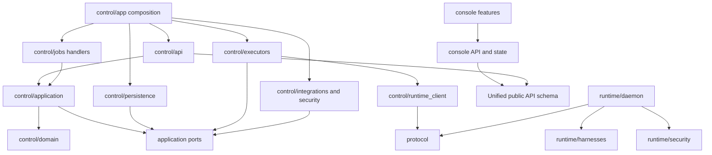

# Proposed repository and package structure

The tree is the **complete target package boundary map**, deep enough to assign later implementation ownership. Filenames are proposed responsibilities, not implementation instructions. No directories shown below are created by this PR except this documentation directory. Continue Python/FastAPI and React/TypeScript; no language rewrite.

Keep `control/` and `runtime/` as distinct packages. A small runtime-safe `protocol/` package holds wire envelopes and schema versions only; it must not grow into a shared business service. Deployment recipes remain outside domain modules. One product API schema generates/wires clients; runtime wire schema is separate.

```text
sbx-browser/
├── AGENTS.md                         # Later update ownership for unified modules
├── README.md
├── LICENSE / CHANGELOG.md / CONTRIBUTING.md / SECURITY.md
├── .gitignore / .env.example          # Credential-free configuration examples only
├── pyproject.toml / uv.lock
├── Makefile                          # Cloud-free standard checks and local entrypoints
├── .github/workflows/                # Existing CI, later updated for unified boundaries
├── protocol/                         # No FastAPI, DB, Modal or frontend dependencies
│   ├── __init__.py
│   ├── runtime.py                    # Handshake, operation identities, lease epochs
│   ├── events.py                     # Observation/event envelopes and schema versions
│   └── capabilities.py               # Wire capability/status records
├── control/
│   ├── __init__.py
│   ├── app.py                        # Composition root and ASGI lifespan only
│   ├── config.py                     # Typed deployment configuration
│   ├── domain/                       # Pure rules/value types, no I/O or routers
│   │   ├── identity.py               # User, Workspace, access/grant policy
│   │   ├── projects.py               # Project versions, EnvironmentSpec, defaults
│   │   ├── connections.py            # Connection, credential/observation references
│   │   ├── sessions.py               # Messages, Turns, lifecycle/results
│   │   ├── execution.py              # Execution, lease, capacity/admission states
│   │   ├── worktrees.py              # Filesystem generations, barriers, Snapshot rules
│   │   ├── changes.py                # ChangeSet, files, subject/content pins
│   │   ├── delivery.py               # ShipPolicy, gates, external effect state
│   │   ├── delegation.py             # Assignment, wait predicate, validated results
│   │   ├── services.py               # Service definition/instance intent
│   │   └── events.py                 # Canonical business event types and reducers
│   ├── application/                  # Commands/queries and transaction orchestration
│   │   ├── ports.py                  # Unit of work, repositories, effect interfaces
│   │   ├── identity.py               # Login, verification, keys and scoped lookup
│   │   ├── projects.py               # Resolve/pin environment and project configuration
│   │   ├── connections.py            # Connect, replace, revoke, validate/materialize
│   │   ├── sessions.py               # Accept Message, cancel/retry/close/archive
│   │   ├── execution.py              # Dispatch/adopt/reconcile and capacity allocation
│   │   ├── worktrees.py              # Activation/checkpoint/apply/file mutation barriers
│   │   ├── changes.py                # Seal/list/read/import immutable ChangeSets
│   │   ├── delivery.py               # Create/resume Delivery and authorize merge
│   │   ├── delegation.py             # Spawn/message/wait/result/cancel
│   │   ├── services.py               # Ensure lifecycle and issue narrow preview grants
│   │   ├── ingest.py                 # Runtime dedupe, persistence, verdict validation
│   │   └── projections.py            # Session/activity/action views and rebuild boundary
│   ├── api/                          # One business router set
│   │   ├── router.py / dependencies.py
│   │   ├── schemas.py / errors.py
│   │   ├── auth.py / workspaces.py / projects.py
│   │   ├── connections.py / sessions.py / turns.py
│   │   ├── changes.py / deliveries.py / delegations.py
│   │   ├── files.py / terminals.py / services.py
│   │   └── events.py / operations.py
│   ├── jobs/
│   │   ├── model.py                  # Claim/fence/backoff records and policy
│   │   ├── worker.py                 # Shared bounded claim loop
│   │   ├── timers.py                 # Enqueue due reconcile/retention; no direct effects
│   │   └── handlers/
│   │       ├── execution.py / snapshots.py
│   │       ├── changes.py / delivery.py / delegation.py
│   │       └── connections.py / services.py / cleanup.py
│   ├── persistence/
│   │   ├── database.py               # PostgreSQL transaction/UoW boundary
│   │   ├── migrations/               # Later reviewed typed schema migrations
│   │   ├── identity.py / projects.py / connections.py
│   │   ├── sessions.py / events.py / execution.py
│   │   ├── worktrees.py / changes.py / delivery.py / delegation.py
│   │   ├── services.py / jobs.py / deduplication.py
│   │   └── blobs.py                  # Manifests, ownership/reference retention
│   ├── executors/
│   │   ├── port.py                   # Location/lifetime contract
│   │   ├── modal.py                  # Explicit owner-context clients
│   │   └── local.py                  # Same runtime protocol, isolated cloud-free lane
│   ├── runtime_client/
│   │   ├── client.py                 # Stable private transport, timeouts and dedupe
│   │   ├── grants.py                 # Scoped capability issuance/revocation
│   │   └── proxy.py                  # Terminal/private live transport bridge
│   ├── integrations/
│   │   ├── git.py                    # Repo identity/ref/transfer operations
│   │   ├── github.py                 # PAT first; App/OAuth optional credential method
│   │   ├── email.py                  # Product identity email delivery
│   │   └── connectors/
│   │       ├── registry.py / modal.py / github.py
│   │       ├── opencode_zen.py / codex.py
│   │       └── provider_native.py    # Verified provider credential acquisition only
│   ├── security/
│   │   ├── vault.py / access.py / redaction.py
│   │   └── credential_leases.py      # Purpose-bound decrypt and refresh CAS
│   ├── storage/
│   │   ├── blobs.py                  # Private blob port and backend
│   │   └── local.py                  # Test/development implementation
│   └── preview/
│       └── proxy.py                  # Owner-checked service routing, separate origin
├── runtime/
│   ├── __init__.py
│   ├── daemon/
│   │   ├── main.py / app.py / auth.py
│   │   ├── operations.py             # Local accepted-op journal and fence validation
│   │   ├── supervisor.py             # CLI process groups, deadline, cancel
│   │   ├── events.py / spool.py       # Normalization envelope, durable ack/watermark
│   │   ├── files.py / worktree.py / changes.py
│   │   ├── terminal.py / processes.py
│   │   ├── services.py / health.py
│   │   └── snapshots.py              # Quiesce/scrub/manifest preparation
│   ├── harnesses/
│   │   ├── protocol.py / registry.py # ONE official CLI interface
│   │   ├── codex.py / opencode.py / claude.py
│   │   ├── devin.py / devin_acp.py / grok.py / antigravity.py
│   │   ├── capabilities.py           # CLI/version support evidence
│   │   └── native_state.py           # Resume compatibility and export manifests
│   ├── security/
│   │   ├── credentials.py / redaction.py
│   │   └── paths.py                  # Allowed roots, symlinks and secret exclusion
│   ├── tooling/
│   │   ├── sbx.py                    # Narrow command client for delegated operations
│   │   └── mcp.py                    # Same primitives exposed via native MCP support
│   └── images/
│       ├── recipe.py / manifest.py / providers.py
│       ├── packages.txt / entrypoint.sh / install-devin.sh
│       └── local/                    # Generated/pinned local container recipes
├── console/
│   ├── package.json / package-lock.json / vite.config.ts / tsconfig.json
│   └── src/
│       ├── main.tsx / App.tsx
│       ├── app/                      # Router, providers, navigation/shell
│       ├── api/                      # One typed client, schemas, HTTP/errors/stream
│       ├── state/                    # Query cache, event watermark/reducers, drafts
│       ├── features/
│       │   ├── auth/ / projects/ / sessions/
│       │   ├── conversation/ / activity/ / changes/ / delivery/
│       │   ├── files/ / terminal/ / services/ / delegation/ / connections/
│       │   └── settings/
│       ├── components/               # Accessible shared UI primitives
│       ├── i18n/ / theme/ / styles/
│       └── test/                     # Shared isolated frontend test support
├── src/sbx/                          # Retain current published Python package name
│   ├── __init__.py / __main__.py / cli.py
│   ├── auth.py / config.py / errors.py
│   ├── commands/                     # Project, Session, Connection, Ship, delegation
│   ├── sdk/
│   │   └── client.py / models.py / errors.py / __init__.py
│   └── operations/                   # Explicit deploy/doctor/local tools, no hidden auth
├── examples/                         # Session, delegation, Ship and local usage examples
├── deploy/
│   ├── hosted/                       # API/worker/PostgreSQL/proxy deployment operations
│   ├── modal/                        # Runtime image publication, no domain orchestration
│   └── edge/                         # TLS/origin routing and private previews
├── scripts/                          # Dev/docs/schema tools; no hidden lifecycle engine
├── tests/
│   ├── conftest.py                   # Isolated HOME/XDG, explicit credential-free env
│   ├── fakes/ / fixtures/            # Official CLI recordings/fakes, REDACTED secrets
│   ├── unit/                         # Domain/application/runtime tests by boundary
│   ├── contracts/                    # Unified API/runtime/Harness consistency
│   ├── integration/
│   │   ├── postgres/                 # Transaction, unique claims, restart/dedupe semantics
│   │   ├── cloud_free/               # Runtime + local executor + official CLI fakes
│   │   └── security/                 # Owner/materialization/preview isolation
│   ├── e2e/                          # Unified Console surface
│   └── e2e_modal/                    # Opt-in live gates, isolated from ordinary tests
├── spike/                            # Historical evidence; later feasibility work isolated
├── docs/
│   ├── architecture/amp-inspired/    # This proposal
│   ├── decisions/                    # Later approved architecture records
│   ├── specs/                        # Future unified API/runtime/domain contracts
│   └── archive/                      # Historical contracts only after explicit replacement
└── docs-site/                        # Maintained product documentation, one concept model
```

Not every named file needs its own class or service. Small application/domain files can stay combined until size warrants splitting. The fixed decision is dependency/ownership direction, not boilerplate. Deferred team administration, Automation definitions, Workflow recipes, OAuth UI, and a standalone TypeScript SDK do not get placeholder engines now; the Console's typed API client already covers its own needs.

## Dependency rules



Domain imports no router, database, Modal client or runtime implementation. Runtime imports no `control` package or business database. Harness adapters do not import backend/image publication. Application effect ports are injected in the composition root; infrastructure implements them. Shared `protocol` contains data contracts, not business reducers or credential decrypt. Console cannot import hosted transport globals into domain models.

## Current module disposition

| Current modules/directories | Target disposition after cutover |
| --- | --- |
| `control/api_v1/**`, `control/api_v2/**`, `/api` Basic dashboard routes, `hosted_routes.py` | **Delete.** One router/schema set under `control/api`; no permanent translation facade. |
| `control/tasks.py`, `api_v1/tasks.py`, `workflow_store.py`, `api_v1/state.py` | **Delete business wrappers.** Repo/settings resolution moves to Projects/admission; parent/child discovery to Delegation relations. |
| `control/service.py` | **Dissolve.** Session use cases, Execution effect handlers and runtime supervisor own its necessary behavior. No giant replacement facade. |
| `control/run_store.py`, `run_activity.py`, `run_errors.py`, `api_v1/lifecycle.py` | **Replace.** Typed Turns/Executions/events and categorized outcomes. Reuse concepts/evidence, not Run identity. |
| `control/workspace.py`, `artifacts.py`, `artifact_ops.py`, `revisions.py`, `handoff.py`, `evidence.py` | **Split then remove old modules.** Worktree/filesystem, ChangeSet/blob storage, Delivery integration, and Delegation/result validation. |
| `startup_dispatch.py`, `hosted_lifecycle.py`, `hosted_delivery.py`, `reaper.py` | **Delete loops/ownership shims.** Jobs/timers invoke one application authority. |
| `hosted_reviews.py` | **Delete special flow.** Delegation review preset + Delivery gate; no route-to-route call. |
| `postgres_state.py`, generic Modal Dict/File business stores | **Replace.** Typed PostgreSQL repositories/UoW; isolated test fakes. No production JSON namespace compatibility store. |
| `connections.py`, `auth_store.py`, `auth_schema.py`, hosted auth modules | **Shrink/move.** Identity persistence/application, Connection domain, vault; preserve encryption/password/owner policy with reviewed migration. |
| `hosted_accounts.py`, scheduler/accounts/credential lifecycle/sync wrappers | **Consolidate.** Connections/capabilities, capacity reservations and credential refresh authority. Retire legacy Account mirrors. |
| `backend.py`, `backends/modal.py`, `real_modal.py`, `hosted_compute.py`, `modal_connection.py` | **Consolidate.** Executor port + Modal/local implementations; Connection-specific provisioning Jobs. |
| GitHub/broker/App/real/mock modules | **Consolidate.** Git/GitHub integration and credential methods; PAT primary, optional App/OAuth. Fake logic belongs in tests. |
| Root `broker/**` GitHub App registration/token service | **Remove from required deployment.** Default manual-token product has no need for a central App broker. Retain only as an optional separately operated acquisition connector if actual users need it; it owns no Session/Execution state. Otherwise retire after the connection migration/export gate. |
| `control/environment.py`, `checkpoint.py`, resources/version/runtime evidence | **Move/reduce.** Versioned Project inputs, Snapshot manifests, native-state compatibility, executor capabilities. |
| `runtime/http_service.py`, `runtime/session_events.py`, `runtime/runner/**` | **Replace shell entry architecture.** Daemon, spool, supervisor, one native Harness interface. Existing adapter translation knowledge and recordings inform relocation. |
| `runtime/image.py`, packages/entrypoint/install/build/version modules, local Dockerfiles | **Move.** Central recipes/manifests under images with executor-specific publication outside domain. |
| `console/src/prototype/**`, `hosted/**`, split API/domain facades | **Fold into features; delete duplicates.** Preserve accessible components, i18n/theme, history/diff behaviors. |
| `web/**`, old build-less Basic dashboard | **Retire.** Console is the single product UI; operator diagnostics are authorized backend resources. |
| `src/sbx/**`, root `sbx` launcher, examples using Agent/Task/Run | **Migrate once.** Keep published package/entrypoint while replacing concepts with Session/Turn/ChangeSet/Delivery and explicit Connection operations, coordinated release rather than permanent aliases. |
| `deploy/**`, `.github/**`, Makefile, docs-site | **Keep and simplify later.** Deployment/check/documentation operations, never a competing product lifecycle. |
| `docs/contracts/**` | **Untouched now.** Future replacement requires reviewed new specs and explicit historical retirement; this proposal overrides no applied contract. |

Repository tests should follow the new ownership boundaries; preserve real failure-mode evidence and credential-free execution. Relocation must not silently register experimental providers or remove version/support gates. Migration order and finite bridge rules are in [migration.md](migration.md).
