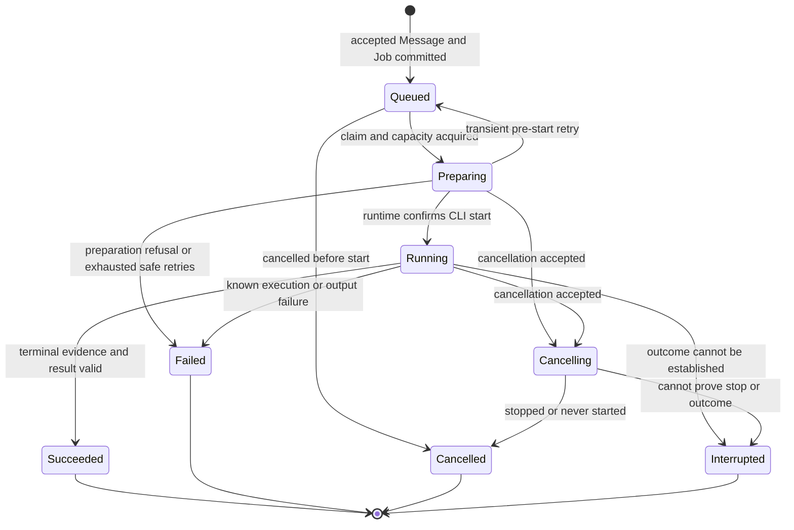
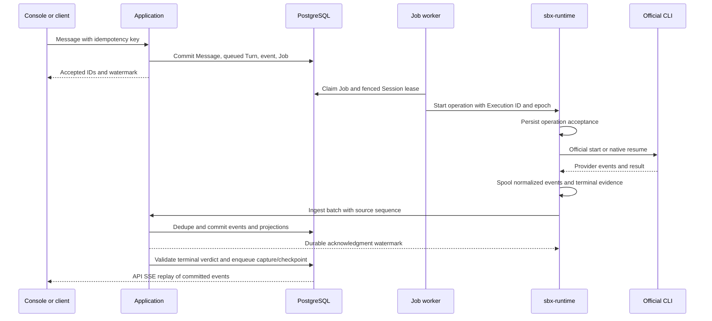
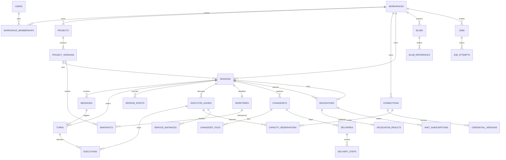

# State authority, persistence, jobs, and credentials

This is proposed SBX design, not a reconstruction of Amp's closed database or scheduler. The [domain definitions](domain-and-components.md) apply throughout.

## 1. Authority: a transactional journal with typed projections

Use an append-only **Session event journal** for accepted commands, observed execution facts, and business transitions. Store typed relational projections in the same PostgreSQL transaction for command-critical state. This is bounded event sourcing for session work, not an event-sourced identity system or an asynchronous CQRS platform.

| State | Authority | Read/repair behavior |
| --- | --- | --- |
| Accepted Messages, Turn lifecycle, Session lifecycle, published results, ChangeSet/Delivery/delegation transitions | Committed application transaction: journal facts plus typed projection. | Events explain the history; projections support current queries and admission. Rebuild projections offline with versioned reducers. Never decide from browser cache. |
| Project versions, memberships, Connection configuration, encrypted credential versions | Typed relational rows, optimistic versions and audit metadata. | Not replayed from Session events; session creation pins relevant versions/references. |
| Job/lease claims, current fencing epoch, capacity reservations | Typed operational rows locked/CASed in transactions. | Not reconstructed from activity text. Expired claims trigger reconciliation. |
| Runtime process state, files, native CLI context before checkpoint | Executor/runtime evidence. | Observe under current lease; persist relevant redacted facts. Last durable checkpoint defines guaranteed recovery point. |
| Immutable Snapshot/ChangeSet/blob content | Verified private blob/backend object + immutable manifest committed in DB. | Hash/size/ownership checks; dangling objects collected by Jobs. An incomplete upload is not a ready resource. |
| Remote Git branch/PR/check/merge state | Git/GitHub at time of observation. | Persist evidence and timestamp; verify again for destructive/irreversible actions. DB status is not proof remote refs remain unchanged. |

Application commands own mutation. Event ingestion does not blindly apply a provider's `turn.completed` as business success: the runtime must finish supervision, and the application must validate terminal evidence/output contract and current fence. Runtime observations and final verdict are distinguishable event types. Queries do not probe compute or mutate Delivery/Review state; freshness is reported as timestamps and pending Job status.

Session sequence is monotonic, allocated transactionally by locking that Session's sequence row. It orders accepted facts, not a global physical clock or native CLI ordering. A runtime observation preserves its own sequence/time. Arrival after a cancellation stays historical and cannot reverse a terminal verdict. A command dedupe key plus request fingerprint ensures repeated requests return the same committed IDs; a changed body under the same key is a conflict.

## 2. Canonical event envelope and categories

Envelope: event ID, Workspace ID, Session ID, Session sequence, type, schema version, recorded/observed timestamps, actor/source, causation and correlation IDs, optional Turn/Execution/lease epoch/Delegation/ChangeSet/Delivery IDs, and a typed redacted payload. Runtime dedupe identity is `(executor_lease_id, runtime_epoch, local_sequence)`. Operation identity is separate from event identity. Unknown event extensions can be ignored; unsupported envelope/schema majors fail explicitly.

| Category | Canonical examples | Authority and use |
| --- | --- | --- |
| Session | `session.created`, `session.settings_changed`, `session.archived`, `session.closed` | Lifecycle/settings facts, independent of latest Turn or compute. |
| Message | `message.accepted`, `message.part_added`, `message.completed` | Conversation and addressed child communication. User messages are durable before execution. Partial output uses part IDs/deltas; completion is explicit. |
| Turn | `turn.queued`, `turn.started`, `turn.cancel_requested`, `turn.succeeded`, `turn.failed`, `turn.cancelled`, `turn.interrupted` | One application-owned outcome per accepted Turn. `interrupted` includes unknown outcome. |
| Execution | `execution.preparing`, `execution.started`, `execution.native_bound`, `execution.observed_terminal`, `execution.stopped`, `execution.health_reported` | Attempt evidence, native binding, process/CLI versions; safe diagnostics. |
| Tool activity | `tool.started`, `tool.updated`, `tool.completed` | Provider-observed tool activity with provider item ID and completeness; not necessarily a control-plane process. |
| Usage/error | `usage.observed`, `diagnostic.reported` | Optional accounting with source/completeness; categorized redacted failure, not raw stderr dump. |
| Environment/compute | `executor.bound`, `executor.unavailable`, `worktree.restored`, `snapshot.ready`, `snapshot.failed` | Compute and recovery facts; do not close a conversation implicitly. |
| Changes/delivery | `changeset.ready`, `changeset.capture_failed`, `delivery.requested`, `delivery.progressed`, `delivery.succeeded`, `delivery.failed` | Independent work-product and transport progress. |
| Delegation | `delegation.created`, `delegation.waiting`, `delegation.result_published`, `delegation.cancel_requested` | Ordinary child work; review result is a typed payload with subject pin. |
| Service | `service.requested`, `service.ready`, `service.failed`, `service.stopped` | Low-volume meaningful facts; high-volume logs remain bounded private streams. |

Connection validation/revocation and internal Job claim telemetry live in their typed operational/audit records, not automatically every Session journal. Only user-relevant consequences enter affected Sessions. Avoid logging secrets, private refresh data, unlimited PTY output, or every HTTP heartbeat. Raw provider traces are optional, redacted, private, bounded, and separately retained; never a public event-log fallback.

## 3. One lifecycle per concept

Session lifecycle is `open → archived → open` (archive is reversible) or `open/archived → closed` (read-only). Delete follows explicit retention policy, not sandbox teardown. Activity is a **projection**: queued/running/awaiting-input/idle, with separate compute unavailable/recovering and delivery attention indicators. Latest Turn success does not make the Session immutable. An archived Session with scheduled work must explicitly pause that schedule or declare it remains active.

Turn lifecycle:

Terminals are immutable. Retry creates a new Turn linked to the prior Turn; it does not rewrite accepted history. Safe pre-start transport/provisioning retries can create new Execution attempts within the original preparing Turn. Once a CLI may have started, reconcile its attempt before any retry. Do not automatically replay a prompt with external side effects after an unknown outcome. An operator/user retry must explicitly acknowledge the unresolved previous attempt, and only proceed after old compute is confirmed stopped or isolated.

A retry command creates a new triggering Message referring to the prior request; it can reuse the request's content/attachments under authorization without changing the original Message. This preserves one triggering Message per Turn and keeps user-request retries separate from internal preparation attempts.

Execution attempt states: preparing, started, stop-requested, then succeeded/failed/cancelled/unknown. Lease states: allocating, ready, quiescing, released/lost. Worktree availability is none/restoring/live/checkpointed/unavailable, with immutable generation/checkpoint refs. Delivery states: pending, executing, awaiting-review/checks/authorization, succeeded/failed/cancelled. Delivery step evidence records push/PR/check/merge; a failed Delivery retry resumes verified unsatisfied steps, not another agent Turn. Job states are queued, claimed, retry-wait, succeeded, failed, cancelled.

Provider tool activity states and native CLI thread markers remain observations; they cannot allocate or terminate Sessions. A result contract can reject a process-successful Turn as application failure with an explicit contract error, retaining its assistant output and process evidence. Strict schema enforcement is useful for child review and automation, not mandatory for every conversation.

## 4. Durable event ingestion and replay

Runtime fsyncs accepted operation identity before launching the process, spools normalized/redacted observations, and writes terminal evidence durably before reporting it. Application ingestion authenticates lease/Session ownership, dedupes source sequence, assigns Session sequence, and updates message/activity projections. It acknowledges only after DB commit. A dropped acknowledgment causes replay of the same source IDs. Runtime prunes acknowledged spool with a bounded retention window.

Terminal evidence includes final runtime observation watermark. Application terminalization waits until required observations through that watermark are persisted, or explicitly declares incomplete evidence. The CLI process may be successful while checkpoint/change capture later fails. Emit separate capture/checkpoint transitions so the UI can show both.

API SSE replays committed Session events using Session sequence (`Last-Event-ID`), not line numbers in an ephemeral file. Snapshot queries return a projection version/event watermark so a client can fetch current state and replay events after that point without duplication. Notifications/polling wake subscribers; DB events remain authority. No Redis is required initially. Lagging clients request bounded pages; retained-history expiration returns a documented reset with a new snapshot watermark, not a silently reused cursor.

If the control plane disconnects, a running runtime can finish and retain unacknowledged evidence. It should not start another Turn without renewed authority. Bounded spool pressure pauses intake or stops work with a diagnosed failure; it must not discard unacknowledged terminal evidence to keep the UI appearing healthy. Abrupt loss before ingestion/checkpoint can lose recent output and files; report the recovery point and an interrupted outcome honestly.

## 5. Concurrency and fencing ownership

Serialize Session command decisions with short DB transactions, using row locks/optimistic versions. Allocate one active Turn and one active Executor lease per Session with database constraints. Worktree mutation has an operation barrier plus generation precondition; runtime enforces it for mediated file/capture/apply operations. Interactive terminal writes during a Turn are explicitly concurrent user edits; the UI warns about contention, and sealing a ChangeSet requires pausing/closing mutating terminal access. Native CLI subagents do not receive separate SBX Worktree leases.

Execution capacity checks and reservations are transactional per selected Connection plus Workspace quota. Use durable slot reservations tied to lease/Execution, with expiry and verified release. Do not count only browser-visible active turns or process-local scheduler dictionaries. Compute reservations can persist for active previews even when provider inference slots are released. Never reclaim a provider slot simply because a worker heartbeat expired while its CLI might still run.

Every lease/claim has an increasing generation, holder, expiry, heartbeat, and resource identity. Workers renew bounded claims; stale DB writes fail the generation check. Runtime rejects stale mutations and enforces grant expiry. A new job claimant must either adopt the same runtime Execution (without relaunch) or stop/reconcile it before allocating competing compute. DB fencing alone cannot stop an already-running official CLI or undo external tool effects. Unreachable compute remains quarantined against replacement until termination/expiry is confirmed; this trades availability for avoiding concurrent writers.

Cancellation records intent and revokes new-start authority atomically. If successful terminalization already committed, cancellation returns that result. If cancellation committed first, late success evidence cannot authorize auto-Ship; terminal result becomes cancelled after confirmed stop or interrupted after an unresolved stop. Preserve observed output for diagnosis. Close additionally cancels queued Turns, handles child policy, and schedules cleanup. Archive is a UI lifecycle operation and must not be confused with cancel or terminate.

## 6. One durable Job mechanism

Use PostgreSQL Jobs; poll due rows with transactionally exclusive claims and bounded batches. One worker initially shares application modules with the API; additional workers require no new ownership model. Timer reconciliation only enqueues deduped resource Jobs; it does not directly mutate resources in a second engine.

| Job family | Replaces current paths | Idempotency scope |
| --- | --- | --- |
| Prepare/dispatch Turn | `startup_dispatch`, api_v1 lifecycle daemon threads, api_v2 ack-budget worker orchestration | Turn + operation generation; accepted DB intent exists before launch. |
| Reconcile Execution/lease | Read-path settle, watcher restart logic, hosted lifecycle/reaper overlap | Execution/lease + observation generation. |
| Build/restore/capture checkpoint | Environment/checkpoint hooks and recovery callbacks | Input digest for cache; Session generation for checkpoint. |
| Capture ChangeSet | Revision finish callback and close-time artifact fallback | Source Turn/Worktree generation/content digest. |
| Perform Delivery / synchronize remote state | Hosted auto-delivery and separate workspace/revision publish paths | Delivery + target + step; verify remote effect before repeating. |
| Publish delegated result / wake waiter | Hosted review polling/creation and workflow binding recovery | Delegation + completing Turn + waiter/message dedupe. |
| Validate/provision Connection or image | Hosted provisioning sweep | Connection credential version + build identity. |
| Terminate/cleanup/retain blobs | Teardown pools and periodic special cleanup | Exact lease/object ID, never "whatever is current". |
| Scheduled message or webhook intake (future) | Automations without a separate workflow executor | Schedule + occurrence time; connector event ID + target Session. |

A Job stores kind, typed target/reference, safe payload, dedupe key, due time, priority, attempt count, retry limit/deadline, claim holder/generation/expiry, last safe error, and result/effect refs. On claim loss a successor reconciles the same operation. No plaintext credentials in payloads. Resolve credential versions at execution boundary under current authorization.

Commands commit domain rows/events and follow-up Jobs together, making Jobs the transactional outbox. Slow external calls execute outside locks; results commit only if the claim/resource fence is current. Successors can recover unrecorded effects through stable operation identities and remote inspection. Startup cleanup is the same worker scanning expired claims, not a separate startup state machine that fails every unbound Session.

Retry uses bounded exponential backoff with jitter and provider retry-after. Transport failures before start are safe retries; invalid/revoked credentials wait for replacement, unsupported settings are user errors, rate limits release confirmed-idle capacity and delay, malformed output needs diagnosis, unknown running effects require reconciliation. Poison jobs stop with safe diagnostics and a user-visible resource failure. Retries do not run forever or starve higher-priority cancellation/cleanup.

Git/GitHub operations are at-least-once, not universally exactly-once. Use deterministic branch naming, expected remote SHA, stable PR association, and discovery after ambiguous responses. If effect presence cannot be established, expose unresolved Delivery and require reconciliation; do not create another PR speculatively. Notifications likewise have an outbox key but delivery may remain at-least-once.

## 7. Connections and encrypted secrets

Product login uses verified email/password; sessions and product API keys store hashes, not encrypted plaintext. External credential acquisition starts with manual input. Generalize the current owner-context AES-GCM vault design, not the current one-Connection-per-provider uniqueness.

| Connection kind / credential type | Initial use | Materialization destination |
| --- | --- | --- |
| `modal` / manual token pair | Owner-owned compute provisioning, create/poll/snapshot/terminate. | Only short-lived executor adapter context in control-plane worker memory. Never sandbox CLI or Project env. |
| `github` / manual token | Repo clone/access, permitted branch push/PR/check/merge. | Integration worker or narrowly prepared Git helper in selected sandbox when needed. Never repository URL, event, command argument, or cached snapshot. |
| `opencode-zen` / manual API key | Official OpenCode CLI inference/model access. | Allowlisted runtime HOME/XDG/config during execution; static key has no credential writeback. |
| `codex` / optional native auth | Official Codex CLI; ChatGPT subscription association where valid. | Selected provider runtime state; connector-controlled refresh or explicit supported export path. |
| Other official providers | Enable only after verified credential/distribution/capability support. | Same scoped boundary with provider-specific materialization. |

Connection metadata includes external account identity, kind, label, owner/principal scope, method (manual/OAuth/native), configured/disabled state, capability observations with verification timestamp, observed health/cooldown, version, and current credential ref. Observations distinguish unverified, verifying, ready, degraded, reauth-required, revoked, disabled. They do not claim a PAT can write every repository just because validation could read one. Model catalogs are Connection/version-scoped and expire; no hidden fallback to another user or disconnected OAuth path.

Credential ciphertext records have encryption key ID, nonce/authentication tag, format, version, expiry if known, and Connection/owner context as authenticated associated data. Encryption keys are outside DB/backups, managed through deployment secret storage with rotation/keyring support. Keep old decrypt keys only for a bounded re-encryption period. Ciphertext alone is not access control: decrypt only after scoped permission/capability checks and audit the purpose. Workspace membership does not automatically grant use of personal third-party credentials; initial personal Workspace makes that policy simple.

Project secret bindings distinguish ordinary environment configuration from encrypted values. Binding grants say which Session/role/service may materialize each value. Avoid automatically giving all services every provider secret. Reusable Project snapshots are secret-free. For a private Session checkpoint, pause/stop secret-bearing services and CLI processes, flush refresh state, scrub credentials/env artifacts, capture filesystem only, then re-materialize on restore. Do not take memory snapshots under a claim that deleting files removed secrets from RAM. Native CLI transcripts may contain user-sensitive data and need private encrypted storage/retention even after credential scrubbing.

Replacement increments credential version, invalidates catalog/status and pending grants, and prevents old refresh writeback. Revocation disables future decrypt/materialization, fences pending effects, and schedules cleanup/termination for affected leases according to policy. A runtime cannot erase secrets already read by a process or remotely revoke a provider token; report local cleanup and provider-side revocation as distinct operations. Preserve a tombstone so a disconnected manual Connection does not silently fall back to old OAuth/App credentials.

Optional writeback requires an adapter-declared refresh behavior, private transfer, and CAS against leased credential version. Shared rotating refresh tokens need a **connector refresh lease** or verified provider multi-session semantics; generic last-writer-wins is unsafe. For Codex broker-managed refresh retain refresh authority in the connector. The daemon exports only allowlisted refreshed material if that path is explicitly supported. Access tokens/keys never enter event journals, job payloads, Console persistence, logs, fixtures, or architecture examples.

## 8. Target relational model

Use typed tables for searchable identities, foreign keys, state, claims, digests, timestamps, and authorization. JSONB is appropriate for versioned event payloads, capability extensions, Project specifications, and structured result values. It is not a substitute for searchable ownership, Turn status, child relationships, or target indexes. Large patches/bundles/screenshots go to private object storage, not base64 in generic JSON namespaces.

| Tables | Key relationships / useful indexes | Mutability |
| --- | --- | --- |
| `users`, `password_credentials`, `login_sessions`, `api_keys`, verification/rate-limit records | Unique normalized email; token/key hash unique; user + expiry/revocation. | Identity configuration and auth lifecycle; hashes only. |
| `workspaces`, `workspace_memberships` | Membership unique Workspace + user; role/status; personal Workspace owner. | Mutable authorization, auditable. Team product deferred. |
| `projects`, `project_versions` | Workspace + slug unique; Project + version unique; current-version FK; repository identity index. | Project metadata mutable; versions immutable. |
| `connections`, `credential_versions`, `connection_observations`, `secret_bindings` | Workspace/principal/kind/status index; version per Connection; current credential FK; capability observation per credential version. | Connection mutable with CAS; ciphertext versions private; observations timestamped; revocation explicit. |
| `sessions` | Workspace + updated time cursor; Project + creation time; lifecycle/activity query indexes; pinned Project version, Harness selector, active Turn/lease refs, sequence/version. | Mutable projection and pinned inputs; lifecycle updates journaled. |
| `messages`, `message_parts`, `turns` | Session + message/Turn ordinal unique; Session + status; triggering Message FK; retry-of Turn; message part ID unique. | Accepted input immutable; streaming parts/result projections updated until sealed; Turn terminal immutable. |
| `session_events` | Session + sequence unique; event ID unique; source tuple unique for runtime; Turn/causation indexes; Workspace-scoped lookup. | Append-only; retention deletion/redaction is explicit controlled policy. |
| `executions`, `native_context_bindings` | Turn + attempt unique; lease FK; native binding Session + lineage; start/outcome evidence versions. | Attempt projection; completed attempts immutable. Native binding checkpoint compatibility recorded. |
| `executor_leases`, `capacity_reservations`, `worktree_operations` | Partial unique active lease per Session; active reservation slot per Connection; lease expiry/due indexes; exclusive active filesystem operation per Worktree. | Claimed/CASed/fenced; durable operational records. |
| `worktrees`, `snapshots` | Worktree unique Session; generation; latest-checkpoint FK; cache kind + Project/input digest uniqueness scoped by Workspace. | Worktree pointer mutable; ready Snapshot immutable. |
| `blobs`, `blob_references` | Workspace + digest + size/storage class; referenced-by entity; retention deadline/ref lookup. | Manifest immutable when ready; retention references mutable. Storage access always owner-scoped. |
| `changesets`, `changeset_files` | Session + capture generation/content digest; source Turn FK; base/head/content digest; ChangeSet + path unique. | Immutable ready payload and file manifest. Failed capture tracked as operation, not fake ready ChangeSet. |
| `deliveries`, `delivery_steps`, `delivery_target_claims` | ChangeSet FK; repository/ref/PR target; policy/authorization snapshot; operation dedupe; target claim unique. | Delivery projection and step facts; completed effect evidence immutable. |
| `delegations`, `delegation_results`, `wait_subscriptions` | Child Session unique; parent/status index; input ChangeSet/digest; result completing Turn; result contract; waiter predicate/expiry. | Assignment inputs immutable; state projection; published result immutable; wait claims mutable. |
| `service_instances` | Session + declaration name + lease epoch; desired/observed state and health timestamp. | Mutable projection; no portable PID promise. |
| `jobs`, `job_attempts`, `command_deduplication` | Due-time + priority for queued/retry; claim expiry; active dedupe key unique; principal + operation + key unique and body fingerprint. | Mutable jobs/claims; attempt/effect evidence append-only. |

Future `automation_definitions` and connector webhook receipts are deferred tables, not required for initial unification. Preview grants can be short-lived signed capabilities plus revocation epoch; no plaintext grant table is required. Review assessments live in `delegation_results` with typed subject/verdict fields for gates; no `reviews` execution table or second hosted-review namespace.

ER edges are cardinalities and ownership, not a SQL migration. Snapshot kind constraints require either Project cache input or Session Worktree input, not both. Jobs can target multiple typed families through validated refs; enforce target ownership on enqueue and execution. Use composite Workspace-aware foreign keys where practical to prevent accidental cross-owner joins. Cross-scope grants remain explicit access records, never inferred from matching repository URLs.

## 9. Recovery examples and retention

| Failure | Required outcome |
| --- | --- |
| API crashes after accepting a Message | DB has Message/Turn/Job; another worker claims it. Same idempotency key returns same IDs. |
| Worker crashes after allocate but before bind | Operation-tagged sandbox is discovered and bound only by current fence, or terminated as orphan; never creates a second active lease blindly. |
| Start response lost | Query runtime by Execution/operation ID, replay spool; do not launch again. |
| Runtime lost during CLI work | Terminal Turn is interrupted if outcome cannot be proven; restore last checkpoint for future work after fencing/stopping old compute. |
| Checkpoint or ChangeSet capture fails after successful Turn | Turn stays succeeded; independent capture failure visible; Session may have live but non-durable files. Auto-Ship waits for ready eligible ChangeSet. |
| Snapshot races follow-up | Follow-up is queued durably; Worktree barrier and current epoch prevent dispatch into scrub/capture window. |
| Git push succeeds but DB update fails | Reconcile deterministic target/head before repeating. PR ambiguity remains pending, not another speculative PR. |
| Child review result malformed | Delegation result fails validation; no approving assessment. Parent gets a safe failure Message. |
| Remote PR head changes after approval | Gate denies merge; capture/review the new subject. No stale assessment mutation required. |
| Credential replaced while worker refreshes | Old version CAS fails; it cannot overwrite replacement or re-enable revoked Connection. |

Define explicit retention for Session journal/history, private native state, snapshots, raw traces, ChangeSets, and attachments. Retain accepted outcomes and shipped subject manifests as long as their references are visible. Private blob access follows live authorization, not possession of a hash. Account deletion can destroy credential ciphertext immediately and schedule private history/blob deletion under product retention policy. Append-only does not mean legally or operationally undeletable; record controlled deletion/tombstone boundaries and do not replay erased secrets into projections.
