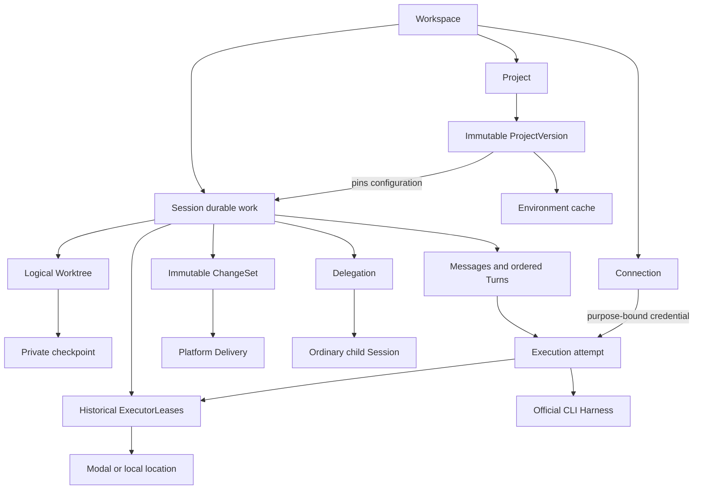
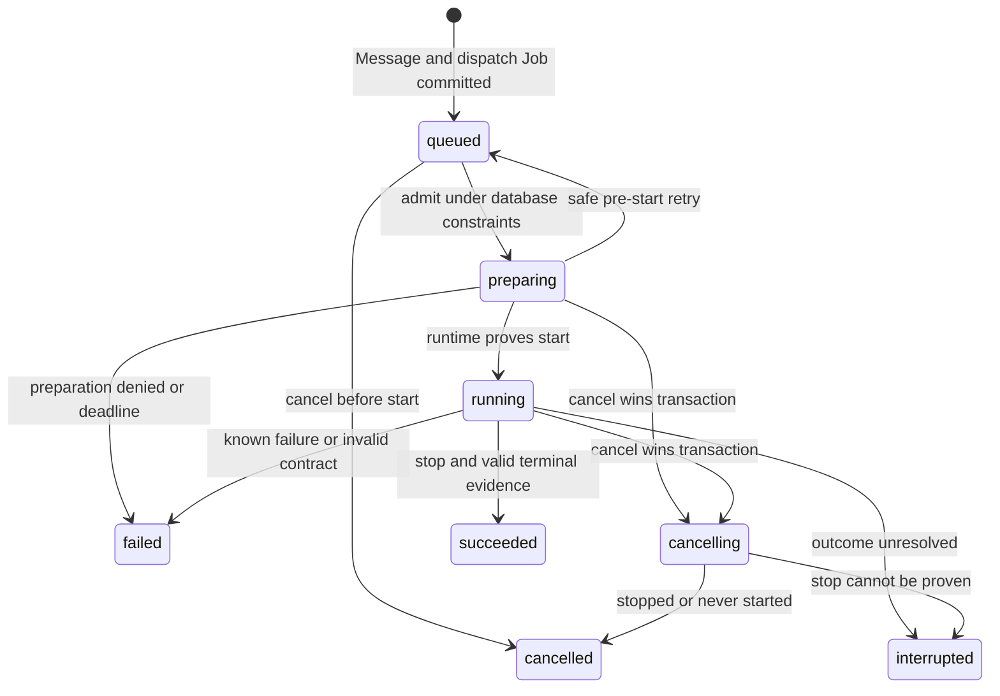

# Domain model and mutation ownership

**NORMATIVE.** [Index and precedence](README.md). All target definitions are original SBX architectural decisions.

## Vocabulary and identities

IDs MUST be globally unique opaque public identifiers with the prefixes below; UUIDv7 suffixes SHOULD be used. IDs convey type, never authorization. Every owned record MUST carry `workspace_id`; a repository URL or matching digest MUST NOT grant access. **Workspace** always means access scope; **Worktree** always means filesystem identity.

| Name / prefix | Identity and cardinality | Required durable fields beyond ID/ownership/timestamps |
| --- | --- | --- |
| User `usr_` | Product principal; independent of provider accounts | normalized email, verified time, identity version |
| Workspace `wsp_` | Personal ownership scope initially; membership permits later teams | owner user, name, policy version |
| Project `prj_` | Reusable repository/environment/default configuration; zero or one per Session | slug, name, current ProjectVersion FK, metadata version |
| ProjectVersion `pver_` | Immutable definition under one Project | ordinal, repository identity, base-ref selector, EnvironmentSpec, service declarations, execution defaults, ShipPolicy, spec digest |
| Connection `con_` | External authority; many of each kind permitted | kind, label, creator, allowed principals/purposes, configured/disabled/revoked state, current CredentialVersion FK, version |
| CredentialVersion `cred_` | Encrypted private material under a Connection | version ordinal, ciphertext/key/format refs, expiry, revoked time; see [security](06-connections-security.md) |
| Session `sess_` | Durable conversation/context/work; same entity for all roles | lifecycle, role, title/labels, creator, pinned ProjectVersion or projectless spec, effective creation inputs, Harness binding, sequence/version |
| Message `msg_` | Accepted authored communication in one Session | ordinal, author principal/source, role, routing, immutable input content/attachment refs, reply/source Message refs |
| Turn `turn_` | One accepted work request; ordered in one Session | ordinal, triggering Message FK, state/reason, resolved settings, ResultContract, retry-of FK, cancellation intent, outcome/usage refs |
| Execution `exec_` | Attempt to perform one Turn; operational evidence, not another work unit | attempt ordinal, ExecutorLease FK, operation ID, attempt state, selected credential-version ref, CLI/adapter/image/runtime versions, native-binding ref, final watermark/outcome evidence |
| ExecutorLease `lease_` | Replaceable location/runtime allocation; many historical, at most one active per Session | backend kind, opaque handle, generation, expiry, observed status/time, image/protocol fingerprint, allocation operation ID |
| Worktree `wt_` | Exactly one logical mutable filesystem per Session, including projectless work | repository/base SHA or directory baseline, generation, availability, last Snapshot FK, recovery point |
| Snapshot `snap_` | Immutable manifest; `environment` or `checkpoint` kind | owner input, input/content digest, blobs/backend refs, runtime/image/native-state compatibility, event watermark |
| ChangeSet `cs_` | Immutable captured subject; zero or many per Session | source Turn optional, Worktree generation, repository/base/head/tree optional, manifest digest, files/blobs, eligibility origin |
| Delivery `dlv_` | Intent/outcome for one exact ChangeSet and external target | subject FK/digest, target identity, policy snapshot, authorizing principal, expected remote refs, state/version, effect evidence |
| Delegation `del_` | Parent assignment to an ordinary child Session; one spawning parent per child | parent/child Session FKs, role, immutable input refs/digests, ResultContract, budget/grant snapshot, state |
| DelegationResult `res_` | Validated immutable result under one Delegation | completing Turn/child identity, contract version, subject pins, typed value, evidence refs, publication time |
| ServiceInstance `svc_` | Realization of a declared service on a particular lease | Session/declaration digest, lease generation, desired/observed state, health time; live PIDs/ports are observations |
| Job `job_` | Durable internal continuation/effect; not user work identity | kind/target, dedupe/effect IDs, safe input refs, claim generation/expiry, deadline/attempts, state, result refs |

Harness and Executor backend are versioned implementations/capability catalogs, not per-Session business aggregates. Event is an append-only fact. EnvironmentSpec, ShipPolicy, ResultContract and ReviewAssessment are versioned typed values. A Blob is private storage metadata; attachments/reports/videos do not require a legacy Artifact-package domain wrapper. ExecutionPreset is optional convenience, never a Session mode identity.

## Authority and mutation ownership

Only application commands may decide domain mutations. Workers call those commands under claims; runtime evidence is validated by `application/ingest.py`. Public handlers MUST NOT mutate repositories directly, call another route, or access another service's private lock.

| State | Single owner | Authorized mutation paths | Forbidden authority |
| --- | --- | --- | --- |
| Identity/membership | Identity application | register/login/verify/change-password/keys/membership commands | provider login, Console cache |
| Project definitions | Project application | publish new version, update current pointer with CAS | runtime setup editing configuration |
| Connection/credentials | Connection application + vault boundary | connect/replace/disconnect/validate/CAS writeback | legacy Account mirror, ambient host credentials |
| Session/Message/Turn | Session application | create/accept/send/cancel/retry/archive/close; validated execution completion | machine lifetime, native terminal frame, UI status reducer |
| Execution/lease/capacity | Execution application | admit/bind/adopt/reconcile/release through Jobs | process-local worker ownership or heartbeat alone |
| Worktree/Snapshot | Worktree application | fenced activation, barrier, checkpoint, restore/apply | live path/PID as durable identity |
| ChangeSet | Changes application | capture/seal verified manifest; no payload update | mutable diff, agent self-report |
| Delivery/merge eligibility | Delivery application | authorize/perform/reconcile/retry/merge exact subject | prompt success, PR UI badge, Session terminal state |
| Delegation/result/wait | Delegation application | spawn/send/register wait/publish validated result/cancel | hosted reviewer poller or DAG engine |
| Service desired state | Services application | activate/stop/restart via Job | preview GET waking compute |
| Committed event sequence | Application UoW | append plus synchronous projections in one transaction | runtime local sequence or global wall clock |
| Job ownership | Jobs claim protocol | transactional claim/renew/complete with generation | thread/actor memory, separate cron state machine |

Typed projections are authoritative current views; the committed journal is explanatory/replayable Session history. See [persistence](04-events-persistence-jobs.md) for atomicity and schema. Remote refs, running processes and files remain timestamped observations until an application transaction commits the relevant facts.

## Lifecycle and transitions

Session lifecycle is `open`, `archived`, `closed`. Create yields open. Archive/unarchive changes open↔archived; it MUST reject new execution requests while archived and pause scheduled/webhook dispatch, preserving already accepted Turns and running work. Explicit unarchive resumes queued work. Close changes open/archived→closed irreversibly, records cancellation for outstanding Turns/children according to policy, and enqueues release/retention; reads/history remain available. Close and archive MUST NOT imply a successful Turn. Deletion follows a separate retention command.

Activity (`idle`, `queued`, `running`, `awaiting_input`, `attention`) is a query projection, never a second lifecycle. `awaiting_input` may mean a completed Turn awaiting human/child input; native approval state is an Execution observation when supported. Compute availability, checkpoint durability and Delivery progress MUST remain separate fields.

| Entity | Canonical states | Allowed transitions and terminal rule |
| --- | --- | --- |
| Turn | `queued`, `preparing`, `running`, `cancelling`, `succeeded`, `failed`, `cancelled`, `interrupted` | queued→preparing/cancelled; preparing→queued/running/failed/cancelling; running→succeeded/failed/cancelling/interrupted; cancelling→cancelled/interrupted. Four terminal states MUST never change. |
| Execution | `preparing`, `started`, `stop_requested`, `succeeded`, `failed`, `cancelled`, `unknown` | preparing→started/failed/cancelled/unknown; started→stop_requested/succeeded/failed/unknown; stop_requested→cancelled/unknown. Ambiguous launch stays preparing with unknown launch evidence while reconciliation runs; only exhausted unresolved recovery seals terminal unknown. Terminal attempts never revive. |
| ExecutorLease | `allocating`, `ready`, `quiescing`, `released`, `lost` | allocating→ready/quiescing/lost; ready→quiescing/lost; quiescing→ready/released/lost. released/lost are historical; late observations do not revive them. Replacement creates a new lease. |
| Worktree availability | `none`, `restoring`, `live`, `checkpointed`, `unavailable` | activation→restoring→live; successful release with checkpoint→checkpointed; failed/lost runtime→unavailable. Availability changes never alter logical identity. |
| Snapshot | `preparing`, `ready`, `failed` | preparing→ready/failed; ready manifest/content immutable. Retention may tombstone it. |
| Delivery | `pending`, `executing`, `blocked`, `succeeded`, `failed`, `cancelled` | pending→executing/blocked/cancelled; executing→blocked/succeeded/failed; blocked→executing/cancelled; failed→pending on authorized retry of same intent. Step evidence remains immutable. Merge is a separate durable operation under Delivery, see [delivery](05-changes-delivery-delegation.md). |
| Delegation | `pending`, `active`, `waiting_result`, `succeeded`, `failed`, `cancelled` | pending→active/failed/cancelled; active→waiting_result/succeeded/failed/cancelled; waiting_result→succeeded/failed/cancelled. A retry assignment creates a new Delegation/child. |
| ServiceInstance | `pending`, `starting`, `ready`, `degraded`, `stopping`, `stopped`, `failed` | lifecycle Jobs and health observations update current lease realization; replacement creates new instance, preserving desired declaration. |

Capacity delay is `reason` on queued/preparing, not another work entity. `unsupported_capability`, `credential_invalid`, `waiting_capacity`, `runtime_incompatible`, `context_mismatch`, `outcome_unknown` MUST remain distinct. A rate limit MUST NOT silently switch Harness. Same-Harness Connection changes require verified native-context portability across accounts; otherwise that lineage stays account-bound.

## Message, Turn, cancellation and continuation rules

Accepted input content is immutable. A Message has `routing=note|queue|steer`; queue requests one Turn, note does not. Default is queue. Steer MUST be rejected as unsupported unless the installed CLI can acknowledge injection against the active Execution; explicit caller-selected `fallback=queue` MAY queue it. It MUST NOT be silently downgraded. An acknowledged steer links the Message to the active Turn without creating a concurrent Turn; rejected/ambiguous injection MUST be reconciled by operation ID before any fallback. Persist `message.routed` with effective routing and Execution ID.

At most one Turn may be preparing/running/cancelling in a Session. Turn ordinal is allocated under the Session lock. Each Turn has one triggering Message; a retry creates a new Message and Turn with `retry_of_turn_id`. Internal pre-start attempts MAY retry in the same Turn. Once a CLI may have started, adoption/reconciliation comes first. Unknown outcomes require explicit user acknowledgement and confirmed isolation/termination before a new Turn runs.

Cancel MUST commit intent before requesting runtime stop. If success committed first, return that terminal verdict. If cancellation committed first, late success evidence cannot yield business success or auto-delivery. Confirmed stop yields cancelled; uncertain stop yields interrupted. Cancelled/failed files MAY be salvaged explicitly into a ChangeSet, with automatic shipping disabled.

Session pins one Harness/native-context lineage. Model/effort settings MAY vary per Turn only within verified capability support and are recorded as effective inputs. A Harness switch MUST create a new linked Session containing an explicit summary/Message and optional immutable ChangeSet/file transfer. This RFC does not permit invisible hidden-context translation. Same-Harness resume MUST verify the native ID/state fingerprint, never silently create a new native thread under the old binding.

## Project and environment inputs

ProjectVersion MUST pin sanitized primary repository identity; base-ref selector; setup and resume hook content digests; base image/dependency inputs; OS/architecture/resource compatibility; non-secret environment; secret/Connection binding refs; service declarations; Harness/model/effort/resource defaults; idle/budget/concurrency policy; and ShipPolicy. The primary repo is initial scope; additional repos MAY be versioned explicit mounts later, with named roots and independent pins.

Session creation resolves defaults into an immutable effective input snapshot, pins ProjectVersion and actual repository base SHA before execution, and records explicit overrides. Resolution order is Project defaults → preset defaults → caller's explicit supported settings, constrained by Workspace policy; instructions compose in declared order with content digests. Presets cannot override policy or secretly select another Harness after creation. Editing Project current version affects future Sessions. An explicit `environment_updates` command MAY repin an idle Session after compatibility checks, checkpoint and recorded change; it MUST NOT replace the repository baseline or native lineage silently.

Environment key MUST include Workspace/ProjectVersion, resolved source SHA, setup/dependency digests, image/runtime/CLI fingerprints and platform compatibility. Setup runs for a cold environment; resume is an idempotent bounded hook on activation. A valid Session checkpoint takes precedence over the Project cache. Wake MUST restore saved work, never reset to current main. Projectless Sessions use the same Worktree/runtime model with an explicit environment spec.

| Snapshot kind | Allowed reuse | Required exclusions |
| --- | --- | --- |
| `environment` | Exact compatible inputs within authorized Workspace/Project; recheck repository access | credentials, personal prompts, native threads, Session files, secret-bearing processes/memory |
| `checkpoint` | Exact Session/Worktree generation and native-state compatibility | credential/config secrets, live memory/sockets/PTY state; native transcript is private sensitive data |

Transient clone/package credentials MAY be materialized for setup with purpose-specific grants. Builds whose credential cleanup cannot be verified MUST remain uncached. Cache TTL is an operational limit, never correctness evidence. Snapshot manifests MUST declare recovery point and compatibility; missing native state permits an explicit linked continuation, not a claimed successful resume.
