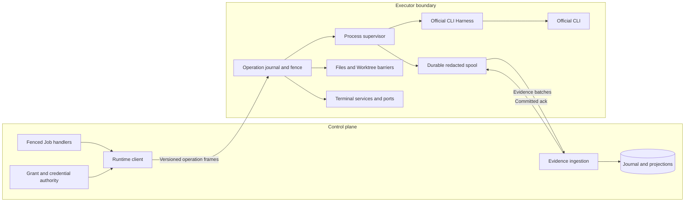
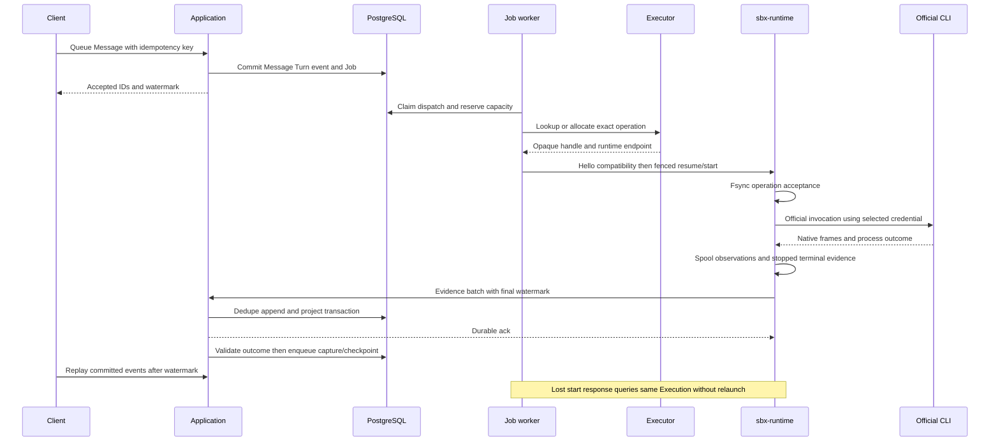

# Execution, runtime and official CLI Harness

**NORMATIVE.** [Domain](02-domain-model.md), [jobs/fencing](04-events-persistence-jobs.md), [security](06-connections-security.md).

## Three boundaries

| Boundary | MUST own | MUST NOT own |
| --- | --- | --- |
| Execution application | admission, capacity, Execution/lease lifecycle, authorization, recovery decisions | provider argv/parsers, reasoning, shell-script orchestration |
| Executor backend | allocate/lookup/describe/terminate, image boot, runtime connectivity, supported snapshot facilities | model selection, Messages/Turn outcomes, event normalization, Git delivery |
| `sbx-runtime` | durable operation acceptance/dedupe, fencing, process supervision, event spool/ack, Worktree/files/terminal/services/capture/checkpoint work | business database, global scheduling, remote merge authorization, agent reasoning |
| Harness adapter | official CLI credentials/config, invocation/ACP/official server, native context, event interpretation, capability and outcome reporting | Executor allocation, SBX Session identity, custom model requests or agent loop |

Initial topology is one daemon and Worktree per live lease. Multiple Turns reuse it sequentially. Services/terminal may coexist under declared policy. Backend handles MUST remain opaque operational metadata; no client or Session identity depends on them. Modal is first production; Local is an isolated development/test implementation of the same protocol, not a hosted multi-tenant security sandbox. BYO Runner is deferred enrollment UX around the same runtime, not a new Session engine.

Executor port methods MUST be `capabilities`, `allocate(spec, operation_id)`, `lookup(operation_id)`, `describe(handle)`, `connect_runtime(handle)`, `capture_filesystem(handle, prepared_manifest)`, `restore(spec, snapshot_ref, operation_id)`, `terminate(handle, operation_id)`. Backend-native pause/restore MAY be supported with evidence. Generic `exec` MUST NOT be part of the target application port. A backend MAY use a bounded boot command solely to start/install the daemon; provider Turns/files/services MUST use runtime operations.

AllocationSpec MUST contain Workspace/Session/lease IDs, allocation effect ID, lease generation, exact image digest, resource class, network policy, protocol range, scoped enrollment ref and selected compute Connection/version. Modal credentials stay in the executor worker. Discovery MUST use operation tags to adopt or terminate unbound allocations after a crash. It MUST NOT allocate a second runtime just because a response was lost.

## Harness contract

`runtime/harnesses/protocol.py` MUST define one provider-neutral interface. Methods return typed records or asynchronous official transport observations; the supervisor executes returned invocations. Transport families MAY share framing helpers, but a generic Codex event shape MUST NOT define provider semantics.

| Method / record | Contract |
| --- | --- |
| `describe() -> HarnessManifest` | provider ID, adapter version, exact CLI version/distribution digest, transport `jsonl|acp|official_server|text`, support tier, capability evidence, supported native-state versions |
| `prepare(context, credential_bundle) -> PreparedHarness` | isolated HOME/XDG and allowlisted config/materialization; validate model/effort/attachments/tools/approval support; never inherit host HOME |
| `start_turn(context) -> NativeInvocation` | official first-turn invocation or official protocol request; explicit cwd/env/stdin and prompt/file references |
| `resume_turn(context, NativeContextBinding) -> NativeInvocation` | explicit verified native ID/state; refusal on missing/incompatible state; no automatic new conversation |
| `normalize(frame, state) -> observations` | stable provider item/message-part IDs, partial/completed distinction, native IDs, tool/usage/diagnostic observations; unknown valid frames allowed |
| `classify_outcome(evidence) -> HarnessOutcome` | combines process stop/exit, provider terminal frames, cancellation/timeouts and framing; returns known success/failure/unknown plus separate credential-health impact and retry advice |
| `discover(context) -> CapabilityObservation` | official CLI discovery or connector-provided catalog metadata with source/time/scope; never perform user agent reasoning through a direct model API |
| `interrupt`, `steer`, `respond_approval` | optional only for verified capabilities; explicit ack/rejection and operation dedupe; native cancel plus supervisor fallback |
| `export_native_state(binding)`, `validate_native_state(manifest)` | state file allowlist, opaque native ref, provider/account affinity, compatibility digest; separates native transcript from auth files |
| `export_refreshed_credentials(base_version)` | optional supported refresh behavior, private allowlisted export; static keys MUST NOT write back |
| `release(prepared)` | scrub ephemeral credential/input files and report failures; preserve approved non-secret native state |

TurnContext MUST include Session/Turn/Execution IDs, attempt/effect identity, lease generation, Worktree generation/path, effective model/effort/instructions and their digests, attachment refs, ResultContract, deadline, native binding, credential-lease ref and allowed tool grants. The runtime MUST NOT trust arbitrary paths/env from a provider event.

HarnessManifest capability entries MUST use `supported|unsupported|unknown`, evidence ID/time, applicable CLI version, limitation and mode when relevant. Required names: `native_resume`, `native_state_export`, `account_portable_resume`, `event_stream`, `interrupt`, `steer`, `interactive_approval`, `mcp`, `skills`, `attachments`, `structured_output`, `model_discovery`, `effort_settings`, `credential_writeback`, `usage`. `structured_output` MUST distinguish native enforcement from prompt-only output; platform ResultContract validation remains independent. Available functionality is the intersection of installed CLI, adapter, runtime, selected Connection and authorized policy. Unknown is never enabled by default.

Codex, OpenCode, Claude Code, Devin CLI/ACP, Grok and Antigravity MUST fit this interface without pretending equal support. Initial production enrollment SHOULD prioritize verified OpenCode/Zen and optional Codex lanes. Having `claude.py` in current main does not establish registration or live support. Proprietary/distribution-limited providers remain disabled until install/auth/native-resume gates pass. Future version upgrades MUST run provider conformance and preserve explicit compatibility, not silently update binaries in an active Session.

Native context records MUST include `provider_id`, `native_id`, `lineage_id`, `cli_version`, `adapter_version`, `state_manifest_digest`, account affinity when required and checkpoint ref. A resumed CLI reporting a different native ID MUST produce `context_mismatch` and stop automatic continuation. Official CLI-server or ACP reuse MAY retain a native process across Turns if supported; process lifetime still belongs to the supervisor and does not redefine Session.

Usage MUST be optional and source-labelled. Missing token/cost data is null/absent, never synthetic zero. Observed tools/commands are activity evidence; undisclosed reasoning/internal tools MUST NOT be invented. No adapter may override cancellation precedence or declare business success before runtime supervision and application contract validation.

## Stable runtime protocol

Use authenticated TLS WebSocket at `/internal/runtime/connect`, outbound from the executor; Local MAY use loopback with the same frames. HTTP/PTY transport optimizations MAY be added only with identical authorization/operation semantics. Wire major starts at 1; minor additions are capability-negotiated. Breaking majors require explicit handshake rejection and image rollout. A mismatch MUST NOT trigger fallback to shell execution. The business API remains one `/api` surface.

`hello` MUST report lease ID/generation, runtime epoch, protocol range, image/runtime build digests, Harness manifests, recovered operation IDs, spool watermarks and health. Enrollment is one-use, lease-bound and short-lived; renewals require current DB authority. Runtime epoch identifies a spool incarnation; a restart with preserved local journal MUST retain it, while a new empty incarnation gets a new epoch and reports the gap.

Every mutating frame MUST carry `operation_id`, `operation_kind`, `session_id`, `lease_id`, `lease_generation`, resource fence/precondition, grant ID/expiry, payload schema version and request digest. Same operation ID/body MUST return the same durable status; same ID with different body MUST conflict. Job claim generation protects worker commits; lease/resource generation protects runtime changes. Operation effect identity stays constant when a Job is reclaimed.

| Frame/method family | Required fields/behavior |
| --- | --- |
| `operation.accepted/status/result` | local fsynced intent/status; query by operation or Execution; accepted→starting→started→terminal, with interrupted-start ambiguity preserved |
| `environment.prepare`, `worktree.restore` | exact manifests/source/config digests and staged readiness; no replace-live-tree shortcut |
| `turn.start`, `turn.resume`, `turn.status`, `turn.cancel`, `turn.steer`, `approval.respond` | IDs/native lineage/settings/credential lease refs; at most one mutating CLI; durable ack/terminal watermark |
| `events.batch`, `events.ack` | runtime epoch, contiguous local sequence interval, source timestamps/observations; ack only after control DB commit |
| `files.list/read/write/upload` | named root and relative path, size cap; writes require content digest/Worktree generation plus barrier |
| `changes.observe/capture/apply/export` | observed generation; capture barrier; apply exact base and subject digest; staged immutable upload manifest |
| `terminal.create/attach/input/resize/close`, `process.status/stop` | lease-local PTY/process IDs, scopes, bounded output; input denied during exclusive capture/snapshot barrier |
| `service.ensure/start/stop/status/logs` | declaration digest, allowed cwd/env/port/probe; supervised process groups; logs bounded and redacted |
| `snapshot.prepare/seal/abort`, `worktree.quiesce/release` | barrier token/generation, cleanup proof, native state export and spool watermark; no full memory promise |
| `health.report`, `lease.renew`, `runtime.shutdown` | heartbeat, actual active Execution, disk/spool pressure, grants/expiry; no domain verdict from heartbeat |
| `tool.request/result`, `credential.writeback` | narrow parent-authenticated callback or private credential channel; no general DB/vault RPC |

Operation acceptance MUST precede process launch. Acceptance alone is not proof launch did not occur: a crash between spawn and durable started record MUST cause process/native-state reconciliation or unknown outcome. The runtime MUST use supervised process groups and a bounded stop escalation, persist terminal evidence after stop, and include final local watermark. It MUST NOT relaunch an ambiguously accepted Execution. Cancellation signal delivery is not confirmed cancellation.

The daemon SHOULD use an on-disk transactional local journal/spool (SQLite WAL with explicit durable commits is permitted), in a protected runtime path outside the Worktree. It MUST bound event/trace/log buffers, disk quotas and frames; pressure stops intake/diagnoses work instead of discarding unacknowledged evidence. Normalized redacted observations are spooled before transmission. Optional raw traces are private, redacted and separately retained.

On transport loss runtime MAY finish the already authorized Turn until its execution grant expires; no new Turn starts without renewed authority. Lease expiry MUST stop mediated writes/start authority and attempt to terminate active processes. New claims MUST adopt the same Execution or prove old compute stopped/isolated before replacement. DB fences cannot stop arbitrary offline CLI effects; unverified old compute MUST remain quarantined and capacity reserved. A retained late spool MAY be imported as historical evidence via a read-only grant; it MUST NOT revive a terminal Turn or old lease.

## Key execution/recovery flow

Checkpoint sequence MUST acquire the exclusive Worktree barrier, block new mutators, stop/drain CLI and secret-bearing services/PTY processes, flush private supported credential refresh, scrub temporary HOME/env/cache paths, export allowed native state, flush spool and verify acknowledged watermark, upload/verify files, commit Snapshot manifest and Worktree pointer, then release/terminate exact lease. Failure leaves the prior checkpoint authoritative; live files may be newer and visibly unsaved. Pending Messages stay in DB and run after barrier completion/abort.

Restore MUST check owner/access, snapshot integrity, declared compatibility, Worktree generation and native binding. It starts fresh processes and services. Process memory, PTY sessions, sockets, undeclared shell daemons and external side effects MUST NOT be represented as restored. A lease-native filesystem snapshot is not necessarily portable; a portable checkpoint export MUST contain explicit file/native-state manifests.

## Files, terminal, services and preview

Paths MUST be root-relative and validated against traversal, absolute paths, symlink escape and archive extraction escape. Named roots are `worktree`, `attachments`, `exports`; runtime state and credential HOME are never generic file-browser roots. Reads are size-bounded observations. Historical files/diff come from immutable manifests without waking compute. Live GETs MUST report `executor_unavailable` when absent; activation is an explicit POST.

Initial terminal mutation policy MUST allow one user writer only while no CLI Turn or exclusive Worktree operation is active. Read attach MAY continue during work. Starting a Turn MUST revoke/drain writer input and obtain a runtime barrier; capture/checkpoint MUST also quiesce spawned processes that can mutate files. The daemon cannot perfectly police arbitrary sandbox code: if quiescence cannot be established, sealing MUST fail instead of claiming an atomic subject. Generation increments on completed mediated mutations and CLI boundaries; a captured manifest includes actual content digests, not merely a generation counter.

ProjectVersion service declaration MUST include name, argv (no shell interpolation unless explicitly configured), relative cwd, preferred port, health probe, env/secret binding refs, restart policy, startup order and preview flag. Runtime supervises restart/process groups/readiness and resolves ports; initial startup order is a list, not a DAG. Services MUST be stopped/quiesced for capture if they can write captured roots. Desired state persists across leases; each new realization gets a new ServiceInstance.

Preview MUST use a dedicated origin, owner-scoped authorization and an allowlisted current lease/service port. Proxy rechecks access/lease on each attach, supports WebSockets, strips product credentials/administration headers and blocks arbitrary host/port routing. Grants are short-lived and never query-string secrets. A stable Session/service URL resolves to the current authorized realization; it MUST NOT auto-allocate compute on GET. Services offline on release are explicit. Browser testing later is a service/dependency/tool capability with private screenshots/videos, never a Browser aggregate.
