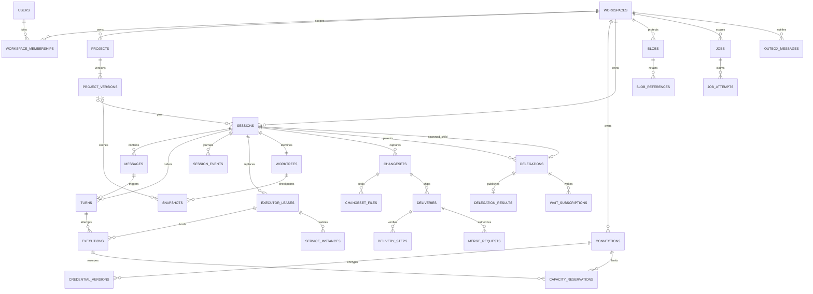
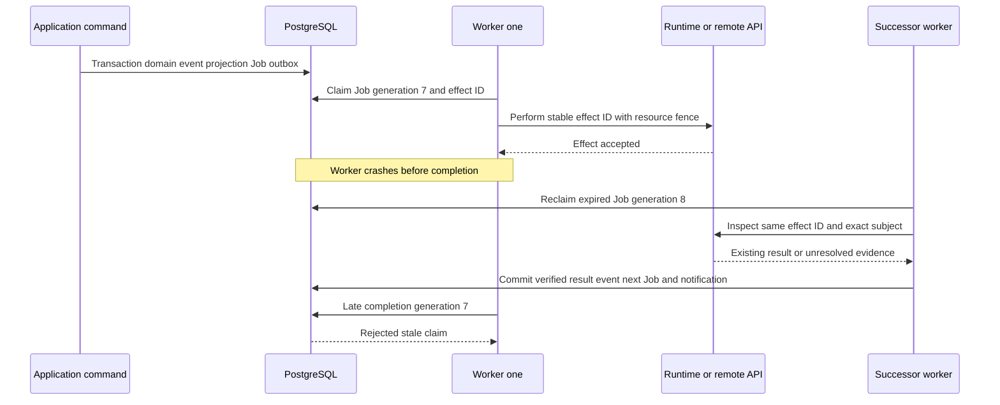

# Events, relational persistence and durable Jobs

**NORMATIVE.** [Domain owners](02-domain-model.md), [runtime](03-execution-runtime-harness.md), [delivery](05-changes-delivery-delegation.md).

## Persistence classes and transactions

PostgreSQL MUST be the production authority. Test fakes MAY implement ports; real PostgreSQL tests MUST exercise locking/uniqueness/claim semantics. Production MUST NOT use generic JSON namespaces, Modal Dict, filesystem stores or process-memory state as an alternate business authority. Initial deployment requires no Redis/Kafka/independent workflow service.

| Persistence class | Records | Normative behavior |
| --- | --- | --- |
| Append-only facts | `session_events`, effect/attempt evidence, published results | No ordinary update/delete; controlled retention/redaction uses explicit audited tombstone boundaries |
| Mutable synchronous projections | Session/Turn/Execution/Delivery/Delegation state, message parts | Updated atomically with corresponding Session journal facts; versions/CAS and terminal constraints |
| Mutable configuration/authorization | Project pointer, membership, Connection state, API keys | Typed rows and audit history; not reconstructed from Session events |
| Immutable manifests | ProjectVersion, ready Snapshot/ChangeSet, Blob metadata | Seal only after private content integrity/ownership verification; changed payload means new ID |
| Operational claims | Jobs, resource fences, reservations, target claims, dedupe | Transactional lock/CAS; increasing generation; never derived from activity text |
| Ephemeral observations | PID, PTY, port, health, live file listing, remote branch/check observations | Persist safe timestamped evidence where useful; refresh through Jobs; no durable identity assumption |
| Encrypted ciphertext | CredentialVersion, encrypted secret material | Separate access purpose and encryption lifecycle; never journal/event/job payload plaintext |

A Session command transaction MUST: authorize scoped rows; enforce request dedupe; lock Session/resource rows in defined order; verify lifecycle/versions/fences; mutate typed projection; allocate sequence and append events; insert deduped follow-up Jobs/outbox records; persist response IDs/watermark; commit. Publishing to clients occurs only afterwards. No external network/process call occurs under this transaction.

Projection reads MUST use a consistent transaction snapshot. A response containing entity state and `event_watermark` MUST represent the same snapshot; it cannot read the watermark after a later event whose state it omitted. Resource queries MUST NOT allocate, dispatch, settle, publish results, validate credentials or merge. Freshness appears as `observed_at`, pending operation and explicit refresh command.

## Committed Session journal

One sequence per Session MUST be allocated by locking the Session sequence row inside the transaction. The sequence starts at 1, is monotonic and contiguous for committed records before explicit retention. Rolled-back transactions consume no sequence. It orders committed facts, not physical time across Sessions. An event's UUID and Session sequence are distinct; clients use sequence for replay.

The envelope MUST contain `id`, `workspace_id`, `session_id`, `seq`, `type`, `schema_version`, `recorded_at`, optional `observed_at`, `actor`, `source`, `causation_id`, `correlation_id`, optional `turn_id`, `execution_id`, `executor_lease_id`, `lease_generation`, `delegation_id`, `changeset_id`, `delivery_id`, and typed redacted `payload`. Runtime source additionally contains `runtime_epoch`, `local_seq`, adapter/CLI version and optional private trace reference. Public trace URLs MUST NOT be embedded. Unknown extension event types MAY be skipped; incompatible envelope/schema majors MUST trigger resync/error, not arbitrary mutation.

| Canonical event names | Payload minimum / semantic owner |
| --- | --- |
| `session.created`, `session.settings_changed`, `session.archived`, `session.unarchived`, `session.closed` | pinned inputs/role or changed fields/lifecycle; Session application |
| `message.accepted`, `message.routed` | Message ID/ordinal/author/content refs; effective routing/Turn/Execution link |
| `message.part_added`, `message.part_updated`, `message.completed` | stable part ID/kind/revision, append delta or replacement explicitly distinguished, sealed revision |
| `turn.queued`, `turn.preparing`, `turn.started` | ordinal/triggering Message; resolved settings/Execution ref; preparing reason may be waiting capacity |
| `turn.cancel_requested`, `turn.succeeded`, `turn.failed`, `turn.cancelled`, `turn.interrupted` | actor/intent or single terminal verdict, error, result refs, evidence completeness |
| `execution.preparing`, `execution.started`, `execution.native_bound`, `execution.observed_terminal`, `execution.stopped` | attempt/version/native refs, provider result, process-stop evidence and final source watermark; evidence is not business success |
| `tool.started`, `tool.updated`, `tool.completed` | stable observed provider tool ID/name, bounded sanitized args/results or refs, completeness/status; not invented tools |
| `usage.observed`, `diagnostic.reported` | source/completeness/optional counts, categorized safe diagnostic and retry advice |
| `executor.bound`, `executor.quiescing`, `executor.released`, `executor.unavailable` | exact lease/generation/capabilities and reason |
| `worktree.restored`, `worktree.changed`, `worktree.apply_requested`, `worktree.applied` | generation/baseline/content refs; live change summary is observation, not sealed ChangeSet |
| `snapshot.requested`, `snapshot.ready`, `snapshot.failed` | kind/operation, manifest/recovery watermark or safe error |
| `changeset.capture_requested`, `changeset.ready`, `changeset.capture_failed` | pinned generation/Turn, subject digest/manifest or independent capture failure |
| `delivery.requested`, `delivery.progressed`, `delivery.blocked`, `delivery.succeeded`, `delivery.failed`, `delivery.cancelled` | Delivery ID, exact subject/target, verified step/state and reason |
| `delivery.merge_requested`, `delivery.merged`, `delivery.merge_failed` | merge operation ID, subject/expected remote head, gate evidence or failure |
| `delegation.created`, `delegation.waiting`, `delegation.result_published`, `delegation.failed`, `delegation.cancel_requested`, `delegation.cancelled` | child/pinned inputs/contract, subscription or immutable validated result |
| `service.requested`, `service.ready`, `service.degraded`, `service.failed`, `service.stopped` | lease-specific declaration realization/health; high-volume logs outside journal |
| Later: `automation.fired`, `webhook.dispatched`, `extension.observed` | definition version/occurrence or receipt ID; bounded namespaced extension payload |

Connection/credential audit and internal Job renewals MUST NOT flood Session history. Only user-relevant consequences are Session events. PTY/log chunks and provider raw traces stay bounded private streams/blobs. Native provider `turn.completed` is `execution.observed_terminal` evidence, never a direct public terminal verdict.

Runtime source dedupe MUST be unique on `(executor_lease_id, runtime_epoch, local_seq)`. Ingestion authenticates source Session/ownership/current fence, validates contiguous ranges and schemas, redacts, inserts unseen evidence and synchronous message/activity projections, and advances the durable source ack in one transaction. Duplicate evidence yields the same ack. Conflicting payload for the same tuple is an integrity error. Ack means DB committed, never received-in-memory. A terminal evidence record's final watermark MUST be fully ingested before normal success; incomplete evidence MUST be represented explicitly and MUST NOT enable automatic Delivery.

Application terminalization MUST additionally verify current Turn state/cancellation order, Execution identity, confirmed process stop, native-context validity and ResultContract. Multiple worker completions MUST produce exactly one terminal event/verdict. Late evidence from a fenced lease can be retained historically through a restricted import path, without changing terminal outcomes.

SSE uses `id=seq`, `event=type`, `data=envelope`; reconnect uses `after` or `Last-Event-ID`. Both present and unequal MUST reject with `invalid_cursor`. Filtering event types/Turn MUST still report the scanned Session watermark so clients do not mistake filtered gaps for data loss. Retention expiration returns `history_reset_required` with current snapshot/watermark and earliest available sequence. Notifications are wake hints; clients/backends always replay DB journal. Default stream heartbeats MAY be 15 seconds; buffering latency is measured, not a correctness shortcut.

## Relational tables and invariants

Use explicit FK columns, ownership, state, searchable identity, ordinals, digests, fences and refs. JSONB MUST be limited to versioned payload/spec/capability/result extensions; fields required for authorization, constraints and gates MUST be typed columns. All owned FKs SHOULD be composite `(workspace_id, id)`; exceptions require explicit scoped grants. IDs and creation times are mandatory in each table.

| Table(s) | Required key columns and constraints | Class / indexes |
| --- | --- | --- |
| `users`, `password_credentials`, `email_verifications`, `login_sessions`, `api_keys` | unique normalized email; password algorithm/hash; token/key hash unique; expiry/revoked/version | auth config; user/expiry indexes; no plaintext product passwords/keys |
| `workspaces`, `workspace_memberships` | personal owner unique initially; `(workspace_id,user_id)` unique; role/status | authorization rows; scoped membership |
| `projects`, `project_versions` | `(workspace_id,slug)` unique; `(project_id,ordinal)` unique; current-version FK constrained to same Project; repo ID, input digest | mutable pointer / immutable versions |
| `connections`, `credential_versions`, `connection_observations` | kind/principal/state/current credential FK; `(connection_id,ordinal)` unique; observation credential-version FK and verified timestamp | mutable metadata/ciphertext versions; kind/state/principal indexes |
| `secret_bindings`, `secret_versions`, `credential_grants`, `refresh_claims` | purpose/allowed-principal/role refs; encrypted material; grant lease/version/revocation epoch/expiry; exclusive refresh claim | private security lifecycle; due/active version indexes |
| `sessions` | lifecycle/role/project-version/Harness binding, effective-spec digest, version, `next_event_seq`, `next_message_ordinal`, `next_turn_ordinal`; active Turn/lease projection refs | typed current view; `(workspace_id,updated_at,id)`, project/lifecycle/labels indexes |
| `messages`, `message_parts`, `turn_messages` | Session ordinal unique; triggering authored content immutable; part ID/revision/sealed; Turn/Message relation for acknowledged steer | accepted input plus streaming output projection; source Message FK |
| `turns` | `(session_id,ordinal)` unique; triggering Message unique; retry-of FK; state/reason/result/error; cancel intent/version | partial unique Session where state in preparing/running/cancelling; terminal update guard |
| `session_events`, `runtime_ingestion_offsets` | `(session_id,seq)` unique; event ID unique; source tuple unique where runtime; ack by lease/epoch | append-only facts; Session/Turn/causation indexes; mutable contiguous ack |
| `executions`, `native_context_bindings` | `(turn_id,attempt_ordinal)` unique; operation ID unique; lease/runtime epoch/state/final watermark; lineage/native ID/provider/account affinity/compatibility | partial unique nonterminal Execution per Turn; immutable terminal evidence; binding history |
| `executor_leases`, `resource_fences` | Session/backend/handle/allocation operation ID; generation/holder/expiry/status; named resource epoch | partial unique Session lease allocating/ready/quiescing; unique allocation effect; expiry index |
| `capacity_reservations` | Workspace, Connection, slot ordinal, Execution/lease FK, state/expiry | unique active `(connection_id,slot_ordinal)`; scoped compute quotas; release only confirmed safe |
| `worktrees`, `worktree_operations` | Session unique; repository/base/generation/last checkpoint; operation/fence/expected generation/type/state | partial unique active barrier per Worktree; current pointer CAS |
| `snapshots` | kind/state, ProjectVersion or Worktree/generation exclusive, input/content digest, manifest/blob/backend refs, compatibility/watermark | ready immutable; environment cache key scoped Workspace; XOR owner-kind check |
| `blobs`, `blob_references` | Workspace/storage key/digest/size/class/state; typed referencing entity and retention policy | sealed immutable metadata; references mutable; private logical ownership even if backend dedupes |
| `changesets`, `changeset_files` | Worktree/Session/source Turn/gen/base/head/tree/content digest/eligibility; `(changeset_id,path)` unique with mode/type/content digest | immutable ready content; source Turn/generation/digest capture dedupe |
| `deliveries`, `delivery_steps`, `delivery_target_claims`, `merge_requests` | ChangeSet/digest/target/policy/principal/preconditions/state; step kind/effect ID/expected/result refs; target claim generation; merge expected head/base and state | Delivery mutable; step evidence append-only; unique active repository/ref-or-PR claim |
| `delegations`, `delegation_inputs`, `delegation_results`, `wait_subscriptions` | child Session unique; parent/role/state/contract digest; typed immutable input refs; completing Turn; result subject digest/head/verdict typed; waiter predicate/deadline/state | parent/state index; one published final result per Delegation; waiter wake dedupe |
| `service_desires`, `service_instances` | Session/name/declaration digest/desired state/version; instance Session/name/lease-generation observed state/health | desire unique `(session_id,name)` persists stop/start across leases; instance `(session_id,name,lease_id)` unique; realization history |
| `jobs`, `job_attempts`, `outbox_messages`, `command_deduplication` | target family/FK, kind/effect ID/dedupe/payload version, due/priority/deadline/claim gen/holder/expiry; attempt evidence; destination/subscriber event ref; principal/workspace/command/key/fingerprint | unique active Job dedupe; unique effect IDs; due/claim-expiry indexes; command replay record |
| `audit_records` | actor/scope/action/purpose/target version/safe result/time | append-only safe security/admin audit; never secret bodies |
| Later: `execution_presets`, `skill_manifests`, `tool_definitions`, `extension_packages` | immutable content/version refs and scope permissions | convenience/packaging, not work execution state |
| Later: `automation_definitions`, `automation_occurrences`, `webhook_endpoints`, `webhook_receipts` | definition/version/target/due policy; unique occurrence; authenticated receipt/event/body ref | trigger config/inbox; execution goes through ordinary Jobs/Messages |

Jobs MUST have a validated target family and exactly one matching typed target FK (for example Turn, lease, Snapshot operation, Delivery, Delegation, Connection or service). Polymorphic unvalidated target text is insufficient. A command initially creating an operation MAY use its durable operation row as target. No FK to a generic legacy namespace is allowed.

`outbox_messages` is for committed notifications/webhook deliveries and waiter wakeups; Jobs are the durable command/effect outbox. Both use the same claim/retry protocol; neither is a second worker authority. Internal Job attempt generation is distinct from lease/resource fencing and native Execution attempt.

Application MUST enforce same-Session triggering Message, retry link and active refs; child genealogy acyclic; input/subject ownership; exactly one Snapshot kind owner; supported state transitions; terminal immutability. DB constraints MUST enforce uniqueness/FKs/XOR/partial-active conditions wherever feasible. Gate-critical result fields (`subject_digest`, head, verdict, validation status, author/child refs) MUST be typed, not inspected from arbitrary JSON at merge time.

Lock order SHOULD be Workspace/quota → sorted Connection IDs → sorted Session IDs → Worktree → lease/Execution → Delivery target → Job. Cross-session commands sort IDs. No waiting on runtime while holding locks. Deadlock/serialization retries MUST reuse command/effect IDs and fingerprint.

## Durable Job and claim protocol

All slow/recoverable actions MUST use one Job mechanism. Required kinds: `turn.dispatch`, `execution.reconcile`, `executor.allocate`, `executor.reconcile`, `executor.release`, `environment.build`, `worktree.restore`, `snapshot.capture`, `changeset.capture`, `changeset.apply`, `delivery.perform`, `delivery.reconcile`, `delivery.merge`, `delegation.publish_result`, `delegation.wake_waiters`, `delegation.cancel`, `connection.validate`, `connection.provision`, `credential.refresh`, `service.ensure`, `service.stop`, `retention.cleanup`; later `automation.fire`, `webhook.dispatch`, `outbox.deliver`. Handlers MAY combine adjacent steps within one resumable Job, but MUST record exact step/effect identities and checkpoints.

Job states are `queued`, `claimed`, `retry_wait`, `succeeded`, `failed`, `cancelled`. Due queued/retry rows are claimed with `FOR UPDATE SKIP LOCKED`; claim increments generation and inserts JobAttempt atomically. Expired claimed rows are reclaimed into a reconciliation attempt with a higher generation. Renew/complete/retry/fail MUST compare ID, holder, generation and expiry and relevant resource fence. Stale worker completion MUST be rejected even if the external call succeeded; successor inspects that same effect ID.

Each Job MUST include Workspace/target ownership, safe versioned input refs, priority, effect/dedupe identity, due time, attempt limit, absolute deadline, last categorized error and claim. Credentials MUST be resolved at the actual boundary after reauthorization, never serialized in Job inputs. Cancellation/cleanup SHOULD outrank new dispatch. Waiting for child results/capacity/checks releases the Job claim into a due/predicate continuation; no worker sleeps with a transaction or owns a permanent domain loop.

Delivery/GitHub/notifications are at-least-once. Exactly-once remote execution MUST NOT be claimed. Deterministic refs, remote head preconditions and effect discovery handle ambiguity. Ambiguous effect without sufficient evidence stays blocked/reconciling; it MUST NOT speculatively create another PR or repeat an unknown agent prompt.

Dedupe keys MUST be scoped `(principal_id,workspace_id,command_kind,key)` with canonical request digest. Same request returns committed IDs/response; changed body returns `idempotency_conflict`. Automatic command retry windows MUST be documented; destructive/irreversible effect identities and receipts MUST persist for the resource's retention lifetime. Resource constraints still prevent duplicate effects after request-cache expiry. Job dedupe is `(kind,target_id,intent_version)` or exact occurrence ID; reconciliation poll cycles do not invent new business intents.

Retries MUST use bounded exponential backoff with jitter, connector retry-after, maximum attempts and deadline. Pre-start transport failure is safe; after possible launch reconcile first. Invalid/revoked credentials block until replacement; unsupported settings fail validation; rate limiting delays only after confirming capacity safe to release; unknown effects quarantine. A timer MAY enqueue due deduped reconciliation/cleanup Jobs, but MUST NOT mutate Session/Delivery state directly. An actor loop MAY optimize latency only by invoking the same DB-authoritative commands and claims.

## Recovery and retention obligations

| Failure window | Required durable behavior |
| --- | --- |
| API dies after Message commit | Same key returns IDs; queued Job survives and is claimed |
| Allocate result lost | discover by allocation effect, bind with current fence or terminate exact orphan |
| Runtime start ack lost | inspect existing operation/Execution; no blind prompt replay |
| Worker claim expires while CLI runs | adopt/renew under current authority or stop/quarantine; retain provider reservation |
| Event ack lost | replay identical source tuples; exactly one committed Session event per observation |
| CLI stopped but contract/capture failed | separate known Turn verdict, result validity and capture/checkpoint outcomes |
| Runtime disappears before final evidence | interrupted/unknown; history remains; restore only last verified checkpoint after isolation |
| Snapshot races follow-up | accepted Message remains queued; barrier serializes resume/dispatch |
| Push/merge response lost | verify exact target/head/merge evidence, preserve ambiguity if unprovable |
| Credential replaced during refresh | old-version CAS rejected; revoked connection stays revoked |

Retention policy MUST distinguish journal, ciphertext, native context, checkpoints, environment cache, ChangeSets, attachments, raw traces, logs and dedupe/effect records. Shipping/reference-visible manifests MUST remain readable or explicitly tombstoned. Blob cleanup MUST use reference accounting and grace periods, and target exact object IDs; an upload not referenced after failed seal is collectible. Private storage access MUST reauthorize current Workspace ownership. Content hash possession is insufficient.

Journal deletion/redaction for retention/privacy MUST record a controlled boundary so replay cannot reintroduce erased content. Offline projection rebuild MUST use versioned reducers and retained baseline snapshots, compare counts/versions/digests, and complete before serving affected authority. Background asynchronous projections MAY serve search/analytics but MUST NOT decide admission/merge/cancellation. Metrics MUST cover queue lag, expired claims, quarantined leases, spool backlog, incomplete evidence, snapshot/capture failures, unresolved effects and credential-version conflicts without exposing secret payloads.
