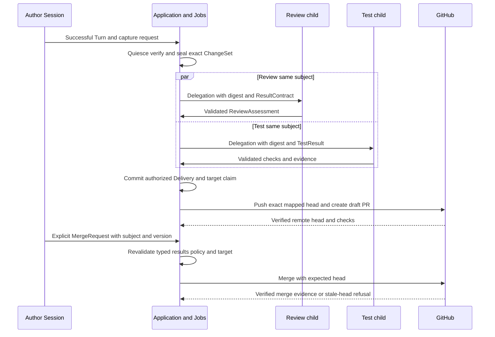
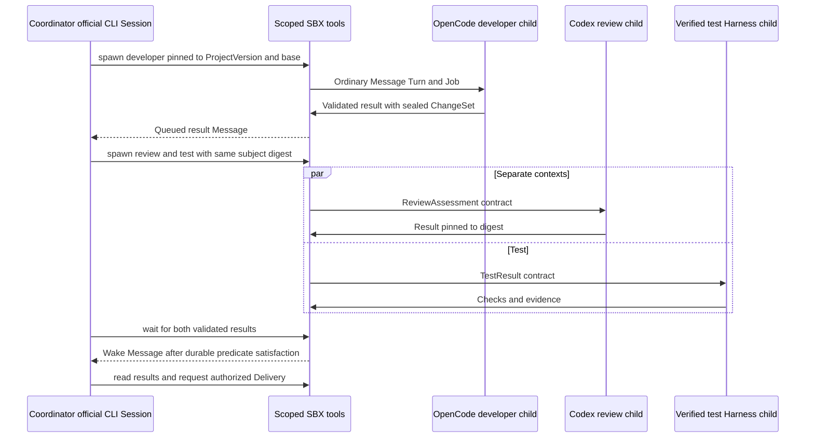

# ChangeSets, Delivery and generic Delegation

**NORMATIVE.** [Domain](02-domain-model.md), [jobs](04-events-persistence-jobs.md), [tool surface](07-extensions-automation.md).

## Mutable files versus immutable subject

Worktree MUST represent current mutable logical files; live Changes is an observation. A ChangeSet MUST be sealed immutable content, independently readable and deliverable after author compute disappears. Snapshot preserves environment/native resume state and MUST NOT stand in for a review subject.

Capture MUST be a Job with `source_turn_id` where applicable, expected Worktree generation, baseline and purpose `automatic|explicit|salvage`. Runtime takes a quiescent barrier, enumerates tracked/untracked/deleted/renamed/binary files within allowed roots, excludes credential/runtime/generated dependency roots per capture policy, produces canonical paths/types/modes/content digests plus patch/bundle or file blobs, and reports a verified manifest. Application seals only after ownership, object integrity, secret exclusions and barrier generation checks pass. A pending/failed capture MUST NOT create a fake ready ChangeSet.

Canonical `subject_digest` MUST be SHA-256 over a versioned canonical manifest: repository identity or projectless namespace, baseline digest/base SHA, exact resulting file paths/types/modes/content digests, optional Git head and tree, and payload manifest version. Content blobs MUST be independently hash-verified. File ordering is normalized; timestamps/remote URLs are excluded. An implementation MUST publish golden digest vectors in replacement specs. Commit rewrite changes subject identity even if its tree is equal; patch-to-commit mapping below is an explicit exception for a subject captured without head.

ChangeSet columns MUST include `manifest_version`, `subject_digest`, source Session/Turn, Worktree generation, baseline/base SHA, optional head/tree SHA, capture origin, `automatic_eligible`, file manifest and private payload refs. Eligibility MUST be false for failed/cancelled/interrupted or manually salvaged work. An explicit user authorization MAY ship salvage under current policy; automatic shipping MUST require durably succeeded Turn, complete terminal evidence, ready capture and pinned authorization. Capture/checkpoint failure MUST NOT rewrite a succeeded Turn.

Application of a child/imported ChangeSet MUST pin destination Worktree generation and baseline digest, reject mismatch/conflict without partial writes, stage atomic filesystem changes under barrier, and produce a new generation/event. Conflict resolution requires an ordinary official CLI Turn or integration child Session and creates a new ChangeSet. A child is never allowed to mutate its parent's Worktree implicitly.

## Delivery intent and steps

Delivery MUST be created before any external effect. It pins one ChangeSet/digest, target repository/ref/optional existing PR, transport `export|git_branch|pull_request|direct_base`, ShipPolicy version/value, authorizing principal, Connection selector, expected remote head/base and effect IDs. Credential plaintext/version is resolved at each actual effect boundary under current authorization. A replaced credential MAY serve a retry with a recorded new version; revoked authority blocks it.

Default shipping is branch with optional draft PR. Direct-base push MUST be opt-in policy with branch protection/precondition checks and the same exact-subject requirements. Custom Ship instructions MAY create a preparing Turn; the resulting capture and authorized Delivery remain distinct resources. SBX MUST NOT infer push/PR success from assistant text or successful CLI exit.

ShipPolicy MUST explicitly define transport/default target/base branch, draft preference, automatic-delivery permission, required result roles/counts, independence policy, required check names, accepted merge methods, and `require_base_unchanged`. Initial defaults are no automatic merge, branch/draft PR, one independent approving ReviewAssessment, required checks declared by Project, and `require_base_unchanged=false`. Current mandatory policy may tighten these. With base stability false, the target branch may advance while the reviewed subject's own baseline/head stays immutable; conflict resolution or rewriting that subject still requires new capture/review. With base stability true, pin the remote base SHA and enforce it atomically or block as unsupported.

| Delivery step | Before call | Recovery / success evidence |
| --- | --- | --- |
| Verify/materialize payload | sealed digest and blobs; authorized target; optional Git head | verify existing commit/bundle or deterministic patch commit map; never capture current live files |
| Push branch | deterministic ref, recorded expected old SHA, intended exact new SHA | remote `ls-remote`/API verifies intended SHA; update uses expected-head CAS/lease; unrelated remote change blocks |
| Create/update PR | stable target/base/ref association and Delivery marker; intended head | discover remote PR by association after ambiguous response; persist ID/url/head; no speculative duplicate |
| Reconcile checks/status | exact repository/PR/head and policy names | timestamped head-scoped CI/draft/protection state; blocked reason and next Job |
| Export | private manifest and authorization | private verified object; bounded download grant; no public-by-hash access |
| Merge | separate authorized MergeRequest; exact head/base/version/gates | provider expected-head merge precondition and verified merge result/ref; ambiguity stays unresolved |

Stable Git refs SHOULD be `sbx/<session-id>/<changeset-id>`; an explicit update of an existing PR MUST create a new Delivery with its own expected old head and new subject. `delivery_target_claims` MUST serialize all platform mutations of one repository/ref or PR with increasing generation. External actors can still change it, so every step MUST recheck actual remote preconditions. Plain unconditional force-push MUST NOT be used. Side effects performed manually/by agent may be recorded as external evidence after verification; they MUST NOT bypass Delivery authorization or qualify as platform success merely because they exist.

Patch-only Git ChangeSets MUST materialize a deterministic commit from pinned baseline, exact resulting tree, explicit author metadata/message and stable timestamp policy, recording the mapping in delivery-step evidence. Review pins the original manifest digest; the gate MUST verify that mapped commit implements exactly its baseline/tree/payload. A ChangeSet with head already present MUST deliver that exact commit. Rebase, added fix, conflict resolution, amended metadata on an already head-pinned subject or base rewrite MUST create a new ChangeSet and require fresh assessment. A reviewed diff against one base does not authorize an unrelated base.

Delivery `succeeded` means its declared export/push/PR transport is verified; it does not mean merged. `merge_requests` are subordinate durable platform operations using the same Job/claim protocol, with states `pending|executing|blocked|succeeded|failed|cancelled`, and one active request per Delivery. Failed Delivery/merge retries preserve subject/target and effect IDs, append attempts and inspect existing remote effects. They MUST NOT rerun the coding Turn. Cancellation can prevent remaining steps but cannot undo a verified push/merge; completed effects remain history.

## Merge gate

`delivery.merge` application MUST calculate eligibility from typed projections and current remote observations. The API exposes reasons/freshness, but the worker MUST revalidate immediately before effect. Minimum checks:

1. Caller is authorized for Workspace, target Connection and merge; explicit MergeRequest has expected Delivery version/subject/head/base and selected merge method.
2. ChangeSet is sealed/integrity verified; selected Delivery's verified remote PR/head equals the mapped exact subject and pinned target/base.
3. Required DelegationResults have validated contracts, approving verdicts or passing required tests, exact subject digest/head where present, independent child lineage and policy-required execution isolation. Required counts/roles come from pinned ShipPolicy.
4. No required requested-changes result for that subject remains unresolved under the policy. Supersession MUST be explicit by a new assessment/assignment; timestamps alone do not erase findings.
5. Required remote CI checks are complete/successful for that exact remote head, draft/protection/mergeability rules pass and observations are fresh.
6. Current policy has not become stricter or revoked authority. Effective gate is the conjunction of pinned intent policy and current mandatory Workspace/Project security policy; loosening requires explicit new authorization, never silent drift.
7. Target claim/fence is current and provider merge call enforces expected head. If required base stability cannot be atomically enforced by the remote provider, the operation MUST block or use a verified provider mechanism that enforces it.

Remote head drift MUST block merge even if Console displays approval. A historical assessment is immutable; `stale` is a derived comparison with selected subject, never a correctness-critical mutable flag. Remote effect failure/ambiguity MUST remain independent of Turn success and reviewer success.

## Generic child work

Review, Test, Research, Security and Integration MUST be ordinary Sessions created by Delegation. There MUST NOT be an independent hosted Review executor/state machine. Roles are policy/instruction/result-contract values. A human assessment product MAY later add a result acquisition path, but MUST NOT add another agent execution engine.

Spawn command MUST atomically create child Session, Worktree identity, Delegation, pinned inputs, initial Message/Turn and dispatch Job. Inputs MUST reference immutable ChangeSets/blobs/repository SHAs and an explicit context summary, never a live parent path. The child gets its own native context and working copy. Parent→child relation is acyclic and child has one spawning parent; Harness-switch context handoffs MAY use `linked_from_session_id` without implying a Delegation.

ResultContract MUST contain `kind`, `schema_version`, schema/digest, enforcement, required subject pins, evidence requirements and completion policy. Initial kinds SHOULD be `ReviewAssessment`, `TestResult`, `ResearchResult`, `IntegrationResult`, `GenericResult`. Child completing Turn MUST be succeeded with valid output; platform validates ResultContract/subject/child identity and publishes one immutable final result. Assistant text or a user-entered verdict is insufficient. Missing/malformed result yields failed Delegation and safe parent notification, never approval. Schema extensions are versioned; gate-critical fields are typed.

ReviewAssessment MUST contain subject digest, optional head SHA, child Session/completing Turn, verdict `approve|request_changes|comment`, findings with severity/message/path/line when known, checks with status/evidence refs, and validation provenance. TestResult MUST pin subject/environment inputs, commands/check identifiers, pass/fail/unknown, exit evidence and logs/blob refs. Review independence MUST mean distinct child Session, native lineage, Execution and isolated Worktree; using a different provider/account is not proof of a different human. ShipPolicy MAY require additional reviewer principal restrictions. Reviewer gets no automatic shipping grant; shell writes in its own copy cannot change the pinned parent subject.

| Primitive | Durable API/tool semantics |
| --- | --- |
| `spawn` | idempotent child + assignment + attenuated grant; returns Session/Delegation IDs |
| `send` | append addressed Message after checking target access; sender and source Message/Turn preserved; optional queue/verified steer |
| `wait` | persist predicate over validated result/terminal state, expiry and wake target; release Job claim, never sleep in transaction |
| `read/result` | pure authorized projection/history/result lookup, paged and bounded |
| `cancel` | cancellation intent for owned child or explicitly scoped subtree; Jobs propagate stop; no unrelated Session cancellation |
| `transfer` | explicit private blob/ChangeSet capability and destination; application is separate with base/generation preconditions |

WaitSubscription states MUST be `pending|satisfied|expired|cancelled`. A satisfaction transaction records predicate evidence and outbox wake Message dedupe `(subscription_id,result_version)`. Registration MUST check already available result in the same transaction, preventing missed wakeups. Durable wait does not imply the official CLI can suspend mid-tool. Portable usage returns a subscription handle, completes current Turn, and queues a parent follow-up when ready. A bounded synchronous tool wait MAY hold active CLI/provider capacity and MUST report that cost; capacity cannot be released while inference/processes remain active.

Delegation budgets MUST cap depth/children, active leases/provider slots, wall-clock deadline and declared cost limits where measurable. Spawn cannot expand parent authority. Cross-Project work reauthorizes both project inputs and chosen Connections; shared Workspace membership alone cannot expose personal provider credentials. Parent close defaults to cancelling owned unfinished descendants; `finish_detached` MAY be explicitly authorized. Archive pauses future parent-triggered dispatch without silently killing active children. Child completion, result publication and waiter notification MUST survive API/worker restart.

## Cross-CLI Coordinator

A Puck-like Coordinator MUST be an ordinary Session role/preset whose selected official CLI plans via these tools. It MUST NOT be a special actor with private scheduler/DB state. Native provider subagents remain Harness-local observations unless explicitly spawned through SBX. Later declarative Workflow recipes MAY compile into these primitives and Jobs; an independent DAG runtime, node state machine or recovery authority is forbidden.
