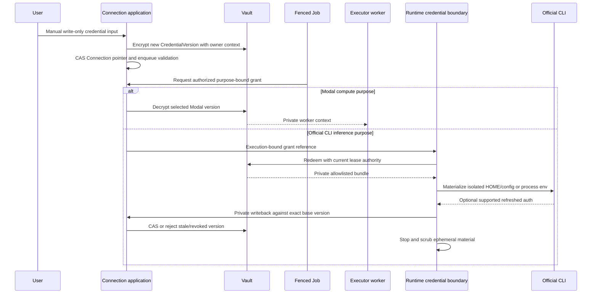

# Connections, credential materialization and security

**NORMATIVE.** [Domain](02-domain-model.md), [runtime](03-execution-runtime-harness.md), [schema/claims](04-events-persistence-jobs.md).

## One Connection domain

Product auth MUST use email/password with verified email, hashed passwords, bounded login/rate-limit/verification flows, secure cookie login sessions and scoped hashed product API keys. External OAuth is not required to create an account or run the initial product. Cookie and API key authentication MUST resolve the same `Principal(user_id, workspace_ids, scopes, auth_epoch)` and resource policy. Cookie mutations require CSRF and origin validation. Keys return plaintext once at creation; stored credentials are hashes, never decryptable product passwords.

All external accounts MUST use Connection + separate CredentialVersion, including compute and source control. GitHub/Modal MUST NOT form a parallel Integration domain. Integration modules are effect/connector implementation boundaries only. Manual baseline is Modal token pair, GitHub token, OpenCode Zen key, with optional Codex native auth. Not every Session needs every connection: public/projectless work may omit GitHub; Local tests require no Modal; Codex is never mandatory onboarding.

| Connection `kind` | Manual acquisition | Exact plaintext destination / forbidden destination |
| --- | --- | --- |
| `modal` | owner submits token pair through write-only input | selected executor worker context only; NEVER runtime, CLI HOME, Project env or snapshot |
| `github` | owner submits personal token | Delivery/integration worker; purpose-bound Git clone helper only if needed; NEVER credential-bearing repository URL/argv or shared image |
| `opencode_zen` | owner submits API key | OpenCode's verified allowlisted config/env in isolated runtime execution; static key MUST NOT export/write back |
| `codex` | optional native auth bundle with verified supported paths/format | selected official CLI ephemeral credential home or connector refresh flow; no host-file fallback |
| Provider-native future kinds | supported manual bundle/key first, later optional OAuth/device acquisition | provider-specific declared boundary, same encrypted/versioned lifecycle |

Metadata MUST include Workspace, creator/allowed principals, label, kind, acquisition method `manual|native_upload|oauth|device`, state/version, current credential ref, external safe identity, capability observations/time/scope and cooldown. Connection configuration states are `configured|disabled|revoked`; observed health is separately `unverified|verifying|ready|degraded|reauth_required`. Replacement invalidates old health/catalog observations. A connector that can read one repo MUST NOT claim universal PR/merge permissions; capability observations MUST be resource/purpose scoped and expire.

Disconnected/revoked Connections retain tombstones. Explicitly disconnecting manual GitHub or Modal MUST NOT fall back to an old App installation, OAuth grant, global environment token, another principal's account or operator credentials. Selectors only consider explicit authorized configured candidates; absent capacity/auth returns an actionable reason. Multiple connections of a kind are supported, with policy-constrained priority/cooldown and transactional slots. Account-portable resume is a Harness capability, not an assumed property of subscription accounts.

## Ciphertext, grants and boundary materialization

CredentialVersion MUST store Connection ID/version, encrypted payload/format, key ID, nonce/tag, associated ownership context, creation/expiry/revocation and safe fingerprint metadata. Use authenticated envelope encryption; encryption master/keyring stays outside DB/backups/runtime and supports bounded key rotation. AAD MUST bind Workspace, Connection, CredentialVersion and format. Secret binding material uses the same vault mechanics with explicit principal/role/service/purpose restrictions. No plaintext appears in events, Job payloads, logs, fixtures, Console persistence or object manifests.

CredentialGrant MUST bind purpose, Connection/version, principal, Session/Execution/lease where applicable, expiry, revocation epoch and allowlisted materialization schema. Grant redemption rechecks current authority. It MAY be retryable only by the same bound operation on its authenticated private channel; it MUST NOT be a transferable product credential. Leases/grants are metadata, not blobs containing all connections.

Runtime MUST materialize only selected provider credentials into ephemeral isolated HOME/XDG (directories 0700, files 0600), separated from Worktree and approved native state. When a CLI couples auth and history paths, the adapter MUST construct a verified temporary merged layout or mounted allowlist and export only approved native state. CLI process env is an explicit allowlist; no `os.environ` inheritance or ambient credential discovery. Control/platform DB keys, vault keys, Modal administration credentials and unrelated Connections MUST never enter the sandbox.

Git cloning MUST use a purpose-bound helper/private channel, not username/token URLs, logs or CLI args. Setup/package access and service secrets require separate bindings; inference credentials MUST NOT be handed to every service. Untrusted project code/official CLI can inspect credentials explicitly permitted in its environment; SBX MUST not present runtime evidence as tamper-proof attestation. Runtime management/grants still deny other Sessions, owners and platform authority.

Known-secret redaction MUST occur before spool/trace/public error emission. Structured fields MUST also be filtered; substring replacement alone is insufficient for accidental env/header dumps. Raw traces are optional, bounded, private and redacted. All credential examples/fixtures MUST use `REDACTED`. Auth bundles/archive uploads MUST enforce provider/path allowlists, traversal/symlink/size limits and format validation; opaque unknown formats are refused. Submitted secrets MUST be cleared from UI fields and never cached by browser service workers/query stores.

## Replace, revoke and optional writeback

Replace MUST atomically append CredentialVersion, CAS Connection version/current pointer, increment revocation epoch, invalidate observations/catalog and grants, and enqueue validation/affected-runtime cleanup. Already started processes may have read old material; ongoing effects must reauthorize, and policy MUST stop/re-materialize affected runtime processes before future work. Revocation MUST prevent decrypt/materialization/new effects immediately, fence queued Jobs and enqueue exact-lease cleanup. Local cleanup and provider-side remote token revocation are distinct statuses; one MUST NOT imply the other.

Writeback MUST be disabled unless connector/Harness capability proves it. Static keys never write back. Supported refresh MUST export only allowlisted fields over a private channel and CAS `(connection_id,base_credential_version,connection_version,revocation_epoch)`. Stale export is discarded safely; it MUST NOT overwrite manual replacement, re-enable disabled/revoked state or use generic newer-expiry/last-writer-wins merging. Rotating refresh tokens require exclusive `refresh_claims` and provider-supported sharing semantics; slots MUST be restricted if concurrent refresh safety is unverified. Broker-managed Codex refresh remains connector-owned, not a competing runtime refresher.

Revoked ciphertext MAY be retained encrypted for a bounded audit/recovery policy, but MUST be undecryptable by ordinary effects. Security audit stores target/version/purpose/actor/result, never secret material. Account deletion MUST revoke product sessions/keys/grants, destroy or schedule destruction of credential ciphertext, and apply private data retention rules. Secret-free checkpoint verification must stop secret-bearing processes and exclude credential/env caches; no memory snapshot is allowed under a claim that deleting files scrubbed RAM.

## Access and transport boundaries

| Surface | Required authorization and isolation |
| --- | --- |
| Business resource | Principal + Workspace ownership + resource/action scope; cross-owner denial SHOULD be 404 |
| Runtime enrollment/management | exact lease/Session generation, protocol audience, short expiry and operation allowlist |
| Agent tool callback | attenuated Session/Delegation grant, target authorization and budgets; no arbitrary vault/DB access |
| Files/terminal | named root/lease grant; separate read versus input scope; barrier/content preconditions |
| Preview | dedicated origin, owner-scoped access and current service allowlist; no Console cookies forwarded to app |
| Blob/native state | private storage with current owner access and bounded download grant; hashes are not capabilities |
| Webhook later | connector signature/authenticated receipt, body limits, replay window and durable dedupe |
| Local/BYO later | explicitly authorized served roots/user; Local is development only; BYO owner trust/capabilities explicit |

No automatic credential probe may run on GET. Validation/provisioning uses Jobs tied to the selected version, limits/minimal documented probes and safe errors. Provider calls that consume quota MUST be reported as such; capability discovery should avoid billable Turns when an official metadata command suffices. OAuth/device flows MAY later add acquisition records/grants using the same Connection model; they MUST NOT become prerequisite or resurrect parallel hosted identity/account engines.
