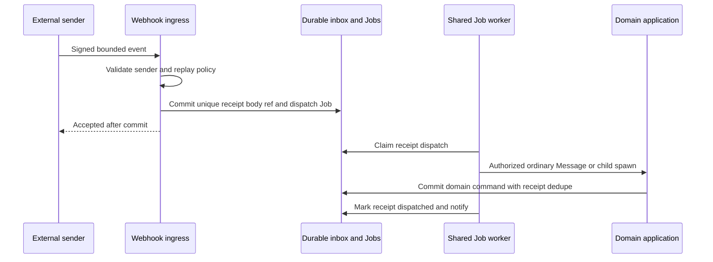

# Presets, native extensions, tooling and automation

**NORMATIVE.** Core rewrite versus later layer is explicit here. [Delegation](05-changes-delivery-delegation.md), [security](06-connections-security.md), [jobs](04-events-persistence-jobs.md).

## Initial architecture and later layer

Initial unified release MUST provide explicit Harness/model/effort settings, provider-native instruction materialization, truthful supported tools/skills capabilities, generic Delegation through API, and the narrow SBX tool gateway for supported official CLIs. It MUST NOT require marketplace, plugin host, arbitrary hook code, OAuth flows, scheduled-work UI or declarative recipes to finish the rewrite. Built-in review/test instructions MAY be data resources without creating a plugin engine.

Later ExecutionPreset registry, packaging, automations and webhooks MUST compose the core. Their persisted definitions are configuration; their executions are Messages/Turns/Jobs. They MUST NOT own parallel Session status, custom reasoning, scheduling claims or a second recovery loop.

| Extension | Allowed responsibility | Forbidden responsibility |
| --- | --- | --- |
| ExecutionPreset | defaults for Harness/model/effort/instructions/tools/skills/approval/resource hints; resolved version/digest recorded | mandatory core Mode ID, hidden switching of active Harness, durable execution authority |
| Skill/instructions | provider-native directory/file/flag materialization with source/version digest | replacing official system prompts/reasoning loop or claiming all CLIs load skills identically |
| Tool | narrow authorized SBX operation or explicitly installed native MCP subprocess | unrestricted platform administration, credential vault access, owning model inference |
| Plugin/package later | versioned presets/skills/tools/hook/webhook declarations and permissions | second agent engine, executing arbitrary code in control API process |
| Hook later | post-commit observation→deduped Job/command; optional native verified pre-tool hook | rollback of committed Turn, universal pre-tool interception promise |
| Automation later | schedule/occurrence→ordinary Message/Turn or spawned child | separate scheduled Run/Task aggregate |
| Coordinator | ordinary Session role/preset using Delegation tools | Puck actor, ThreadActor memory authority or custom DAG engine |

ExecutionPreset resolution MUST persist explicit effective settings and digests at Session creation/Turn acceptance. Provider-specific settings MUST validate against installed manifest and selected Connection observations. User explicit values override preset defaults; policy restrictions always win. Presets MAY be updated for future use; accepted work never silently follows a mutable alias. No default `auto` provider fallback may silently move an existing Session to another Harness.

## Native instructions and skills

Materializer MUST use adapter-declared native locations/flags and preserve repository-owned instructions. Resolved instruction order/content digests MUST be recorded. Generated Session overlays MUST be temporary or separately versioned, not invisibly edit user source. Unsupported native skills MAY become explicitly chosen instruction text if semantically appropriate; that is a labelled fallback, not claimed native skill support. No provider CLI's internal tools/system prompt are replaced by an SBX agent loop.

Skill manifests MUST pin owner, source ref/content digest, expected materialization type, compatible Harness/version range and declared resources. Loading repository instructions is untrusted content, not authority to expand Connections/Jobs/merge rights. Workspace policy MUST bound which tool/secret grants a skill can request; skill metadata cannot decrypt credentials.

## Narrow tool surface

Runtime tooling MUST expose one set of operations over a Session-scoped grant, preferably native MCP where supported; a narrow `sbx tool` command MAY call the same gateway where verified CLI shell access exists. Human/API Delegation remains usable without MCP. The tool host MUST call application commands; it MUST NOT manipulate DB state directly. Each mutation MUST supply a stable tool-call operation ID as dedupe key and preserve source Session/Turn/Execution identity.

| Tool name | Required input/behavior |
| --- | --- |
| `sbx.sessions.spawn` | ProjectVersion/Harness/settings, pinned input refs, role/ResultContract/budget; creates child Delegation |
| `sbx.sessions.send` | authorized target, content refs, source/reply, queue or verified steer with explicit fallback |
| `sbx.sessions.wait` | Delegation/result predicate and deadline; returns result or durable subscription handle |
| `sbx.sessions.read` | authorized bounded Session/messages/Turn projection, watermark; pure |
| `sbx.delegations.result` | read validated result or submit own completing result under exact contract/subject |
| `sbx.sessions.cancel` | explicitly owned target/subtree scope, cancellation intent; no general admin kill |
| `sbx.files.transfer` | source immutable blob/ChangeSet, authorized destination and path; grants transfer, does not silently apply |
| `sbx.changesets.apply` | exact destination generation/base/digest; uses fenced apply Job |
| `sbx.blobs.upload` | bounded private evidence/file manifest; integrity and secret guards |
| `sbx.deliveries.request` | exact ChangeSet/target/version; only if parent-granted shipping authority and project policy allow |
| Later `sbx.automations.get/set/pause` | versioned trigger config with allowed target and occurrence policy |

MCP transport is capability, not permission. Grants MUST limit target Projects/Sessions/child depth/budget/actions/expiry and selected workspace, and MUST be revocable by lease/Session auth epoch. A coordinator MUST NOT get connection secret reads or broad operator rights. Agent-initiated native approval requests MAY be surfaced only through verified Harness protocol; a generic tool asking a human does not prove CLI tool execution was prevented.

## Plugin packaging later

An extension manifest MUST contain namespace/name/version/content digest, source/license metadata, SBX schema compatibility, Harness capability requirements, declared presets/skills/tool processes/hooks/webhook endpoints, permissions/resource budgets and dependencies. Resolution MUST produce an immutable lock manifest per accepted use. Scope precedence SHOULD be Project → personal → Workspace → system, constrained by policy; same-name conflicts MUST be explicit in the resolved manifest. No unreviewed package auto-upgrades active Sessions.

Runtime-native tool subprocesses run with only their assigned roots/env/grants. Future control hooks MUST run in an isolated bounded worker with narrow application API, not import arbitrary package code into FastAPI. Packages MUST NOT read DB/vault/platform keys or implicitly gain all Session secrets. Hook failure emits a safe namespaced observation and independent Job failure; it MUST NOT rewrite a committed Turn. Pre-tool blocking exists only when official CLI/version exposes a verified native interception capability; post-hoc observation is never advertised as prevention.

No SBX plugin manifest is an implementation of Amp PluginAPI. Public Amp registration interfaces are product/extension evidence only; [source caveats](01-evidence-and-comparison.md) prohibit upstream prompt/source copying.

## Automations later

AutomationDefinition MUST pin target Session or spawn template, definition version, timezone/cron-or-once-or-interval, prompt refs, budget, next due time, overlap policy and pause state. Initial overlap policy SHOULD queue, with a bounded missed-occurrence policy declared as `skip|coalesce|bounded_catchup`; DST behavior MUST be documented in the replacement schema. Occurrence key `(automation_id,definition_version,scheduled_at_utc)` MUST be unique. Multiple schedules MAY exist only when limits/policy are explicit; no architectural one-per-Session assumption is required.

Timer enqueues `automation.fire` under the shared claim protocol. Occurrence transaction MUST create one ordinary Message/Turn (or child spawn), record occurrence/event and outbox notification. Archive MUST pause trigger dispatch; unarchive requires explicit schedule resume. Close disables it permanently. Natural-language end conditions MAY be instructions to an official CLI; only an authorized command changes trigger state. No process-local scheduler job is authority.

## Webhooks later

Endpoint registration MUST bind Workspace/connector/target/version/signature policy, payload limits, permission attenuation and safe captured headers. Incoming request MUST validate signature/authentication/replay bounds before durable receipt. Persist body privately with digest plus receipt metadata and Job atomically; acknowledge only after durability. Duplicate `(endpoint_id,connector_event_id)` with same body returns prior receipt; changed body conflicts. Sources lacking event IDs require an explicit documented replay/digest scheme, never random dedupe on each receipt.

Receipt states MUST be `pending|dispatched|paused|dead_letter`; transport attempts use Jobs. Failed handlers retry with bounds, then dead-letter with explicit replay action preserving effect identity. Archived targets pause already durable receipts; closed targets reject new ingress with retirement semantics. GitHub events/comments use the same inbox, not another hosted review/workflow engine. Webhook receipt does not imply successful agent work or delivery.

Future declarative Workflow MUST be a versioned compiler to Sessions/Delegations/Messages/Jobs with pinned inputs. Workflow recipe ID MAY group ordinary resources, but MUST NOT be another work unit or independent DAG scheduler. Extension development cannot postpone deletion of legacy Task/Workflow wrappers.
