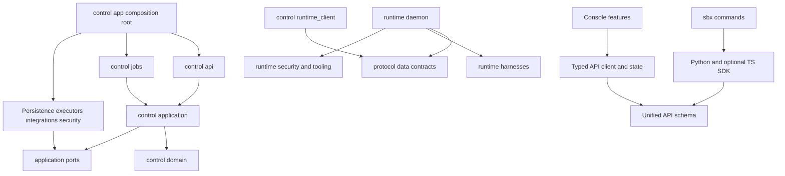

# Target repository, module boundaries and current disposition

**NORMATIVE.** [Index](README.md), [cutover](10-rewrite-cutover.md). Top-level `control/`, `runtime/`, `console/`, `src/sbx/` MUST remain unless a later concrete architectural requirement justifies relocation. Internals MAY be replaced wholesale. Keeping directory names is not a compatibility promise.

## Complete target source tree

The tree fixes responsibility boundaries and canonical module names. Slash-separated sibling filenames are individual files, not required classes/services. Deferred modules marked `(later)` MUST NOT become empty execution engines needed by the rewrite. Existing license/build/release files remain repository support, not domain owners.

```text
sbx-browser/
├── AGENTS.md                         # later reviewed unified ownership/protocol update
├── README.md / LICENSE / CHANGELOG.md / SECURITY.md
├── pyproject.toml / uv.lock / Makefile
├── .github/workflows/                # cloud-free checks; opt-in live evidence
├── protocol/                         # runtime-safe data/wire types only
│   ├── __init__.py
│   ├── runtime.py                    # versions, frames, operation IDs/fences
│   ├── events.py                     # observation envelope, no business reducer
│   ├── capabilities.py
│   ├── manifests.py                  # portable filesystem/native manifest data
│   └── errors.py                     # wire error vocabulary
├── control/
│   ├── __init__.py / app.py / config.py
│   ├── domain/                       # pure decisions/value/state types
│   │   ├── identity.py / projects.py / connections.py
│   │   ├── sessions.py / execution.py / worktrees.py
│   │   ├── changes.py / delivery.py / delegation.py
│   │   ├── services.py / events.py / errors.py
│   │   └── extensions.py / automation.py              # later config/trigger rules
│   ├── application/                  # commands, queries, UoW orchestration
│   │   ├── ports.py                  # repositories, UoW, vault/blob/effect interfaces
│   │   ├── identity.py / projects.py / connections.py
│   │   ├── sessions.py               # accept/cancel/retry/archive/close
│   │   ├── execution.py              # admission/bind/adopt/reconcile
│   │   ├── worktrees.py / changes.py
│   │   ├── delivery.py / delegation.py / services.py
│   │   ├── ingest.py                 # source dedupe, terminal validation
│   │   ├── projections.py            # current resource/actions views, offline rebuild
│   │   ├── tools.py                  # scoped generic tool commands
│   │   └── extensions.py / automation.py / webhooks.py # later
│   ├── api/                          # one /api business contract
│   │   ├── router.py / dependencies.py / schemas.py / errors.py
│   │   ├── auth.py / workspaces.py / projects.py / connections.py
│   │   ├── sessions.py / messages.py / turns.py / events.py
│   │   ├── worktrees.py / files.py / terminals.py / services.py
│   │   ├── changesets.py / deliveries.py / delegations.py / blobs.py
│   │   ├── catalog.py / operations.py
│   │   └── extensions.py / automation.py / webhooks.py # later
│   ├── jobs/
│   │   ├── model.py / worker.py / claims.py / backoff.py
│   │   ├── timers.py                 # enqueue only; no second lifecycle loop
│   │   └── handlers/
│   │       ├── execution.py / snapshots.py / changes.py
│   │       ├── delivery.py / delegation.py / connections.py
│   │       ├── services.py / cleanup.py / outbox.py
│   │       └── automation.py / webhooks.py / extensions.py # later
│   ├── persistence/
│   │   ├── database.py / unit_of_work.py / migrations/
│   │   ├── identity.py / projects.py / connections.py
│   │   ├── sessions.py / events.py / execution.py / worktrees.py
│   │   ├── changes.py / delivery.py / delegation.py / services.py
│   │   ├── jobs.py / outbox.py / deduplication.py / blobs.py / audit.py
│   │   └── extensions.py / automation.py / webhooks.py # later
│   ├── executors/
│   │   ├── port.py / modal.py / local.py
│   │   └── runner.py                 # later; same runtime protocol
│   ├── runtime_client/
│   │   ├── client.py / grants.py / ingress.py / proxy.py
│   │   └── compatibility.py
│   ├── integrations/                 # implementation adapters, NOT Integration domain
│   │   ├── git.py / github.py / email.py
│   │   └── connectors/
│   │       ├── registry.py / modal.py / github.py
│   │       ├── opencode_zen.py / codex.py / provider_native.py
│   │       └── oauth.py              # later optional acquisition method
│   ├── security/
│   │   ├── access.py / identity.py / vault.py / redaction.py
│   │   └── credential_leases.py / refresh.py / audit.py
│   ├── storage/
│   │   ├── port.py / objects.py / local.py
│   │   └── retention.py
│   ├── preview/proxy.py              # separate origin, owner/port allowlist
│   ├── tooling/gateway.py            # same commands via attenuated grants
│   └── extensions/                   # later packaging; no custom agent engine
│       ├── registry.py / manifests.py / materialization.py
│       └── hooks.py                  # sandboxed Job invocation, no API-process code load
├── runtime/
│   ├── __init__.py
│   ├── daemon/
│   │   ├── main.py / app.py / auth.py / compatibility.py
│   │   ├── operations.py / journal.py / fences.py
│   │   ├── supervisor.py / events.py / spool.py
│   │   ├── files.py / worktree.py / changes.py / snapshots.py
│   │   ├── terminal.py / processes.py / services.py / health.py
│   │   └── transport.py              # connect/reconnect/committed ack
│   ├── harnesses/
│   │   ├── protocol.py / registry.py / capabilities.py / native_state.py
│   │   ├── transports/jsonl.py / acp.py / official_server.py / text.py
│   │   ├── codex.py / opencode.py / claude.py
│   │   └── devin.py / grok.py / antigravity.py
│   ├── security/credentials.py / paths.py / redaction.py
│   ├── tooling/mcp.py / sbx.py        # provider-native tool surface, common gateway
│   ├── extensions/materialize.py     # native skills/instructions; packaging later
│   └── images/
│       ├── recipe.py / manifest.py / providers.py / versions.py
│       ├── packages.txt / entrypoint.sh / install-devin.sh
│       └── local/Dockerfile
├── console/
│   ├── package.json / package-lock.json / vite.config.ts / tsconfig.json
│   └── src/
│       ├── main.tsx / App.tsx
│       ├── app/router.tsx / providers.tsx / shell.tsx
│       ├── api/generated/ / client.ts / errors.ts / events.ts
│       ├── state/queries.ts / watermarks.ts / reducers.ts / drafts.ts
│       ├── features/
│       │   ├── auth/ / projects/ / sessions/ / conversation/ / activity/
│       │   ├── changes/ / delivery/ / files/ / terminal/ / services/
│       │   ├── delegation/ / connections/ / settings/
│       │   └── automation/ / extensions/               # later
│       ├── components/ / i18n/ / theme/ / styles/
│       └── test/
├── src/sbx/
│   ├── __init__.py / __main__.py / cli.py / config.py / auth.py / errors.py
│   ├── sdk/client.py / models.py / errors.py / events.py / __init__.py
│   ├── commands/projects.py / sessions.py / connections.py / changesets.py
│   │   └── deliveries.py / delegations.py / operations.py
│   └── operations/deploy.py / doctor.py / local.py / runner.py # runner later
├── sdk-ts/                           # optional later shared typed client release
├── resources/
│   ├── result-contracts/             # original SBX versioned schemas
│   ├── instructions/                 # built-in child role instructions
│   └── presets/                      # optional convenience data
├── examples/                         # only unified concepts at final cutover
├── deploy/hosted/ / modal/ / edge/    # infrastructure operations, no domain loops
├── scripts/                          # schema/docs/build tools only
├── tests/
│   ├── conftest.py / fakes/ / fixtures/
│   ├── unit/domain/ / application/ / runtime/ / jobs/
│   ├── contracts/api/ / events/ / runtime/ / harnesses/ / results/
│   ├── integration/postgres/ / cloud_free/ / security/ / delivery/
│   ├── e2e/                          # unified Console and API
│   └── e2e_modal/                    # explicit opt-in per-provider evidence
├── docs/
│   ├── architecture/unified/         # this sole target RFC set
│   ├── specs/unified/                # later reviewed executable replacement specs
│   │   ├── openapi.yaml / errors.yaml / events/ / runtime/
│   │   └── harness.schema.json / manifests/ / results/ / tools/
│   ├── decisions/                    # reviewed amendments referencing this RFC
│   └── archive/                      # retired legacy docs/evidence with historical labels
└── docs-site/                        # one maintained product vocabulary
```

Temporary `control/legacy_bridge/`, importer and cohort routing are migration-only, deliberately excluded from the target tree. They MUST disappear in [R7](10-rewrite-cutover.md); old-runner bridge expires at R3. Optional broker acquisition code, if actually needed, MAY live under connector/deployment tooling; it MUST own no work state and MUST NOT be required for manual setup.

## Dependency direction and forbidden patterns



Domain MUST import no I/O/router/SQL/Modal/runtime provider implementation. Application MUST depend on injected ports, not infrastructure concrete classes or API routes. Infrastructure implements ports; composition root wires API/worker instances. Runtime MUST import no `control` package, DB repository or platform vault decrypt implementation. `protocol/` MUST contain data/schema compatibility only, never business reducers, scheduling or secret access. Control plane MAY consume Harness manifests as data but MUST NOT import runtime adapter execution code.

Executor modules MUST NOT import provider adapters; Harness modules MUST NOT import Modal/backend provisioning. GitHub/Modal/provider-specific implementation branching belongs in adapters/connectors, not Session rules or Console status logic. CLI/Console business access MUST use the public API contract. Native runtime tooling uses narrow private grants to the same application commands. Tests MUST enforce boundary imports and absence of legacy dependencies.

Forbidden: route-to-route calls; shared private locks across modules; `sandbox.exec` for agent Turns/files/capture; read-path settling; actor memory authority; generic `control_records` business payloads; run-line cursors as public history; prompt-established delivery success; hosted-only review loops; global credentials after disconnect; dual-writing old/new authorities; timer performing effects outside Jobs. A renamed giant `ControlPlane` facade is not acceptable decomposition.

## Current → target disposition

All paths below refer to baseline `83317cd8b90b487a01a534ac7c440154efac2d03`. **Preserve knowledge** means requirements/fixtures/security invariants, not keeping the old module as target authority. This is permission for later reviewed wholesale rewrite, not edits in this RFC PR.

| Current subsystem/modules | Disposition and target | Explicit retirement |
| --- | --- | --- |
| `control/app.py`, `config.py`, `deploy.py`, `modal_app.py`, `hosted_server.py`, `hosted_deployment.py`, `production_adapters.py` | Rewrite composition/config/deploy entrypoints; target API/worker wiring, deployment profiles | old V1/V2/hosted composition, finish callbacks and namespace selectors |
| `api_v1/**`, `api_v2/**`, `hosted_routes.py`, old Basic routes in app | Replace with `control/api/**`; preserve error/replay/admission requirements | DELETE both API-version packages and hosted domain routes |
| `service.py`, `codex_process.py`, `sandbox_io.py`, `runtime_state.py`, `real_codex.py` | Dissolve into Session/Execution applications, Jobs, daemon/supervisor and Harness | DELETE old ControlPlane/process watch/ad-hoc exec orchestration |
| `tasks.py`, `api_v1/tasks.py`, `workflow_store.py`, `api_v1/workflows.py`, `api_v1/state.py`, `ports.py` legacy protocols | Project resolution/admission, typed Session and Delegation FKs; ResultContract | DELETE Task/Agent/Workflow/V1State wrappers and old ports after reviewed contract retirement |
| `run_store.py`, `run_activity.py`, `run_errors.py`, `api_v1/lifecycle.py`, `evidence.py` | Preserve monotonic terminal/unknown/output validation scenarios; typed Turn/Execution/journal | DELETE Run ledger identity and transcript/replay mirrors |
| `store.py`, `postgres_state.py`, legacy stores in accounts/artifacts/revisions/workspace/environment/checkpoint | typed `persistence/` repositories/UoW, PG concurrency tests | DELETE generic JSON namespaces, Modal Dict/file production business stores and manual index repair |
| `workspace.py`, `environment.py`, `checkpoint.py`, `resources.py`, `compute.py` | Logical Worktree, ProjectVersion, Snapshot, lease/capability/resource policy | DELETE mixed filesystem/PR/review state and duplicated environment authority |
| `artifacts.py`, `artifact_ops.py`, `revisions.py`, `handoff.py` | Preserve capture integrity/binary/untracked/secret guards; ChangeSet/blob/Delivery/Delegation | DELETE Artifact-package/Revision wrappers and Workspace/Revision Delivery mirrors |
| `startup_dispatch.py`, `reaper.py`, `hosted_lifecycle.py`, `hosted_delivery.py`, `latency.py` ack-thread ownership | shared Jobs/claims/timers and exact-handle cleanup; preserve cancellation/recovery evidence | DELETE startup/reaper/delivery engines, process-local mutation registry |
| `hosted_reviews.py` and hosted review routes | Delegation review instructions/contracts/results, Delivery gates | DELETE delivered-branch prerequisite, Codex hard-code, GET-settled review namespace |
| `accounts.py`, `hosted_accounts.py`, `scheduler.py`, `capabilities.py`, `devin_pool.py` | Connection catalogs/cooldown, durable reservations/admission | DELETE Account mirrors, per-process slot authority/provider pool special engine |
| `connections.py`, `provider_auth.py`, `onboarding.py`, `connect.py`, `credlifecycle.py`, `credsync.py` | Connection/vault/private grants/optional CAS refresh; preserve path/health/version knowledge | DELETE parallel login/refresh sweep and export-over-exec path |
| `auth_email.py`, `auth_bearer.py`, `auth_schema.py`, `auth_store.py`, `hosted_auth.py`, `hosted_auth_routes.py`, `hosted_auth.html/js`, `resend_email.py`, `ownership.py` | Retain reviewed hash/encryption/access concepts; one identity app/security/persistence/email adapter | DELETE Basic/hosted/operator auth island and duplicate ownership shims |
| `backend.py`, `backends/**`, `real_modal.py`, `hosted_compute.py`, `modal_connection.py`, `modal_tags.py` | explicit owner-bound Executor port/Modal/local, operation-tag discovery and Connection provisioning Jobs | DELETE provider exec port and sandbox tags as claim authority |
| `github.py`, `github_remote.py`, `github_app.py`, `github_broker.py`, `hosted_github.py`, `real_github.py`, `mock_git.py` | Git/GitHub transport under integrations; PAT first, optional App acquisition; mocks under tests | DELETE duplicate shipping implementations and App requirement |
| `codex_broker.py`, `hosted_coding` configuration/docs, root `broker/**` | Optional connector acquisition/refresh only where verified users need it | Remove broker from required deploy; DELETE unused broker after Connection export/migration gate |
| `runtime/http_service.py`, `session_events.py`, `provider_runtime.py`, `runner/**` | Replace with daemon/spool/supervisor/Harness interface; preserve adapter native transport and fixtures | DELETE read-only direct stream plus shell runner entry architecture and Codex-shaped canonical adapter |
| `runtime/image.py`, `build_identity.py`, `versions.py`, `packages.txt`, `entrypoint.sh`, `install-devin.sh`, `Dockerfile.local` | Move/rewrite centralized images/manifests/install compatibility under runtime/images | retire unverified host-binary copying/global image assumptions |
| `console/src/api/**`, `state/**`, `prototype/**`, `hosted/**` | Rewrite one typed client/store/features; preserve history/diff/error UX | DELETE hosted/prototype domain/API facades and dual direct/relay stream cache |
| Console components/pages/i18n/theme/styles | preserve useful accessible UI knowledge/components; map to unified features | retire Task/Run/phase-derived success and UI merge authority |
| `web/**`, build-less Basic dashboard | single Console replaces them; scoped operator diagnostics remain API | DELETE legacy frontend and its routes/build/deployment outputs |
| `src/sbx/**`, root launcher, `examples/**` | coordinated SDK/CLI major release; keep published package/entrypoint | DELETE Task/Agent/Run/recovery aliases and old implicit credential fallback |
| `tests/**`, `spike/**` | keep useful sanitized provider/version/failure evidence; rewrite contracts/integration/e2e by boundaries | delete tests asserting retired architecture after successor scenarios exist; archive spike evidence, no runtime dependency |
| `deploy/**`, edge workers, `.github/**`, Makefile | keep infrastructure/check entrypoints and revise one deployment/API vocabulary | DELETE Basic/V1/V2/hosted router forwarding and independent lifecycle cron code |
| `docs/contracts/**`, `docs/architecture.md`, hosted docs, docs-site | unchanged now; later reviewed specs replace contracts, archive histories and rewrite maintained docs | DELETE active legacy spec links/claims at R7; archived docs explicitly non-normative |

No listed preserve-knowledge path implies compatibility code forever. Exact deletion and data gates are in [cutover](10-rewrite-cutover.md); implementation support evidence is in [acceptance](11-implementation-acceptance.md).
