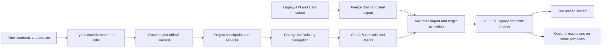

# Full rewrite, data cutover and deletion

**NORMATIVE.** End state is [target tree](09-repository-structure.md), not V2-over-V1. This RFC permits later wholesale replacement of internals. It does not authorize production migration in this draft PR or edit current frozen contracts.

## Rewrite phases and hard exit gates

| Phase | Work and authority | Exit evidence / deletion obligation |
| --- | --- | --- |
| R0 — contracts/domain | Review replacement `docs/specs/unified/` OpenAPI/events/errors/runtime/Harness/manifests/result schemas; pure domain/state rules; unified ownership instructions | Vocabulary, state transitions, schema examples/digest vectors, current data shape/ownership report; old contracts unchanged until explicit replacement approval |
| R1 — durable state/jobs | typed PG rows/UoW/journal/projections/dedupe, claims/fences/reservations/outbox, identity and Connection/vault | restart/concurrency/cancel/claim tests; one accepted intent writer; no read effects; unknown outcomes explicit |
| R2 — runtime/Harness | daemon operation journal/spool/supervisor; Local/fake lane; thin provider adapters; Modal backend and scoped credentials | lost-ack/start response, native resume, runtime compatibility, stale fence, runtime loss and credential isolation gates; no blind replay |
| R3 — Project/environment | versioned specs, cold setup/quick resume, exact cache keys/private checkpoints, services/preview/files/terminal | restore preserves Worktree/native lineage; caches isolated/secret-safe; Modal supported-lane live evidence; DELETE old-runner effect bridge before target release |
| R4 — ChangeSet/Delivery/Delegation | immutable capture/apply; deterministic Git platform effects, target claims/merge gates; child results/waits/tool gateway | teardown-safe delivery/retry; exact-subject review-before-PR; stale-head/invalid-result/cancelled-auto-ship denied; all effects Jobs |
| R5 — API/Console/SDK/CLI | one `/api`, one client/watermark, coordinated breaking client release, target deployment/docs | cloud-free end-to-end product flow, privacy/accessibility/history gates; no target Session calls old routes/reducers |
| R6 — data cutover | freeze old writes, drain/stop compute, final export/import/reconcile with ownership/provenance/digest report, activate sole target writer | verified backup/rehearsal/counts/ownership/results/refs; target writes only; legacy route retirement and read-only export deadline published |
| R7 — DELETE legacy | remove modules/loops/stores/clients/contracts-active-links/temporary routing and import bridge; archive inert evidence | all deletion checks below; no new release declared unified-complete until R7 passes |

R2 and R3 provider work MAY proceed for separate supported lanes after contracts/state boundaries exist; provider rollout is capability-scoped. Optional extension layer (marketplace/plugins/schedules/OAuth/BYO enrollment/Workflow recipes) MUST NOT delay R7. New target Sessions MUST use target authority from acceptance through delivery. Legacy active cohort may drain under its old sole writer; there MUST never be two writers for the same resource.

## Temporary bridges: allowed narrowly, never end state

| Temporary mechanism | Scope / one-way rule | Hard deletion |
| --- | --- | --- |
| Old-runner effect adapter | R1–R2 experiments only: new accepted intent owns execution; old runner is an effect adapter with operation evidence. No V1State/Task reducer owns target data. It MUST not serve production target Sessions. | Removed before R3 exit; replacement daemon conformance is prerequisite |
| Cohort routing | Each pre-existing Session belongs to old or target writer, never both. Old accepts no new work after R6 freeze. | Removed R7; drain deadline fixed in cutover plan before enabling cohort split |
| Read-only history/export endpoints | May expose old records for user export only, with Deprecation/Sunset and no settling/probing | At most 30 calendar days after R6 activation; removed R7 with recorded export disposition |
| Offline importer and ID mapping | Reads frozen sanitized exports; writes only target schema under migration principal; retains provenance mapping as data, not handlers | Runtime import bridge/old store readers removed R7; reproducible offline archival tool MAY remain outside deployed app |

Any bridge MUST have owner, specific expiry, removal gate and test proving one writer. A bridge whose deadline cannot be met requires a reviewed cutover reschedule before activation, not a silent permanent compatibility extension. No dual writes, target projections over Task state, V2-over-V1, old API write translator or separate legacy recovery daemon is allowed in the final release.

## Data interpretation and import

Migration MUST first inventory actual deployed schema/store shapes rather than assuming the old Modal Dict diagram. Current hosted PostgreSQL uses typed auth plus `control_records` payloads; self-host legacy store families may differ. Export MUST pin source revision/store/version/time/owner and integrity hashes, and report absent/conflicting facts. Credentials MUST remain protected ciphertext or be migrated through an authorized vault-only channel; credential-bearing samples/logs are forbidden.

| Legacy data | Target interpretation | Refusal/limits |
| --- | --- | --- |
| Hosted user/auth/key | User + personal Workspace + reviewed compatible password/key hashes | Cannot infer unknown operator resource ownership from repo URL; explicit assignment/export needed |
| Public V2 Session/Task bound to internal Agent | one Session identity; preserve existing public `sess_` ID where collision-free; `imported_reference` maps Task/Agent IDs | unrelated old records MUST not be merged solely by shared repo/native thread; ambiguous genealogy requires report |
| Run/queued follow-up | Turn + triggering Message, recorded outcome/settings; safe queued intent imports only after confirmed drain | UNKNOWN→interrupted/outcome_unknown, never guessed succeeded; unfinished native attempt not auto-rerun |
| `events.jsonl`, RunActivity transcript, V2 history | normalized imported Session facts with original source cursor/time and `history.imported` marker | old line cursor is not target seq; missing portions flagged incomplete; no fabricated intermediate events |
| Workflow/role/parent-task indexes | explicit parent/child Delegations only if original assignment/inputs known; otherwise labels/imported refs | no reconstructed DAG, no invented ResultContract or review approval |
| Workspace/git + Artifact/Revision payload | verified immutable ChangeSet and file manifests | secret scan/digest integrity/base/head/content required; conflicting mirrors diagnosed, not best-effort approved |
| Delivery/publish/PR/merge mirrors | one historical Delivery with actual verified remote effect evidence | unresolved conflicts block new merge; stale remote facts require target reconcile Jobs after activation |
| Review record/hosted-review Session | child Session/DelegationResult only if exact subject and independent execution/output validation provable | SHA-only approval of unmatched patch MUST not authorize target content; unsupported assessment remains historical text |
| Environment/checkpoint/native thread | ProjectVersion/cache or private Snapshot only after kind/owner/compatibility verification | absent native state makes historical read-only work or explicit linked continuation; no manufactured native resume |
| Account/connection/secret blobs | Connection + newly encrypted CredentialVersion and explicit grants | invalidate readiness/catalog; unverified until target validation; disconnect tombstone prevents old acquisition fallback |
| Artifact/report/trace object | private Blob/reference with digest/size/owner/type | no public URL reuse by hash; retention/integrity/provenance required |
| Live backend handles/processes | drain/stop and optionally scrubbed final checkpoint | no live lease migration across authorities; no assumed memory/PTY restore |

Importer MUST be restartable/idempotent by `(source_system,source_record_id,source_version)` and output counts, maps, conflicts, skipped data, integrity checks, status loss and capability limitations. Import-only `history.imported` schema MUST be reviewed; it is not a native provider event. Projects inferred from repeated legacy inputs MUST preserve exact version values, never merge differing setup/Ship policy silently. Legacy imported Sessions SHOULD be archived until owner chooses supported continuation; dispatch cannot start merely because import found a queued field.

A cutover rehearsal MUST use stripped credentials/isolated HOME/XDG and a frozen export in a new environment. Compare owner/resource/message/Turn counts, reference closure, immutable digests, terminal outcomes and remote mappings. No source import may silently authorize shipping; imported Delivery eligibility requires the same target gates.

## Activation and rollback

Before R6, operators MUST choose drain deadline, retention/export deadline, supported provider lanes, backup restore procedure and remote-effect freeze window. R6 MUST stop accepting old mutations, drain or cancel/quarantine old CLI work, obtain final snapshot/export, validate target import under read-only serving, then explicitly activate target writes. Old endpoints MUST return intentional retirement responses, not transparently mutate target through old wrappers.

| Moment | Allowed rollback | Constraint |
| --- | --- | --- |
| Before target traffic | discard experimental target state/revert deployment | old remains sole production writer |
| Target new-cohort work before final import | stop new target creation; forward-repair existing target Sessions; drain old independently | MUST NOT hand target data to old reducers |
| Final import before writes/effects | restore verified DB/blob backups and old deployment after isolation checks | no remote effects during validation window |
| After target writes or Git effects | forward recovery preferred; reverse migration only with explicit stop/export/data/effect plan | reverting code cannot undo pushes/merges/schema/native upgrades |

Database migrations MUST be reviewed/versioned with backup restore rehearsal. No irreversible schema/drop or external effect is implied by accepting this document. Keys/credential formats and snapshot compatibility require their own migration evidence; rollback MUST never restore revoked credentials or re-enable old fallbacks.

## R7 deletion targets and gates

DELETE old `control/api_v1/**`, `api_v2/**`, hosted domain routers/reviews/lifecycle/delivery/startup loops, Task/Agent/Run/Workflow/V1State wrappers, generic namespace business stores, Workspace/Revision publish mirrors, old process watching/ad-hoc runner execution, direct-runtime authoritative stream, `web/**`, Console hosted/prototype API/domain facades and SDK legacy namespaces. Rewrite `control/app.py` as composition only. Retire unused required broker and Basic auth/deploy forwarding. Replace old runner interface/entrypoint with daemon/Harness. Preserve useful provider fixtures, version/digest/support evidence, password/encryption knowledge and equivalent failure-mode tests.

R7 MUST prove:

- No deployed imports/references to old routes/private locks/store namespaces/Task/Agent/Run wrappers, and no hidden fallback to old authority.
- No jobs/timers/cron/process-local actors decide state outside the shared UoW/claim protocol.
- One public Session identity, committed cursor and client state model; no raw run line cursor/direct authoritative SSE.
- One owner for Worktree, immutable subject, transport and result; no duplicate PR/review status mirrors.
- No temporary bridge/cohort routing/import-on-read remaining; read-only export deadline completed.
- Target cloud-free lint/test/contract/restart/security/Console checks pass, plus supported-lane live evidence; [acceptance](11-implementation-acceptance.md) gates are met.
- Deployment/docs-site/examples/SDK/CLI name only unified concepts. Historical contracts/evidence are archived explicitly INFORMATIVE, with no active normative index links.

`docs/contracts/**` MUST remain untouched until replacement approval in the implementation project; their eventual archive/delete is a deliberate R7 contract retirement, not incidental file cleanup. Old proposals #165/#166 remain source references, never active parallel target sets. The rewrite is complete only after deletion, not when a new facade appears beside the old system.
