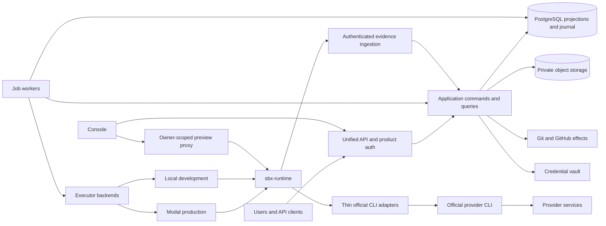

# Unified SBX architecture RFC

**Canonical index · NORMATIVE · final consolidated design · pending human architecture review.**

This is the single target architecture for `soren-labs/sbx-agent`. It synthesizes [PR #165](https://github.com/soren-labs/sbx-agent/pull/165) at `638621b81e8ab52c2c72cfa177076334db23b9a0` and [PR #166](https://github.com/soren-labs/sbx-agent/pull/166) at `9a6918bb7023f9009b0bb710775092a9d74c091d`, against main at `83317cd8b90b487a01a534ac7c440154efac2d03`. All three refs matched on 2026-10-05. The proposals remain research artifacts; neither is an alternative implementation blueprint after this RFC is accepted.

SBX runs **official provider CLIs**. Its durable product identity is **Session**; its replaceable execution location is **ExecutorLease**; its provider boundary is **Harness**, a thin adapter to an official CLI. SBX MUST NOT implement a model reasoning/tool-selection loop, substitute Amp SDK for the provider CLI, or hide a proprietary agent harness behind the runtime.

## Reading order and precedence

| Document | Classification | Authoritative subject |
| --- | --- | --- |
| [01-evidence-and-comparison](01-evidence-and-comparison.md) | INFORMATIVE | Pinned public evidence, licenses, current repository findings, proposal reconciliation |
| [02-domain-model](02-domain-model.md) | NORMATIVE | Vocabulary, identity, state ownership, lifecycle, Project version inputs |
| [03-execution-runtime-harness](03-execution-runtime-harness.md) | NORMATIVE | Executor/Harness ports, runtime wire operations, recovery, services |
| [04-events-persistence-jobs](04-events-persistence-jobs.md) | NORMATIVE | Journal, relational schema, dedupe, claims, outbox, concurrency |
| [05-changes-delivery-delegation](05-changes-delivery-delegation.md) | NORMATIVE | Immutable subjects, Git effects, merge gates, generic child work |
| [06-connections-security](06-connections-security.md) | NORMATIVE | Product auth, Connection/vault, boundary materialization, revocation |
| [07-extensions-automation](07-extensions-automation.md) | NORMATIVE | Presets, native skills, narrow tools, deferred extension rules |
| [08-api-console-sdk](08-api-console-sdk.md) | NORMATIVE | One business API, resource routes, Console state, client behavior |
| [09-repository-structure](09-repository-structure.md) | NORMATIVE | Complete target module map, dependency rules, current disposition |
| [10-rewrite-cutover](10-rewrite-cutover.md) | NORMATIVE | Rewrite phases, data interpretation, finite bridges, deletion gates |
| [11-implementation-acceptance](11-implementation-acceptance.md) | NORMATIVE; current validation section INFORMATIVE | Required implementation evidence and this RFC's documentation checks |
| [12-decisions-risks](12-decisions-risks.md) | NORMATIVE decisions; INFORMATIVE risk analysis | Resolved disagreements, rejected alternatives, feasibility limits |

MUST/MUST NOT are requirements; SHOULD permits an explicitly documented exception supported by evidence; MAY is optional. Unqualified field names, state names, route names, event names, and table names in normative sections are the canonical implementation vocabulary. Diagrams illustrate those rules and MUST agree with the tables. Examples are original SBX designs, not Amp internals.

This index fixes the core decisions. Each subject document owns its detailed contract; a contradiction MUST be resolved by a reviewed amendment before implementation, never by creating a parallel subsystem. An implementation agent MUST read the index, its subject documents, and the acceptance gates. Library choice and performance tuning MAY evolve without changing the domain. Changing ownership, identity, terminal semantics, event authority, or subject gates requires an architecture amendment.

This design does not amend the current frozen `docs/contracts/**` or deployed behavior. Future implementation MUST introduce reviewed replacement specs as described in [cutover](10-rewrite-cutover.md), then retire the old contracts. Normative means binding for the **target**, not a claim that the target already exists. This draft is not authorization to migrate production or merge the RFC.

## Fixed architecture

1. Session owns durable conversation/work; it is never a machine, native thread, PR, or API-version wrapper.
2. Logical Worktree survives lease replacement. Modal is the first production Executor backend; local and later BYO backends use the same runtime protocol.
3. Official CLI differences stay in thin Harness adapters and truthful versioned capabilities. Harness changes create linked Sessions with explicit context handoff.
4. `sbx-runtime` supervises operations/processes/files/services and spools evidence. It is infrastructure, with no model reasoning loop.
5. A committed append-only Session journal explains history. Typed synchronous relational projections decide current state; runtime spools and browser caches never do.
6. Every slow/recoverable effect uses durable Job, fenced claim, and transactional outbox. Reads MUST NOT settle or launch work.
7. Project versions define reusable repository/environment/defaults. Environment caches and private Session checkpoints have distinct reuse policies.
8. Worktree is mutable; ChangeSet is an immutable subject; Delivery owns exact-subject external effects and remote verification.
9. Review/test/research/security/integration are ordinary child Sessions through Delegation. A ReviewAssessment is a validated result, not an execution subsystem.
10. Spawn/send/wait/read-result/cancel/explicit-transfer enable cross-CLI coordination. A Coordinator is an ordinary Session role.
11. One Connection model covers Modal, GitHub, Zen, Codex and future providers; encrypted CredentialVersion is separate. Manual input is the initial baseline.
12. One `/api/...` business surface, one typed Console client, one event watermark. Runtime protocol versioning is independent of the business API.
13. Rewrite/delete legacy internals aggressively. Compatibility is finite, with one writer per resource and hard removal in phase R7.

## System context

Initial deployment is a Python/FastAPI modular monolith, API and worker processes, PostgreSQL, private blob storage, Modal executors, and authenticated edge/preview proxies. React/TypeScript and the `src/sbx/` Python package remain. Team billing, marketplace/plugins, OAuth acquisition, BYO Runner registration, and declarative Workflow recipes are later layers; none blocks the rewrite.

Non-goals: custom model harness; Kubernetes/Substrate migration; required OAuth; independent DAG runtime; microservices without measured need; language rewrite for aesthetics; Amp private-core claims; unlicensed source reuse; permanent V1/V2/hosted compatibility. There is no first-class Task, Agent, Run, Revision wrapper, Browser aggregate, or Puck-specific actor in the target.
