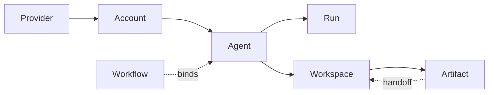
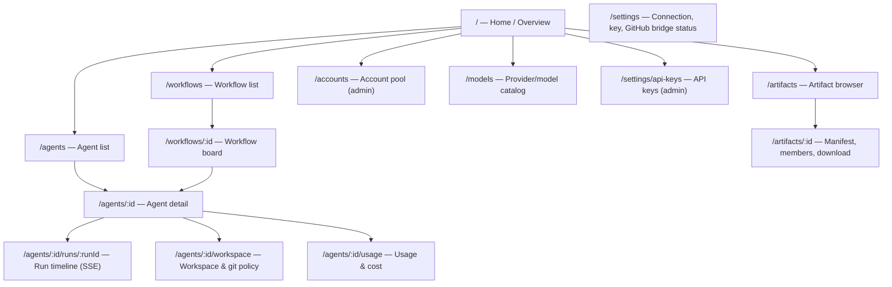
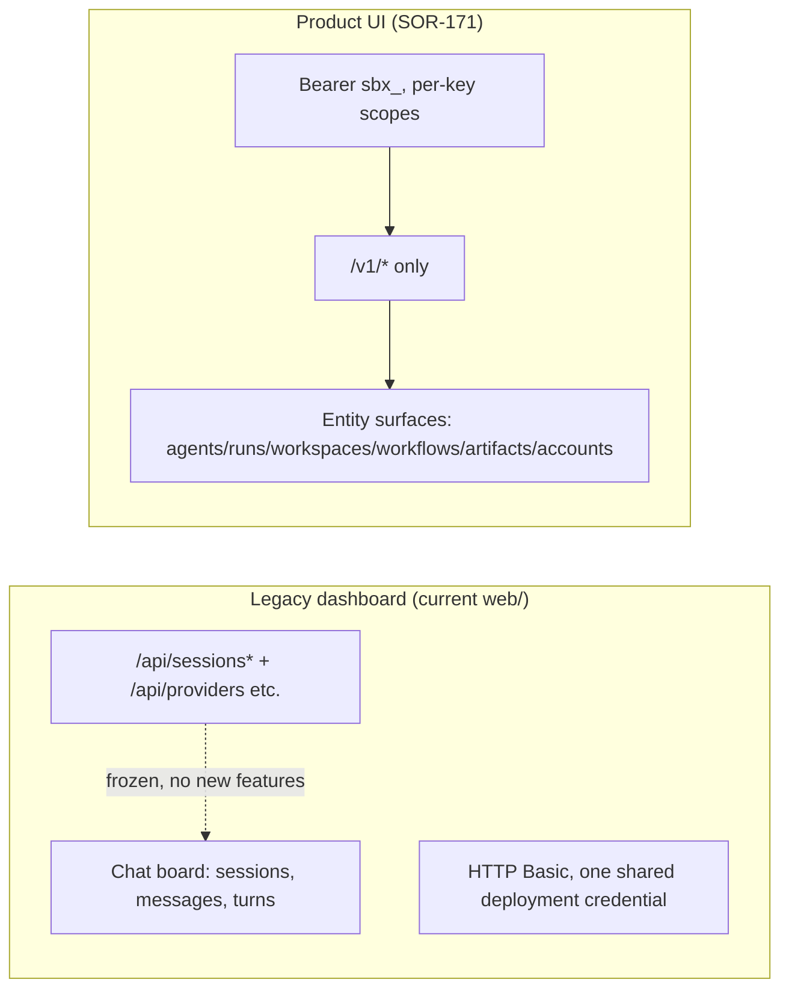
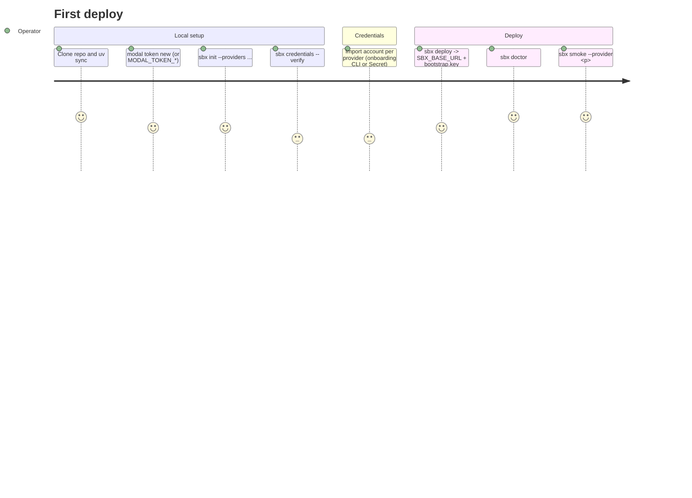

# Productization UX Contract — SOR-169 (design freeze)

Status: **design freeze candidate**. This document is the human-facing product
contract derived from the frozen public API
([docs/contracts/api-v1.yaml](../contracts/api-v1.yaml) at `v0.1.1`). It changes
no runtime or control-plane behavior. SOR-170 (product docs) and SOR-171
(product UI) implement against this document independently; any change to it is
a contract change request, not an edit in flight.

Scope guardrails:

- All user-facing copy is **English only** — labels, empty states, error text,
  docs, diagrams. Existing proper nouns and API identifiers (`sbx-browser`,
  `sbx_<key>`, `agent.id`, `POST /v1/agents`, …) are preserved verbatim.
- Every claim maps to the shipped `/v1` surface. Nothing below invents product
  surface the API does not expose; aspirational items are marked *(future)* and
  are not part of this freeze.
- `/api/*` is internal/legacy and stays that way (§5).

## 0. What the product is, in product terms

sbx-browser is **self-hosted orchestration for cloud coding agents**: one API
call creates an isolated Modal Sandbox running the official provider CLI the
operator already pays for. There is no hosted service, no multi-tenancy, and no
billing — one deployment is one Modal workspace, and the sandbox is the only
security boundary. The product UI is a control surface *over* that plane, not a
hosted product.

Three audiences share the same `/v1` surface:

| Audience | Typical key scope | Primary needs |
| --- | --- | --- |
| Operator (deploys and owns the plane) | `admin` (+`agents`) | bootstrap, accounts/credentials, capacity, cost, recovery |
| Engineer (drives agents day to day) | `agents` | create agents, steer runs, ship repo work |
| Reviewer (verifies output) | `agents` | workspace pinning, artifact inspection, PR handoff |

## 1. Canonical terminology

The product speaks **API nouns**. Internal names (`session`, `turn`,
`sandbox`, `Dict`) never appear in user-facing copy unless quoting a literal
identifier or log line.

| Canonical term | Definition | API anchor | Key fields | Lifecycle states | Do NOT say |
| --- | --- | --- | --- | --- | --- |
| **Provider** | An upstream agent-CLI vendor whose official CLI runs inside the sandbox. Fixed enum, not user-extensible in `v0.1.1`. | `agent.provider`, `ProviderId` enum | `codex`, `devin`, `antigravity`, `grok`, `opencode` (`claude` = not supported) | Stable / Experimental / Preview / Not supported (evidence tiers, `docs/providers.md`) | model, integration, plugin |
| **Account** | An imported provider login (credential file blob) with concurrency slots and cooldown state. Credentials are never displayed or returned. | `/v1/accounts*` | `id`, `label`, `status`, `max_concurrent`, `running`, `models`, `last_error` (redacted code only) | `active` / `cooling` / `invalid` / `disabled` | credential, token, login |
| **Agent** | A long-lived execution environment: one Modal Sandbox running one provider CLI, holding a native multi-turn conversation. `agent ≙ legacy session`. | `/v1/agents*` | `id`, `name`, `provider`, `account_id`, `model`, `usage`, `cost_estimate_usd`, `metadata.workflow_id`, `resources` | `creating` / `idle` / `running` / `closed` / `timed_out` / `lost` | session, sandbox, VM, worker |
| **Run** | One turn of work on an agent. `POST /v1/agents` creates the agent *and* run 1; follow-ups are new runs on the same agent. | `/v1/agents/{id}/runs*` | `id`, `status`, `result.text`, `error` (structured `RunError`), `usage`, `artifact_refs`, `structured_output`, `output_contract` | `CREATING` / `RUNNING` / `FINISHED` / `ERROR` / `CANCELLED` / `EXPIRED` / `UNKNOWN` | turn, message, job |
| **Workspace** | The durable record of a repo binding declared at agent create: clone target plus recorded commit pins. | `/v1/agents/{id}/workspace*` | `repo`, `base_ref`, `base_sha`, `checkout_sha`, `head_sha`, `reviewed_head_sha`, `git` policy, `branch`, `pushed_head_sha`, `pull_request` | implicit: declared → prepared → (published → reviewed) | repo, checkout, project |
| **Workflow** | A caller-defined grouping of agents, bound by `metadata.workflow_id`, keyed by `(API key, workflow_id)` — the recovery and scoped-cleanup unit. | `/v1/workflows/{id}` | `workflow_id`, `agents[]` (`task_id`, `role`, `parent_task_id`), `progress` | aggregate only: `all_terminal`, `open_agents`, `latest_runs_by_status` | task, project, batch |
| **Artifact** | A durable, sha256-verified snapshot package of an agent's workspace — the trusted channel for moving code between agents and out of the system. | `/v1/artifacts*` | `artifact_id`, `format=patch`, `base_sha`, `head_sha`, `producer{agent_id,run_id}`, `files[]`, `payloads{}`, `tests[]`, `warnings[]` | immutable once created | patch, export, snapshot (use "artifact" in UI; `patch.diff` is a *member*) |

Supporting nouns (secondary, keep verbatim): **API key** (`sbx_<key>`, scopes
`agents`/`admin`), **model** (`GET /v1/models`), **event** (canonical SSE
frame), **handoff** (`HandoffRef`: `artifact_id` | `head_sha` | `pull_request`),
**git policy** (`GitPolicy`: `branch`/`push`/`auto_create_pr`/`target`/`draft`).

Entity graph:

An agent has exactly one provider, one bound account, at most one workspace
record, and N runs; a workflow binds N agents; an artifact is produced by one
run of one agent and consumed by handoffs into other workspaces.

## 2. Information architecture & navigation

Top-level navigation follows the entity graph: **work** on the left,
**plane administration** on the right. The product UI is a single-page app
served at `/` that talks only to `/v1` with a user-supplied `sbx_<key>` (§5).

Surface inventory (each is a route plus an empty state):

| Surface | Primary data | Primary actions |
| --- | --- | --- |
| Home / Overview | `GET /v1/me`, `GET /v1/agents`, `GET /v1/models` | health strip (key scopes, live agents vs cap, provider availability), "New agent" CTA, recent agents |
| Agents list | `GET /v1/agents` (filters: `provider`, `account_id`, `status`, `workflow_id`, `cursor`) | filter, paginate, open detail, close agent |
| Agent detail | `GET /v1/agents/{id}`, `GET .../runs` | prompt composer (new run), cancel live run, close agent; links to workspace/usage/artifacts tabs |
| Run timeline | `GET .../runs/{runId}/stream` (SSE) + `GET .../runs/{runId}` fallback | live event log (canonical items), `Last-Event-ID` resume, structured error card, `result.text`, `structured_output` + contract verdict |
| Workspace | `GET .../workspace` | base/checkout/head/reviewed sha timeline, git policy state, "Publish" (`git/publish`), "Apply handoff", "Pin reviewed head" + review comment |
| Usage | `GET .../usage` | `usage` token breakdown, `cost_estimate_usd`, `sandbox_seconds` — always labeled an estimate |
| Workflows | `GET /v1/agents?workflow_id=` | list workflows bound under the caller's key |
| Workflow board | `GET /v1/workflows/{id}` | per-agent role/task/status rows, `progress` aggregates, "Close workflow" (`DELETE`) with per-agent outcome |
| Artifacts | `GET /v1/artifacts` (`?agent_id=`) | filter by producing agent |
| Artifact detail | `GET /v1/artifacts/{id}`, `.../download?member=` | manifest view, per-file sha256 list, member download, "Use as handoff" deep link to agent create |
| Accounts (admin) | `GET/POST/DELETE /v1/accounts`, `POST .../verify` | import credential (file upload → `files` blob), per-account status/slots/cooldown, "Verify" probe, remove |
| Models | `GET /v1/models` | provider → model → `accounts_available` matrix + evidence tier badges |
| API keys (admin) | `GET/POST/DELETE /v1/api-keys` | mint key (plaintext shown exactly once), revoke; label + scopes |
| Settings | `GET /v1/me` | store the API key, show key id/scopes, base URL, GitHub-bridge advisory state |

Navigation notes:

- **No "Sessions" label anywhere** — the word is retired in product copy
  (§5). Lists sort by `updated_at` desc; `idle`/`running` agents float above
  terminal ones.
- **New agent is the global primary action** and opens a create form with:
  prompt, provider (from `/v1/models`, disabled when
  `accounts_available = 0`), model, `account_id` (`auto` default), `name`,
  `idle_timeout_s`, and collapsible advanced sections: `workspace`
  (`repo`/`base_ref`/`base_sha`), `handoff` (exactly one ref kind), `git`
  policy, `metadata` (`workflow_id`/`task_id`/`role`/`parent_task_id`),
  `output_contract` (`schema` + `enforcement`), `resources`
  (`secrets`/`mcp` refs, names only).
- **Empty states must teach, not just say "none"**: e.g. an empty agent list
  links to docs and shows the `sbx smoke` hint; an empty accounts page
  explains import and links the per-provider login commands.
- **Deep-linkable everything**: every route above is a stable URL; agent/run/
  artifact/workflow ids go in the path (the legacy `#/s/<id>` hash scheme is
  not carried over).

## 3. Capability map — `/v1` endpoint → UI surface → docs surface

Docs surface refers to the SOR-170 doc set proposed in §7 (`docs/product/…`
names are placeholders for that deliverable; "API reference" = the existing
`docs/contracts/api-v1.yaml` rendered as reference docs).

| Endpoint | UI surface | Docs surface |
| --- | --- | --- |
| `POST /v1/agents` | New-agent form (Home, Agents) | Guide: "Create your first agent"; API reference `createAgent` |
| `GET /v1/agents` | Agents list (filters = query params) | Guide: "Manage agents"; API ref `listAgents` |
| `GET /v1/agents/{id}` | Agent detail header | API ref `getAgent` |
| `DELETE /v1/agents/{id}` | "Close agent" action (with read-only-history confirmation) | Guide: "Agent lifecycle & cleanup" |
| `POST /v1/agents/{id}/runs` | Prompt composer on agent detail | Guide: "Follow-up runs"; API ref `createRun` |
| `GET /v1/agents/{id}/runs` | Run list tab | API ref `listRuns` |
| `GET /v1/agents/{id}/runs/{runId}` | Run detail / terminal result card | Guide: "Reading run results"; API ref `getRun` |
| `GET .../runs/{runId}/stream` | Live run timeline (SSE) | Guide: "Streaming events (SSE)" incl. `Last-Event-ID` resume |
| `POST .../runs/{runId}/cancel` | "Cancel run" button | Guide: "Cancel & timeouts" |
| `GET /v1/agents/{id}/usage` | Usage tab | Guide: "Usage & cost estimates" |
| `GET /v1/agents/{id}/workspace` | Workspace tab | Guide: "Repo workspaces"; API ref `getWorkspace` |
| `POST .../workspace/review` | "Pin reviewed head" + comment box | Guide: "Independent review"; `repo-workflow.md` §review pinning |
| `POST /v1/agents/{id}/handoff` | "Apply handoff" dialog (artifact/sha/PR ref pickers) | Guide: "Handoffs between agents" |
| `POST /v1/agents/{id}/git/publish` | "Publish branch / open PR" action | Guide: "Publish & pull requests"; `repo-workflow.md` §git policy |
| `POST /v1/agents/{id}/artifacts` | "Create artifact" action on workspace/run | Guide: "Artifacts & evidence" |
| `GET /v1/artifacts` | Artifacts browser | API ref `listArtifacts` |
| `GET /v1/artifacts/{id}` | Artifact detail (manifest) | Guide: "Artifact manifest anatomy" |
| `GET /v1/artifacts/{id}/download` | Per-member download buttons | same as above |
| `GET /v1/workflows/{id}` | Workflow board | Guide: "Workflows & recovery" |
| `DELETE /v1/workflows/{id}` | "Close workflow" scoped cleanup | Guide: "Workflows & recovery" §cleanup |
| `GET /v1/models` | Models catalog + provider picker data | Guide: "Providers & models" (mirrors support matrix) |
| `GET /v1/me` | Settings connection card; scope gating for admin nav | Guide: "API keys & scopes" |
| `GET /v1/accounts` | Accounts list (admin) | Guide: "Accounts & credentials" |
| `POST /v1/accounts` | "Import account" dialog (admin) | Guide: "Accounts & credentials" §import |
| `GET /v1/accounts/{id}` | Account detail (admin) | API ref `getAccountV1` |
| `DELETE /v1/accounts/{id}` | "Remove account" (admin) | Guide: "Accounts & credentials" §removal |
| `POST /v1/accounts/{id}/verify` | "Verify credential" probe (admin) | Guide: "Accounts & credentials" §verify probes |
| `GET /v1/api-keys` | API keys list (admin) | Guide: "API keys & scopes" |
| `POST /v1/api-keys` | "Create key" (admin; one-time plaintext modal) | same |
| `DELETE /v1/api-keys/{id}` | "Revoke key" (admin) | same |

No endpoint is unmapped. Admin-scoped surfaces are hidden (not merely
disabled) when `GET /v1/me` returns no `admin` scope, with a docs link
explaining scopes.

## 4. State, error & readiness vocabulary

### 4.1 Object states (badge text = enum verbatim, sentence case)

| Agent `status` | Badge | Meaning in UI copy |
| --- | --- | --- |
| `creating` | Creating | Cold start in progress — sandbox being provisioned; composer disabled |
| `idle` | Idle | Live and ready for a follow-up run; still holds a concurrency slot |
| `running` | Running | A run is in flight; cancel available, new run blocked (`turn_in_progress`) |
| `closed` | Closed | Explicitly closed; history read-only, slot released |
| `timed_out` | Timed out | Reclaimed after idle retention; history read-only |
| `lost` | Lost | Sandbox vanished (reaper/infra); history read-only; never imply success |

| Run `status` | Badge | Notes |
| --- | --- | --- |
| `CREATING` | Queued | accepted, not yet started |
| `RUNNING` | Running | SSE live |
| `FINISHED` | Finished | `result.text` available; may carry `warn`-mode contract violations |
| `ERROR` | Failed | show structured `RunError` card (`code`, `source`, `message`, `retryable`, `retry_after`) |
| `CANCELLED` | Cancelled | user or system cancel |
| `EXPIRED` | Expired | bounded lifetime hit |
| `UNKNOWN` | Unknown | outcome unavailable — **never rendered as success or failure**; copy: "The run's outcome could not be recovered." |

| Account `status` | Badge | Notes |
| --- | --- | --- |
| `active` | Active | schedulable, `running`/`max_concurrent` slots shown |
| `cooling` | Cooling down | provider-side failure cooldown; `cooldown_until` shown |
| `invalid` | Invalid | credential rejected (`auth_invalid`); prompt re-import + Verify |
| `disabled` | Disabled | operator-disabled; not schedulable |

Additional enums rendered verbatim: `OutputContractResult.status` =
`pending` / `valid` / `invalid` / `skipped`; `enforcement` = `strict` /
`warn`; `run.error.source` = `provider` / `runtime` / `control` /
`telemetry`; key `scopes` = `agents` / `admin`.

### 4.2 Error vocabulary

Request failures render `error.code` verbatim plus a plain-language gloss.
The gloss table below is the canonical copy set (docs and UI share it):

| `error.code` (HTTP) | User-facing gloss |
| --- | --- |
| `unauthorized` (401) | "Missing or invalid API key." → Settings |
| `forbidden` (403) | "This key does not have the `admin` scope." |
| `not_found` (404) | "This {agent\|run\|artifact\|workflow\|account} no longer exists or is not visible to this key." |
| `invalid_provider` (400) | "Unknown provider or malformed request." |
| `turn_in_progress` (409) | "A run is already in progress on this agent." |
| `session_not_runnable` (409) | "This agent is closed — its history is read-only. Create a new agent to continue." |
| `account_busy` (409) | "The named account has no free slot." |
| `account_unavailable` (409) | "The named account is not active." |
| `provider_exhausted` (429) | "No free account for this provider." + `retry_after` |
| `concurrency_limit` (429) | "Live-agent cap reached. Close idle agents to free slots." + `retry_after` |
| `idempotency_conflict` / `idempotency_in_progress` (409) | "A conflicting/in-flight request was sent with the same idempotency key." |
| `workspace_invalid` (400) | "The workspace or git policy declaration is invalid." |
| `workspace_not_found` (404) | "This agent declared no workspace." |
| `repo_unavailable` (409) | "The repository could not be reached/cloned/pushed — check access or the GitHub bridge." |
| `checkout_failed` (409) | "`base_ref`/`base_sha` did not resolve in the clone." |
| `base_sha_mismatch` (409) | "The base ref no longer points at the declared `base_sha` — the agent refused to run on the wrong commit." |
| `head_sha_mismatch` (409) | "The expected head does not match the recorded/pinned commit — the ref may have drifted." |
| `checksum_mismatch` (409) | "An artifact failed integrity verification." |
| `artifact_not_found` / `artifact_invalid` | "The artifact is missing or malformed." |
| `artifact_secret` (409) | "Snapshot refused: credential-shaped content was detected. Nothing was stored." |
| `invalid_output_contract` (400) | "The output-contract schema uses unsupported keywords." |
| `invalid_resource` / `unsupported` | "A declared session resource (secret/MCP ref) is unknown, disallowed, or unsupported by this provider." |

Run-level `error.code` (`auth_invalid`, `rate_limited`, `quota_exhausted`,
`model_unavailable`, `model_capacity`, `provider_unavailable`,
`runtime_error`, `event_parse_error`, `timeout`, `cancelled`,
`contract_violation`) render inside the run's error card with `source`,
`retryable`, and `retry_after` — and docs map each to operator action
(e.g. `auth_invalid` → re-import credential + `POST .../verify`).

### 4.3 Readiness & connectivity vocabulary

| Condition | UI label | Rule |
| --- | --- | --- |
| SSE live | "Live" | stream open |
| SSE reconnecting | "Reconnecting…" | auto-resume with `Last-Event-ID` |
| SSE ended | "Stream ended" | fall back to the persisted run record; never retry forever |
| `usage: null` | "Not measured" | never render `0` for unmeasured usage |
| `cost_estimate_usd` | "Estimated cost" | always labeled an estimate (Modal list price) |
| Agent `creating` | "Cold start — sandbox is being provisioned" | ~skeleton state, composer disabled |
| Terminal agent | "Read-only" banner | history visible, actions hidden |
| `accounts_available = 0` | "No accounts available" | provider disabled in picker + link to Accounts |

## 5. Migration boundary — legacy `/api` dashboard → `/v1` product UI

This is the explicit cut line SOR-171 implements.

Boundary rules:

1. **New UI consumes `/v1` exclusively.** No `/api/*` call in product code.
   The legacy bundle stays only until the product UI reaches parity for
   create/list/detail/stream/stop/close — then it is removed or reduced to a
   redirect; the `/api` contract itself stays frozen and untouched.
2. **Terminology cut-over:** `session` → `agent`, `message`/`turn` → `run`,
   `title` → `name`, `#/s/<id>` → `/agents/<id>`. Stop-turn → cancel run;
   close-session → close agent (same read-only-history semantics).
3. **Auth cut-over:** Basic → Bearer. The UI stores the `sbx_<key>` locally
   (browser storage, never the URL); admin features gate on `GET /v1/me`
   scopes. Native `EventSource` cannot send `Authorization`, so SSE uses
   `fetch` + `ReadableStream` (the technique already proven in
   `web/lib/sse.js`) — or the edge keeps injecting credentials only for the
   legacy surface; the product surface never relies on edge auth injection.
4. **Feature deltas the new UI adds:** provider/account pickers, workspace +
   git policy + handoff + output-contract + resources create options, run
   ledger/structured errors, artifacts browser, workflow boards, accounts and
   API-key administration, model catalog, `UNKNOWN`/read-only honesty states.
   Nothing on `/api` has equivalents — no porting, only re-derivation from
   `/v1`.
5. **Language:** the product UI is English-only; the current bundle's zh-CN
   copy is not carried over.
6. **Deployment:** the static product UI can ship through the same
   `web/`→edge path, but edge routing is out of this contract's scope beyond
   "must serve the SPA and pass `/v1` through with caller `Authorization`"
   (the existing worker already does).

## 6. User journeys

### 6.1 First deploy (operator)

Happy path per `docs/bootstrap.md`: `init` → `credentials --verify` → import →
`deploy` (prints base URL + mints admin `sbx_<key>` to `<state>/bootstrap.key`)
→ `doctor` → `smoke`. First UI session: open the product UI, paste the key in
Settings, `GET /v1/me` shows `admin` scope, Home shows provider availability.

Failure states the docs/UI must answer: partial `MODAL_TOKEN_*` pair,
`permission_invalid` credential files, missing provider Secret on deploy,
`401 unauthorized` on first call, `sbx deploy` self-healing key rotation.

### 6.2 First agent (engineer)

Home → "New agent" → pick provider (picker reads `/v1/models`; a provider
with `accounts_available=0` is disabled with a hint to Accounts) → prompt →
submit. Agent lands in `creating` (cold-start state), run 1 `CREATING` →
`RUNNING`; the timeline streams canonical events; on `FINISHED` the
`result.text` card renders. Follow-up prompt → new run on the same agent.
Errors surface as cards: `provider_exhausted`/`concurrency_limit` (with
`retry_after`), run `ERROR` with structured `auth_invalid` → link to re-import
+ verify.

### 6.3 Repo development (engineer)

New agent with `workspace {repo, base_ref, base_sha}` and optional `git`
policy (`branch`, `push`, `auto_create_pr`, `target`, `draft`). Workspace tab
shows declared `base_sha` vs actual `checkout_sha` — a `base_sha_mismatch`
fails run 1 visibly (run `ERROR`, agent closed), never silently. Iterate with
runs; when satisfied, "Publish" pushes the work branch and (if armed via the
opt-in GitHub bridge) opens a PR; `pushed_head_sha` + `pull_request` metadata
appear on the workspace record. Private github.com repos show the bridge
requirement up front (docs link), and `repo_unavailable` explains arming it.

### 6.4 Independent review & handoff (reviewer)

Two entry points:
- **PR-native:** create a reviewer agent with `handoff.pull_request
  {ref: "refs/pull/<n>/head", head_sha}` — a drifted ref fails closed
  (`head_sha_mismatch`). The reviewer inspects, then pins
  `reviewed_head_sha` via "Pin reviewed head" and optionally posts the
  machine-readable `comment` to the PR (never an approval — shared GitHub
  identity).
- **Artifact-based (GitHub-less):** producer "Create artifact" → reviewer
  creates an agent with `handoff.artifact_id`; the ordered validation chain
  (manifest → repo → sha256 → base → apply → re-verify) guarantees the review
  workspace stands on exactly the producer's head; chainable (B's
  `base_sha` = A's `head_sha`).

### 6.5 Artifact & evidence inspection (any scope)

Run page links `artifact://` refs and sandbox-relative `artifact_refs`
(annotate: refs may dangle after reclaim — the ledger and artifacts are the
durable truth). Artifacts browser → manifest detail → per-member download
(`patch.diff`, `repo.bundle`, `files/<path>`); `artifact_secret` refusals are
explained as fail-closed protection, not data loss.

### 6.6 Recovery & cleanup (operator)

- **Process restart / lost client state:** `GET /v1/workflows/{id}` rebuilds
  the whole picture from API key + `workflow_id` (bound agents, latest runs,
  `progress.all_terminal`) — the UI exposes this as "Resume workflow" by id.
- **Lifecycle endings:** `timed_out`/`lost` agents are read-only history;
  recovery = create a new agent, optionally `handoff` from an artifact.
- **Scoped cleanup:** "Close workflow" (`DELETE /v1/workflows/{id}`) reports
  `closed` / `already_terminal` / `missing` / `skipped` per agent — shown as
  a per-agent outcome list, idempotent on retry.
- **Fleet hygiene:** Agents list surfaces idle agents holding slots;
  "Close agent" releases them. Docs cross-link `sbx doctor` / `sbx
  uninstall`/`--purge-*` for plane-level teardown.

## 7. Recommendations for SOR-170 (docs) and SOR-171 (UI)

Each item is independently implementable; nothing below requires the other
work package to land first.

**SOR-170 — product documentation** (proposed `docs/product/` set):

1. Adopt §1 verbatim as the glossary; add a "Terminology" page that maps
   `/v1` fields to product nouns and retires `session`/`turn` in prose.
2. Write the guide set referenced in §3's docs column: *Create your first
   agent*, *Follow-up runs*, *Streaming events (SSE)*, *Repo workspaces*,
   *Handoffs between agents*, *Independent review*, *Artifacts & evidence*,
   *Workflows & recovery*, *Accounts & credentials*, *API keys & scopes*,
   *Usage & cost estimates*, *Providers & models*.
3. Publish the §4.2 error-code table as a reference page; every code gets a
   "what it means / what to do" pair mirroring `README.md` troubleshooting.
4. Turn §6 journeys into walkthrough pages with `sbx_client.py`/curl
   examples; keep curl examples runnable against `$SBX_BASE_URL`.
5. Document the auth model for browser consumers (Bearer key storage,
   `EventSource` limitation, fetch-based SSE) since today only
   `web/` internals cover it.
6. Keep all docs English-only; do not translate frozen contract files'
   existing non-English prose — quote canonical identifiers instead.

**SOR-171 — product UI** (new `/v1` SPA):

1. Implement the §2 route map; minimum lovable surface for parity +
   migration: Home, Agents (list/detail/run timeline), Accounts, API keys,
   Settings. Workspace/Artifacts/Workflows surfaces can ship second behind
   nav, because their routes are stable either way.
2. Ship a shared `api.ts` `/v1` client: Bearer from storage, structured
   `ErrorBody` handling with the §4.2 gloss table, SSE via fetch +
   `Last-Event-ID` resume (reuse the `web/lib/sse.js` pattern).
3. Render states exactly per §4.1 (enum badges verbatim, `UNKNOWN` honesty,
   `null` usage = "Not measured", read-only terminal banners).
4. Gate admin surfaces on `GET /v1/me`; scope-`agents` keys see work
   surfaces only, with a docs link explaining scopes.
5. New-agent form implements the full `CreateAgentRequest` (advanced
   sections collapsible) — including workspace, handoff (exactly-one
   validation client-side), git policy, workflow metadata, output contract,
   and resource refs.
6. English-only copy throughout; add a lint/CI string check if feasible.
7. Suggested acceptance gates: Playwright specs mirroring today's
   `tests/e2e/` chat flows against a `/v1` mock, plus artifact download and
   workflow cleanup flows.

## 8. Open decisions (not frozen by this document)

1. **Product naming/branding** — whether the UI header keeps "sbx-browser"
   or adopts a display name; no logo/brand guidance exists yet.
2. **Parity cut-over timing** — exact conditions under which `web/` legacy
   bundle is removed vs. kept behind a `/legacy` path; owner decision needed
   since `/api` depends on the edge Basic-injection path.
3. **Key-entry UX for the SPA** — whether Settings accepts only pasted keys
   or also a bootstrap-file upload; either way the key must never transit a
   third party.
4. **Pagination shape in UI** — `GET /v1/agents` has `cursor` but list
   sizes/lazy loading are unspecified; default proposal is 50/page.
5. **`cost_estimate_usd` display** — rounding/precision conventions (the
   legacy UI's `$<0.01 → 6 decimals` rule is a reasonable default).
6. **Docs hosting** — whether SOR-170 output stays Markdown-in-repo or is
   published to a docs site; this contract only fixes content.
