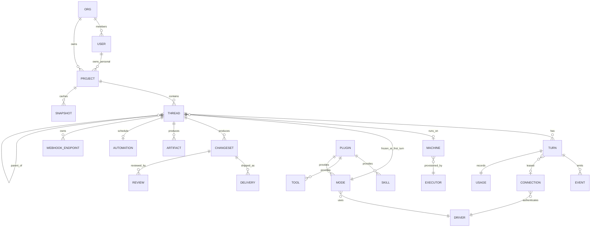
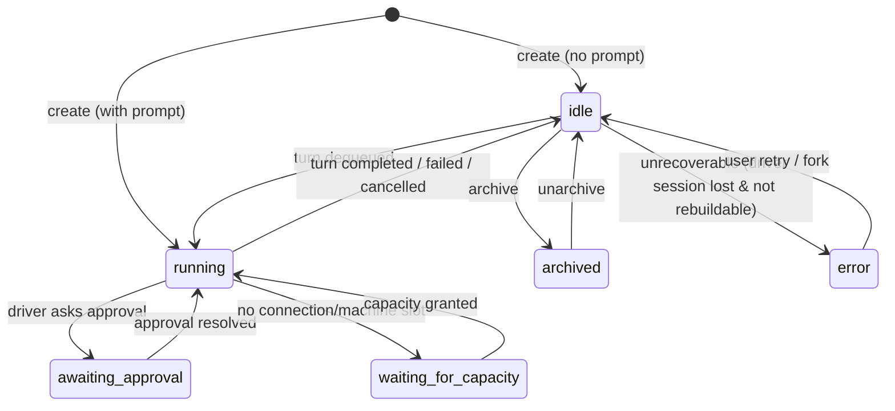
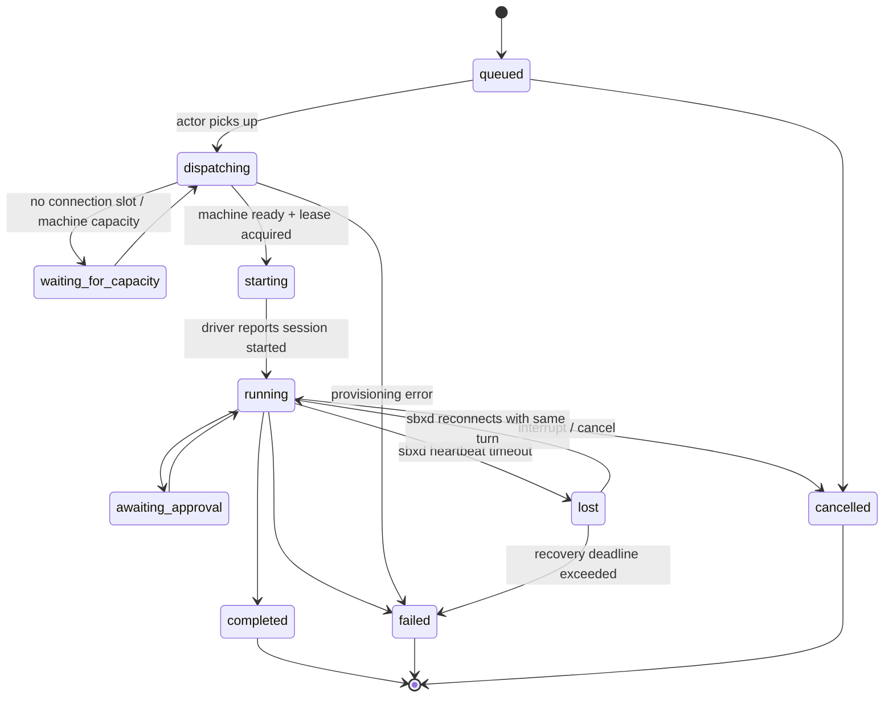
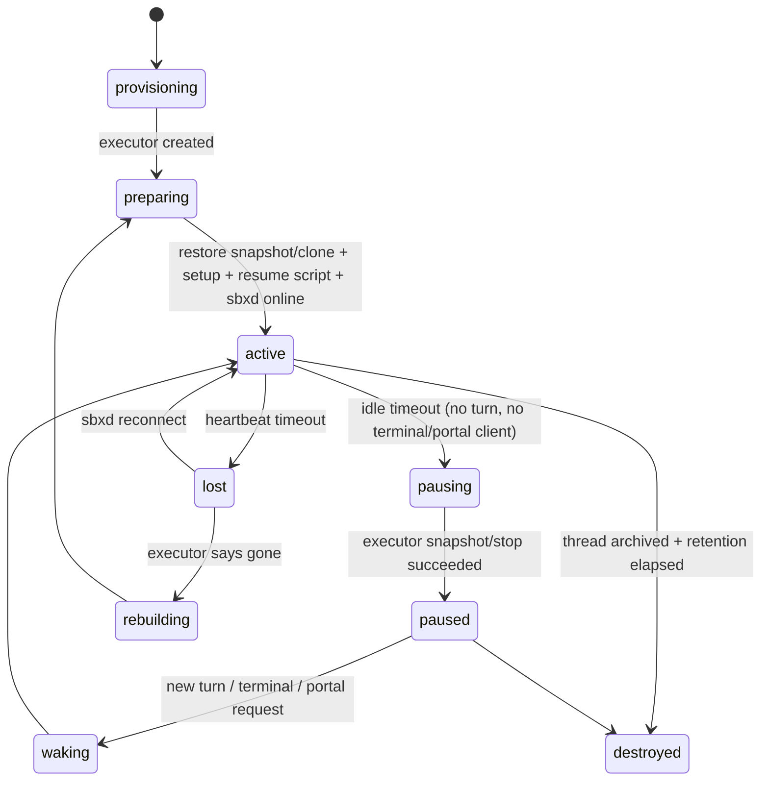

# 02 · 统一领域模型与状态机

## 实体总览

## 实体定义

| 实体 | ID 前缀 | 归属 | 关键字段 | 取代的旧概念 |
|------|---------|------|----------|-------------|
| `Org` | `org_` | — | name, policies（禁止个人 connection、默认 visibility…） | hosted owner / operator 空间 |
| `User` | `usr_` | Org（可多） | identities（email、GitHub） | hosted user、API key owner |
| `ApiKey` | `key_` | User 或 Org(service) | scopes, prefix `sbx_`, last_used | `/v1` Bearer key、operator key、HTTP Basic |
| `Project` | `prj_` | User 或 Org | repo（github / git url / sbx-hosted）, extra_repos, base_branch, ship_behavior, machine_size, pre_clone/pre_setup script, env/secrets, default_mode | repository config、environment、workspace 配置 |
| `Thread` | `thr_` | Project 或 无项目 | title, mode_id（冻结）, state, visibility, labels, parent_thread_id, origin(api/console/cli/automation/webhook/agent), driver_session_ref, machine_id, executor_pref, output_schema | Agent、Task、Session、Workflow 节点 |
| `Turn` | `trn_` | Thread | seq, input(message blocks + attachments), delivery(steer/queue/interrupt), state, connection_id, started/ended_at, result, error | Run |
| `Event` | `evt_` | Thread（按 Turn 分段） | seq（thread 内单调）, type, data, source | events / run stream / session events |
| `Machine` | `mch_` | Thread（1:1，可重建） | executor_id, size, state, snapshot_id, endpoints, last_active_at | Sandbox、Agent 的 live 部分 |
| `Executor` | `exe_` | 系统 / Org / User(runner) | kind(modal/local/runner), capacity, regions, health | `SBX_BACKEND`、SandboxBackend、hosted compute |
| `Runner` | `run_`(=Executor kind runner) | User/Org | runner_id(hostname), served_dirs, sharing, online | 无（新）|
| `Snapshot` | `snp_` | Project × size | source_fingerprint, created_at, ttl | checkpoint（部分） |
| `Driver` | 名称 `codex` 等 | 系统注册表 | manifest（见 05）、capabilities、cli_version | provider、AgentAdapter |
| `Mode` | `codex/high` | 系统/Plugin/Org | driver, model, effort, instructions, tool_policy, skill_set, approval_policy | provider+model+reasoning_effort 组合 |
| `Connection` | `con_` | User 或 Org | driver(s), kind(subscription/api_key/gateway), status, priority, model_mapping, slots, cooldown_until, secret_ref, version | Account、provider credential、hosted Codex connection |
| `Integration` | `int_` | User/Org | kind(github_app, modal, slack), status, metadata | `/connections`（GitHub、Modal） |
| `ChangeSet` | `chg_` | Thread | base_sha, head_sha, branch, files_summary, diff_ref | Revision、Changes |
| `Delivery` | `dlv_` | ChangeSet | kind(push_base/push_branch/pull_request/custom), pr_url, pushed_sha, merge_state | Delivery |
| `Review` | `rev_` | ChangeSet | reviewer_thread_id, verdict(approve/request_changes/comment), pinned_head, stale | Review |
| `Artifact` | `art_` | Thread（可选 Turn） | kind(file/patch/screenshot/video/log/structured_output), blob_ref, size, sha256 | Artifact、handoff package |
| `Automation` | `aut_` | Thread（≤1） | schedule(cron/once/interval), prompt, run_mode(existing/fresh), end_condition, paused | 无（新） |
| `WebhookEndpoint` | `whk_` | (owner, project, plugin, key) → owning thread | url_token, headers_captured, paused | 无（新） |
| `Plugin` | `plg_` | 系统/Org/User/Project | manifest, version, scope, enabled | 无（新） |
| `Usage` | — | Turn | tokens(in/out/cache), cost_estimate, quota_signal, duration | usage view |

### 命名决策

- **不再使用 `Workspace` 指代租户**（避免与代码工作区冲突）：租户叫 `Org`；代码工作区叫 `Worktree`（Machine 内部概念，不是 API 资源）。
- **不再有 Agent / Task / Session / Run / Workflow 资源**。旧 workflow 的“按 workflow_id 恢复一组 agent”= `GET /v1/threads?label=workflow:release-42` 或 `parent_thread_id` 树。
- **Structured output**（旧 Task 的输出契约）是 Thread 的 `output_schema` 字段；最后一个 Turn 的结果按 schema 校验后写为 `structured_output` Artifact。

## 状态机

### Thread

Thread 状态描述“对话层面”的状态，对齐 Amp `ThreadState` 并补充 sbx 需要的等待态：

- `idle` 是正常静止态（≈ 旧 `finished`），**不是终态**；任何时候都可以继续发消息。
- 只有 `archived` 会停止 automation 与 webhook 投递。
- Thread 没有 `completed` 状态。“任务完成”由 Turn 结果、ChangeSet、Delivery 表达。

### Turn

- `failed.error.code` 来自统一错误目录：`connection_auth_invalid`、`connection_rate_limited`、`driver_crashed`、`driver_session_unresumable`、`machine_provision_failed`、`timeout`、`output_schema_invalid` …（Driver 的 `classify_exit()` 负责映射）。
- `connection_rate_limited` / `connection_auth_invalid` 在**同一 Turn 内**可自动换 Connection 重试（仅当 Turn 尚未产生副作用事件，或 Driver 声明 `resume_on_new_credential`）。
- 同一 Thread 同时只有一个 Turn 处于 `dispatching..awaiting_approval`；其余排队。`delivery=steer` 的消息若 Driver 支持则注入当前 Turn，否则转为 queued Turn。

### Machine

- Executor 不支持 pause（如普通本地进程）时 `pausing → destroyed-with-persisted-worktree`，唤醒时走 `rebuilding`。语义对上层透明。
- `rebuilding` 需要：Project snapshot + 最新 Worktree checkpoint（git bundle + 未提交 patch + driver 会话目录归档）。见 05。

## 不变量

1. Thread 的 `mode_id` 在第一个 Turn 进入 `dispatching` 时冻结；之后修改必须 `fork`（新 Thread，`parent_thread_id` 指向原 Thread，可选携带 Worktree）。
2. 每个 Event 的 `(thread_id, seq)` 唯一且连续；客户端可以 `after=seq` 无损续读。
3. Connection secret 只存在于 Vault 与 Machine 的 lease HOME；任何资源视图只暴露 `fingerprint/status/expires_at`。
4. Turn 结束后 Connection lease 必须在 TTL 内归还；控制面 reaper 是兜底。
5. ChangeSet 由观察器从 git 状态推导，不信任 agent 自述。
6. Review 的 verdict 只对 `pinned_head` 有效；ChangeSet head 变化即 `stale`；同一 Thread 产生的 Review 不算 independent。
