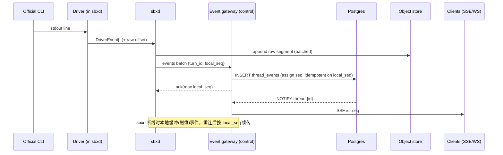

# 04 · 统一事件协议

## 设计要点

1. **Thread 级 append-only 日志**：所有事件属于一个 Thread，`seq` 在 Thread 内单调递增、无空洞。Turn 只是日志中的区段（`turn_id` 字段）。这取代现在的“每个 run 一个 `events.jsonl` + 按行号续读”。
2. **公共事件是 sbx 自己的词汇**，不是任何 CLI 的形状（现状以 Codex 0.153 形状为 canonical，导致非 Codex provider 必须伪装成 Codex）。
3. **消息内容使用 content blocks**（`text / thinking / tool_use / tool_result / image / file`），与 Amp streaming JSON 及 Claude stream-json 同构，便于 SDK 兼容投影。
4. **原始输出永不丢**：Driver 的每一行 raw stdout/stderr 写入对象存储分段（`raw_ref`），公共事件只引用其偏移；用于排障和重放翻译器（翻译器升级后可重新生成规范事件）。
5. **持久化先于推送**：sbxd 产生的事件先由控制面写入 Postgres（`thread_events`），再广播到 SSE/WS 订阅者。客户端直连 Machine 的旁路（现 hosted direct-connect）被取消，统一走事件网关，延迟靠批量写入 + LISTEN/NOTIFY 解决。

## 信封

```json
{
  "id": "evt_01J…",
  "thread_id": "thr_…",
  "turn_id": "trn_…",          // 线程级事件可为 null
  "seq": 1842,
  "ts": "2026-10-05T08:00:00.123Z",
  "type": "item.completed",
  "data": { … },
  "source": {
    "kind": "driver",            // control | sbxd | driver | plugin | observer
    "driver": "opencode",
    "driver_version": "1.4.2",
    "raw_ref": "raw/thr_…/trn_…/0003.jsonl#L120-L131"
  }
}
```

`type` 以 `<noun>.<verb>` 命名，`data` 的 schema 版本化存放于 `contracts/events/*.schema.json`。未知 `type` 必须被客户端忽略。

## 事件目录

### Thread / Turn 生命周期（source=control）

| type | data |
|------|------|
| `thread.created` | `{mode, project_id, origin, parent_thread_id}` |
| `thread.updated` | `{changes:{title?,labels?,visibility?}}` |
| `thread.state_changed` | `{from, to, reason}` |
| `thread.archived` / `thread.unarchived` | `{}` |
| `turn.queued` | `{seq_in_thread, delivery, input:{content[]}, origin}` |
| `turn.dispatching` | `{}` |
| `turn.waiting_for_capacity` | `{reason: connection_slots \| machine_capacity \| runner_offline, eta_s?}` |
| `turn.started` | `{connection:{id,fingerprint,driver}, model, effort}` |
| `turn.steered` | `{message_index}` — 一条 steer 消息被注入当前 turn |
| `turn.completed` | `{result:{text?, structured_output_artifact?}, usage, duration_ms}` |
| `turn.failed` | `{error:{code,message,retryable}, usage?}` |
| `turn.cancelled` | `{by}` |

### Agent 内容（source=driver，经翻译）

| type | data |
|------|------|
| `session.bound` | `{driver_session_ref}` — CLI 原生会话 id 首次确定（只在 thread 首个 turn 或 rebuild 后出现） |
| `item.started` | `{item}` |
| `item.delta` | `{item_id, delta}` — 可选；Driver 声明 `streaming.deltas` 才会出现 |
| `item.completed` | `{item}` |

`item.kind` 统一集合：

| kind | 字段 | 说明 |
|------|------|------|
| `message` | `role: assistant\|user`, `content[]` | 助手/用户消息；content blocks |
| `reasoning` | `text`, `redacted?` | 思考摘要（若 CLI 提供） |
| `command` | `command`, `cwd`, `output`, `exit_code`, `status` | shell 执行 |
| `file_change` | `changes[{path, kind: add\|modify\|delete\|rename}]`, `status` | CLI 自报的文件变更 |
| `tool_call` | `name`, `server?`(mcp), `input`, `output?`, `is_error?`, `status` | 非 shell 工具（含 MCP、sbx 内置工具） |
| `plan` | `steps[{text,status}]` | todo/plan 列表 |
| `subagent` | `thread_id?`, `name`, `status` | CLI 内部子代理或 sbx agent-to-agent |
| `notice` | `level`, `message` | 非致命错误/警告（原 `item.type=error`） |

### 交互（source=driver/control）

| type | data |
|------|------|
| `approval.requested` | `{approval_id, kind: command\|file_write\|tool\|network, summary, payload}` |
| `approval.resolved` | `{approval_id, decision: allow\|deny\|allow_always, by}` |

### Machine / 工作区（source=sbxd / observer）

| type | data |
|------|------|
| `machine.state_changed` | `{from,to,executor,size}` |
| `machine.setup.output` | `{stream, chunk_ref}`（setup/resume 脚本日志，引用存储） |
| `worktree.changed` | `{files_changed, insertions, deletions}`（节流，观察器产生） |
| `changeset.updated` | `{changeset_id, head_sha, branch}` |
| `delivery.created` / `delivery.updated` | `{delivery_id, kind, pr_url?, state}` |
| `review.completed` | `{review_id, verdict, pinned_head}` |
| `artifact.created` | `{artifact_id, kind, name, size}` |
| `port.opened` / `port.closed` | `{name, port, url?}` |

### 自动化 / 扩展（source=control/plugin）

| type | data |
|------|------|
| `automation.fired` | `{automation_id, run_mode}` |
| `webhook.received` | `{endpoint_id, event_id}`（不含 body，body 在 inbox 存储） |
| `plugin.event` | `{plugin, name, data}` — 插件自定义事件，命名空间隔离 |

## 流式协议

- **SSE** `GET /v1/threads/{id}/events?after=<seq>&turn=<tid>&types=…`：`id:` = seq，`event:` = type。支持 `Last-Event-ID`。心跳 15s。
- **WebSocket** `/v1/stream`：多路复用订阅多个 thread（Console 侧边栏用），消息为同一信封。
- **列表态推送**：`/v1/stream` 支持订阅 `threads.summary`（state/title/unread 变化），console 不需要轮询列表。
- **回放**：`?format=json&after=&limit=` 分页拉取；`/export` 生成 Markdown。

## 兼容投影（SDK `execute()` / `--stream-json`）

在客户端/网关把信封投影为 Amp/Claude 兼容的 4 类消息：

| 投影消息 | 来源 |
|----------|------|
| `system/init` | `turn.started` + thread 元数据（`session_id` = thread_id、tools、mcp_servers） |
| `assistant` | `item.completed(kind=message, role=assistant)`、`tool_call` 的 `tool_use` 部分、`reasoning`(thinking) |
| `user` | `turn.queued.input`、`tool_call` 的 `tool_result` 部分、`command` 输出 |
| `result` | `turn.completed` / `turn.failed`（`is_error`, `usage`, `duration_ms`, `result`） |

投影是有损的视图；完整信息只在信封事件里。

## Driver 翻译规则

Driver 实现 `translate(raw: RawLine, ctx: TurnContext) -> list[DriverEvent]`（纯函数 + 小状态机），其中：

- 必须产出：`session.bound`（若有原生会话）、至少一个终态信号（`completed`/`failed`），并在 `exit` 时由 sbxd 兜底补齐。
- 无法识别的行：产出 `notice(level=debug)` 而不是丢弃；raw 永远保存。
- `usage` 归一化为 `{input_tokens, cached_input_tokens, cache_write_input_tokens?, output_tokens, reasoning_output_tokens?, cost_usd?, quota?:{remaining?, resets_at?}}`；不提供的字段省略，不填 0。
- 翻译器以 **golden fixture** 测试：`drivers/<name>/fixtures/*.raw.jsonl → *.events.jsonl`（沿用现有 replay 夹具思路）。

## 事件流图


