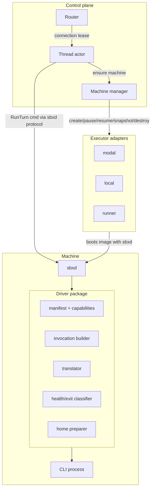
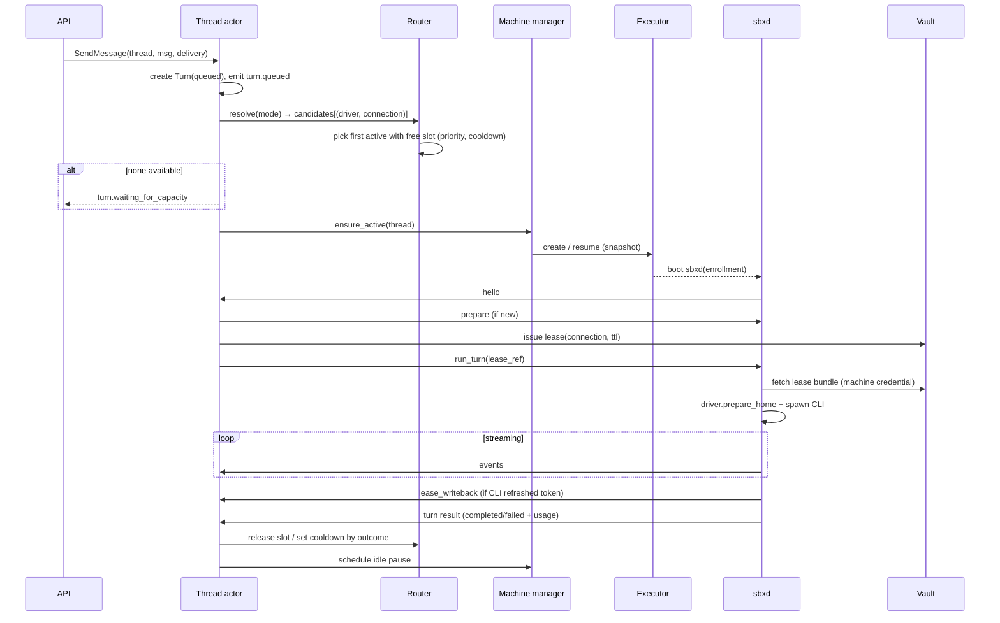

# 05 · 执行面：Driver / Executor / Machine / sbxd

## 职责切分



| 层 | 知道什么 | 不知道什么 |
|----|---------|-----------|
| Control plane | Thread/Turn 状态、Mode、Connection 元数据、Driver manifest | CLI argv、输出格式、Modal API |
| Executor adapter | 如何创建/暂停/恢复/快照/销毁一台机器、如何把 sbxd 启起来 | Thread、CLI、凭证内容 |
| sbxd | 机器内一切：Worktree、进程、终端、端口、凭证 HOME、Driver 调度 | 数据库、其他 Thread |
| Driver | 一个 CLI 的全部细节 | Machine 从哪来、控制面怎么存 |

## Driver

### Manifest（声明式，控制面可读）

```yaml
# drivers/opencode/driver.yaml
name: opencode
display_name: OpenCode
version: 1                       # driver 包自身版本
cli:
  package: {npm: "opencode-ai", version: "1.4.2"}   # 或 binary url / pip
  bin: opencode
  image_layer: opencode          # Machine 镜像层名
models:
  discovery: command              # static | command | none
  static: []
auth:
  connection_kinds: [subscription, api_key]
  files: [".local/share/opencode/auth.json"]       # 相对 lease HOME
  env: ["OPENAI_API_KEY"]                          # api_key 类型时
  login_flows: [device_code, upload_file]
  refresh: cli_managed            # cli_managed（CLI 自刷，需回写）| static | none
capabilities:
  resume: native                  # native | replay | none
  steer: false
  interrupt: signal               # signal | protocol | none
  approvals: none                 # none | protocol（ACP/stdio）
  hooks: {pre_tool: false, post_tool: false}
  mcp: config_file                # config_file | flag | none
  skills: {dir: ".opencode/skills"}   # 或 instructions_file: AGENTS.md
  structured_output: prompt       # native | prompt
  streaming: {deltas: false}
  usage: tokens                   # tokens | none
efforts: [low, medium, high]
profiles:                         # 生成默认 Modes：opencode/medium …
  medium: {model: "auto", effort: medium}
```

### 运行时接口（在 sbxd 内加载，Python）

```python
class Driver(Protocol):
    manifest: DriverManifest

    def prepare_home(
        self, home: Path, ctx: TurnContext
    ) -> None: ...  # 写 CLI 配置、MCP 配置、skills
    def invocation(self, ctx: TurnContext) -> Invocation: ...  # 首轮/续轮 argv+env+stdin 模式
    def translate(self, line: RawLine, state: TranslateState) -> list[DriverEvent]: ...
    def classify_exit(
        self, code: int | None, stderr_tail: str, state: TranslateState
    ) -> Outcome: ...
    def interrupt(self, proc: Proc) -> None: ...
    def steer(self, proc: Proc, message: Message) -> bool: ...  # capability 为 false 时不被调用
    def respond_approval(self, proc: Proc, approval: ApprovalDecision) -> None: ...
    def login(
        self, flow: LoginFlow, io: LoginIO
    ) -> CredentialBundle: ...  # 订阅登录（在隔离 login machine 内）
    def verify(self, home: Path) -> CredentialHealth: ...
    def collect_credential_changes(self, home: Path) -> CredentialBundle | None: ...
```

- `TurnContext` 含 `mode`（model/effort/instructions）、`driver_session_ref`、`worktree_path`、`lease_home`、`mcp_endpoints`、`skills`、`output_schema`。
- **Driver 家族复用**：大量 CLI 讲共同协议，提供基类：
  - `StreamJsonDriver`（Claude Code 形 stream-json：claude、amp CLI 本身、部分兼容 CLI）
  - `AcpDriver`（Agent Client Protocol JSON-RPC stdio：devin acp、gemini-cli、Zed 生态 agent）— 天然支持 approval / steer
  - `JsonlExecDriver`（codex exec --json）
  - `TextDriver`（只有纯文本输出的 CLI，降级）
  新增一个 CLI 通常 = 一个 manifest + 一个 50–200 行的子类 + fixtures。
- 现有 `runtime/runner/adapters/{antigravity,grok,opencode,devin,claude}.py` 与 `codex.py` 的知识迁移进对应 Driver 包；实验性 `claude` 在新架构中直接成为正式 Driver 候选。

### Driver 一致性测试套件（每个 Driver 必须通过）

`contracts/driver-conformance/`：用 fake CLI / 录制 fixtures 验证 首轮→续轮 resume、中断、凭证失效分类、限流分类、usage 解析、未知行容错、MCP 工具调用可见、skills 生效。

## Executor

```python
class Executor(Protocol):
    kind: str  # "modal" | "local" | "runner" | 未来 "k8s" | "firecracker"

    def capabilities(
        self,
    ) -> ExecutorCaps: ...  # pause, snapshot, ports_ingress, terminal, desktop, sizes
    async def create(self, spec: MachineSpec) -> MachineHandle: ...
    async def pause(self, h: MachineHandle) -> None: ...
    async def resume(self, h: MachineHandle) -> None: ...
    async def snapshot(self, h: MachineHandle, label: str) -> SnapshotRef: ...
    async def destroy(self, h: MachineHandle) -> None: ...
    async def describe(self, h: MachineHandle) -> MachineStatus: ...
    async def list(self, selector: Mapping[str, str]) -> list[MachineHandle]: ...  # reconcile 用
```

- **不再有 `exec()`**：所有进程执行通过 sbxd 协议完成。Executor 只负责让一台运行 sbxd 的机器存在，并把 enrollment token 注入它。这样 Modal、本地、K8s 与 BYO Runner 对上层完全同构。
- `MachineSpec = {image(driver layers), size, env(非 secret), enrollment_token, labels(thread/project/org), network_policy}`。
- **modal**：Sandbox + Modal snapshot（filesystem snapshot）实现 pause/resume；ingress 用 Modal tunnel 给 ports/terminal。
- **local**：本机子进程 + 独立目录（开发、CI、self-host 小规模）；pause = 停进程保留目录。
- **runner**：用户自带机器长期在线；`create` = 在其服务目录中创建 git worktree 并启动一个 sbxd 子会话；不支持 snapshot（capabilities 声明）。
- **BYO Modal**（hosted 用户自带 Modal 账户）= 同一个 `modal` executor，实例化时绑定用户 Integration 的凭证。

## sbxd（Machine 守护进程）

一个二进制/包，三种部署：Machine 内（modal/local）、BYO Runner（`sbx runner`）、本地 CLI 执行（`sbx -x` 在进程内嵌）。

职责：

1. **出站连接** `WS /internal/sbxd/connect`，enrollment token → machine credential；心跳；断线本地缓冲事件。
2. **Worktree 管理**：clone/fetch 主仓库与附加仓库（`../repos/`）、checkout base 分支、创建 thread 分支 `sbx/<thread-short-id>`、配置 commit trailer `Sbx-Thread-ID`。
3. **生命周期脚本**：`pre_clone`（项目设置）→ clone → `pre_setup` → `.agents/setup`（仅在无快照时，结束后清理进程与凭证再快照）→ 注入 env/secret → `.agents/resume`（每次激活/唤醒）。沿用 Amp 的文件约定（`.agents/setup`、`.agents/resume`），可兼容 Amp 项目。
4. **Turn 执行**：接收 `RunTurn{turn_id, input, mode, driver_session_ref, lease}` → 物化 lease HOME → `Driver.prepare_home` → spawn → 翻译 → 回传事件 → 结束后 `collect_credential_changes` 回写 → 擦除 HOME。
5. **Steer / interrupt / approval** 转发给 Driver。
6. **MCP 工具服务器**：在本机暴露 `sbx` MCP（stdio 或 localhost HTTP），Driver 把它写进 CLI 的 MCP 配置。工具实现通过 sbxd 协议回调控制面（agent-to-agent、schedule、artifact 上传）或本地执行（file transfer）。
7. **服务、端口、终端**：`.sbx/services.yaml`（兼容读取 `.amp/services.yaml`）声明长期服务；共享 tmux 会话供 Terminal WS 与 agent 共用；端口代理到 Executor ingress。
8. **Git 观察器**：节流地计算 `git status/diff --stat`、HEAD 变化，产生 `worktree.changed / changeset.updated`。
9. **Checkpoint**：Turn 结束与暂停前，持久化 `git bundle`（thread 分支）+ 未提交 patch + Driver 会话目录（如 `~/.codex/sessions/<id>`）到对象存储，供 `rebuilding` 使用。**凭证文件被排除**。
10. **Secret 遮蔽**：对所有输出流做已知 secret 值替换（与 Amp 行为一致），再交给翻译器。

### sbxd 协议（控制面 ↔ sbxd）

JSON 帧，双向，按 `machine_id` 认证：

| 方向 | 帧 | 说明 |
|------|----|------|
| ↑ | `hello{sbxd_version, drivers[], caps, served_dirs?}` | 注册/重连；runner 上报服务目录 |
| ↓ | `prepare{project, snapshot?, scripts, env, secrets_ref}` | 准备机器 |
| ↓ | `run_turn{…}` / `steer{turn_id,message}` / `interrupt{turn_id}` / `approval{…}` | |
| ↑ | `events{turn_id, from_local_seq, events[]}` / `ack` ↓ | 至少一次 + 幂等 |
| ↑ | `lease_writeback{connection_id, version, bundle_enc}` | 凭证刷新回写（CAS） |
| ↓↑ | `tool_call{…}` / `tool_result{…}` | MCP 工具回调控制面 |
| ↓ | `checkpoint{}` / `shutdown{}` | |
| ↔ | `terminal.*`、`fs.*`、`port.*` 子通道 | Files/Terminal/Ports |

## Turn 执行生命周期



## Worktree 与持久层次

| 层 | 位置 | 生命周期 | 是否进快照 |
|----|------|----------|-----------|
| Project snapshot | Executor snapshot 存储 | ≤ 72h，按 source fingerprint 失效 | 是（setup 结果，无凭证） |
| Worktree（thread 分支 + 未提交） | Machine 磁盘 + checkpoint（对象存储） | Thread 生命周期 | Machine pause 快照；checkpoint 兜底 |
| Driver 会话目录 | Machine `$HOME_STATE/<driver>` + checkpoint | Thread 生命周期 | 是 |
| Lease HOME（凭证） | tmpfs，每 Turn 物化 | Turn | **否** |
| Raw logs | 对象存储 | 保留策略（默认 30 天） | — |
| 规范事件 | Postgres | Thread 生命周期 | — |
| Artifacts | 对象存储 + 元数据 Postgres | 独立保留策略 | — |
