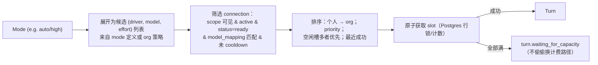
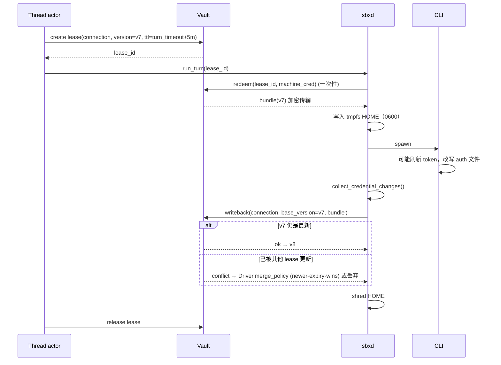

# 06 · Connections：订阅、凭证与路由

> 这是 sbx 相对 Amp 的核心优势所在：Amp 的 Model Routing 是“可选地用你自己的 key/订阅”，sbx 则是“**订阅 CLI 登录就是主路径**，并且可以把同一个 Mode 分发到一池账号上”。

## 模型

```text
Connection
  id, scope: user | org, owner_id
  driver: codex | antigravity | grok | opencode | devin | claude | ...   (一个 connection 服务一个 driver；网关型可服务多个)
  kind: subscription | api_key | gateway | cloud
  label, priority (0 = 最先), active
  model_mapping: ["*/*", "-openai/o1-*", "foo -> bar"]   # 语法借鉴 Amp
  slots: 并发上限（订阅默认 1–2）
  status: unverified | ready | refreshing | rate_limited | auth_invalid | disabled
  cooldown_until, last_error_code
  secret_ref -> Vault(version)
  fingerprint (sha256 前 12 位，展示用)
  quota: {plan?, remaining?, resets_at?}   # Driver 能解析时
```

## 路由



- **Thread 粘性**：Thread 首个 Turn 选定的 `driver` 固定（Mode 冻结）；Connection 可以在 Turn 之间切换（同 driver 不同账号），前提是 Driver 声明 `resume` 与账号无关（codex 本地会话文件可被任意账号 resume；若某 CLI 的会话绑定账号，manifest 声明 `session_bound_to_account: true`，则 Thread 也粘住 Connection）。
- **结果反馈**：`classify_exit` → `rate_limited` 设置 cooldown（优先使用 CLI 提供的 reset 时间）；`auth_invalid` 标记 connection 并通知所有者；成功清除错误计数。
- **组织策略**：org 可禁止个人 connection、限制可用 driver、为 mode 指定 driver 白名单。

## 生命周期与登录

| 流程 | 说明 |
|------|------|
| `device_code` / `browser_oauth` | 控制面启动一台**专用 login Machine**（小规格、无仓库），sbxd 运行 `Driver.login()`，把验证 URL/代码通过 `login_session` 事件推给 console；完成后打包 credential bundle 加密入 Vault |
| `upload_file` | 用户在本地 `sbx connections login --driver codex` 由本地 CLI 完成登录后上传 auth 文件（现有方式），服务端只接受 manifest 声明的文件路径 |
| `api_key` | 直接写 Vault |
| `verify` / Check Access | 运行一次最小 Turn（固定 prompt），更新 status/quota |

## Lease 与回写



- Vault 实现：Postgres 表 + 应用层信封加密（KMS/主密钥由部署提供），或外部 Vault（HashiCorp/云 KMS）适配器。
- **凭证从不出现在**：API 响应、事件、日志、快照、checkpoint、Worktree、环境变量列表（API key 类型除外，且仅在 CLI 进程 env 中）。
- 同一订阅账号的多个并发 lease 由 `slots` 控制；订阅刷新 token 冲突通过 CAS 解决（延续现 `credsync`/`credlifecycle` 的语义）。

## 项目 env 与 secrets（与 Connection 区分）

- Project/Org/User 三级 env 与 secret（覆盖顺序 user > project > org，同 Amp）。
- 注入时机：`prepare`（setup 阶段只给 project/org 级，不给个人）、每次 Turn 前刷新。
- 未来：Machine 签发 OIDC workload identity token（`aud` 指定，scope = org/project/user/thread），替代长期云凭证。

## 安全模型摘要

| 边界 | 规则 |
|------|------|
| 租户 | 所有查询带 `org_id/owner_id`；跨租户访问一律 404 |
| Machine credential | enrollment token 一次性、短 TTL；machine credential 只能访问自身 thread 的 lease/事件/工具 |
| Runner | runner 注册属于 user/org；共享 runner 需显式授权；runner 只接受其所有者可见的 thread |
| Plugin | 见 07：不能读 Vault，不能直接访问 DB |
| 网络 | Machine 默认出网放行（CLI 需要），可按 project 配置 allowlist |
| 审计 | connection 创建/登录/回写/删除、secret 修改、runner 注册写入 `audit_log` |
