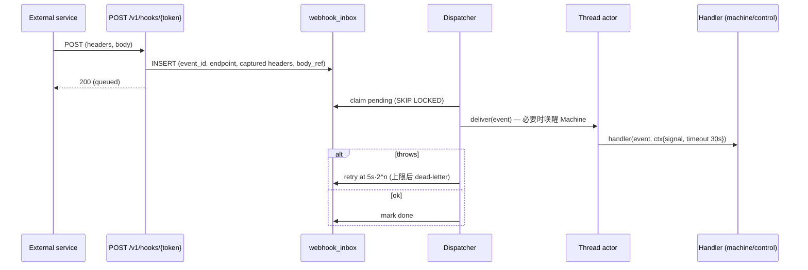

# 07 · 扩展模型：Plugin / Mode / Skill / Tool / Automation / Webhook / Agent-to-Agent / Ship

## 前提：我们不拥有 harness

Amp 的插件运行在它自己的 agent 进程里，可以注册工具、拦截 tool call。sbx 运行的是第三方 CLI，所以扩展必须落在三个 **CLI 中立的注入点**：

| 注入点 | 机制 | 覆盖面 |
|--------|------|--------|
| **Instructions / Skills** | sbxd 把 skill 物化到 Driver 声明的位置（`skills.dir`，或合并进 `AGENTS.md`/系统提示文件） | 所有 CLI |
| **Tools** | sbx MCP server（Machine 本地），Driver 写入 CLI 的 MCP 配置 | 支持 MCP 的 CLI（绝大多数）；不支持时工具不可用并在 mode 上标注 |
| **Lifecycle hooks** | 控制面事件总线（thread/turn/item 事件，post-hoc）；若 Driver 支持 `hooks.pre_tool`，可同步拦截 | 所有 CLI（post-hoc）；部分 CLI（pre-tool） |

## Plugin manifest

```yaml
# plugins/official/review/plugin.yaml
name: sbx-review
version: 1.2.0
scope_hint: org                     # system | org | user | project
compat: {sbx: ">=2.0", drivers: ["*"]}
provides:
  modes:
    - id: review/strict
      driver: codex                 # 或 "auto"
      model: auto
      effort: high
      instructions: ./modes/review.md
      tools: [sbx.threads.report, gh.pr.comment]
      skills: [code-review]
      output_schema: ./schemas/review.json
  skills:
    - path: ./skills/code-review    # SKILL.md + 资源
  tools:
    - name: gh.pr.comment
      runtime: machine              # machine：在 sbxd 中作为 MCP 子进程；control：在控制面沙箱 worker 中
      command: ["node", "./tools/gh-comment.js"]
      input_schema: ./schemas/gh-comment.json
      permissions: [network:api.github.com, integration:github]
  hooks:
    - on: turn.completed
      runtime: control
      handler: ./hooks/on-turn-completed.js
  webhooks:
    - key: github-events
      headers: [x-hub-signature-256]
      handler: {runtime: machine, command: ["node", "./webhooks/github.js"]}
```

### 作用域与优先级

`project`（仓库 `.sbx/plugins/`，兼容读取 `.agents/skills`）> `user` > `org` > `system`。同名覆盖，按 scope 可禁用。

### 运行位置与信任

| runtime | 运行在 | 能访问 | 不能访问 |
|---------|--------|--------|----------|
| `machine` | sbxd 拉起的子进程（与 CLI 同一 Machine，隔离用户） | Worktree、Thread 的 env/secrets、sbx MCP 回调 | Vault、DB、其他 Thread |
| `control` | 控制面的隔离插件 worker（独立进程/容器，限 CPU/时间） | 受限的 Plugin SDK：读本 thread 事件、发消息、写 artifact、调用已授权 integration | Vault、原始 DB、其他租户 |

失败隔离：hook 抛错仅记录 `plugin.event{level:error}`，不影响 Turn；超时 30s（与 Amp webhook 一致）。

## Mode

Mode = **对“谁来干活、怎么干”的命名组合**，相当于 Amp 的 mode + agent definition：

```text
Mode
  id: "<namespace>/<profile>"   e.g. codex/high, grok/medium, auto/high, review/strict
  driver | "auto"(候选列表)
  model, effort
  instructions (追加到系统提示/AGENTS 指令)
  tools  (允许的 sbx/plugin 工具)
  skills (预加载)
  approval_policy: never | on_risky | always   (受 Driver approvals 能力约束)
  output_schema?
  machine_size_hint?
```

- 系统根据每个 Driver manifest 的 `profiles` 自动生成 `<driver>/<profile>`。
- `auto/<effort>`：org 配置候选顺序（如 `codex → opencode → grok`），Router 选第一个有容量的 driver，**选定后写回 thread.mode_resolved 并冻结**。
- Mode 在首个 Turn 冻结（Amp 规则 + CLI 原生会话不能换 CLI 的现实）。

## 内置 sbx 工具（MCP `sbx`）

| 工具 | 作用 |
|------|------|
| `sbx.threads.create` | 创建子 thread（可指定 project、mode——**可以是另一个 CLI**、executor、size、labels），返回 thread_id |
| `sbx.threads.send` | 给某 thread 发消息（queue/steer） |
| `sbx.threads.wait` | 等待某 thread 当前 turn 结束，返回结果摘要 |
| `sbx.threads.read` | 读取 thread 摘要/最后结果（引用 `@thr_…`） |
| `sbx.threads.search` | 按 label/project/文本查找 thread |
| `sbx.files.send` / `sbx.files.fetch` | 在 thread Worktree 之间显式传输文件（经对象存储） |
| `sbx.artifacts.upload` | 上传截图/视频/报告为 Artifact（返回可嵌入 PR 的 URL） |
| `sbx.schedule.get` / `sbx.schedule.set` / `sbx.schedule.clear` | 自动化（同 Amp `get_schedule` 用法） |
| `sbx.approval.request` | 对不支持原生 approval 的 CLI，由 agent 主动请求人工确认 |
| `sbx.report` | 写结构化输出（满足 `output_schema`） |

这让 **跨订阅、跨 CLI 的多 agent 编排** 成为平台能力：例如 codex thread 派生 3 个 grok thread 并行测试，再派一个 opencode review thread——这是 Amp 无法做到、sbx 独有的。

## Automation（定时）

- 每 Thread ≤ 1 个；字段：`schedule`（cron / interval / once，带时区）、`prompt`、`run_mode: existing | fresh`（fresh = 每次 fork 一个新子 thread，适合避免上下文膨胀）、`end_condition`（自然语言，agent 通过 `sbx.schedule.clear` 自行结束）、`paused`。
- 触发：scheduler（Postgres 定时扫描 + `SKIP LOCKED`）创建 Turn，输入为短系统消息 `"[automation aut_…] run scheduled task"`，agent 通过 `sbx.schedule.get` 取完整 prompt（借鉴 Amp，避免 prompt 在历史中重复膨胀）。
- 去重键：`(automation_id, scheduled_at)`。

## Webhook（事件驱动）



- 注册键 `(owner, project, plugin, key)` → 稳定 URL；首个注册的 thread 为 owning thread；thread 归档 → URL 返回 410，投递暂停。
- handler 常见动作：`ctx.thread.send(...)` 让 agent 处理，或 `ctx.threads.create(...)` 开新 thread。
- 内置 GitHub 集成（PR 评论 `@sbx`、check 失败）也走同一 inbox，作为 system plugin 实现，而不是专用路由。

## Ship / Review / Restack = prompt 模板

| 动作 | 实现 |
|------|------|
| Ship | Project `ship_behavior`：`push_base`（rebase→test→push base）、`push_branch`（push `sbx/<id>` + 打开 PR）、`custom`（用户 prompt）。点击 = 发送对应 prompt 的 Turn |
| Delivery 记录 | 控制面 git 观察器 + GitHub integration 检测 push/PR，生成 `Delivery`；**不依赖 agent 自述** |
| Review | 新建 review thread（`review/strict` mode，默认选择与作者不同的 driver 或 connection），`output_schema` 校验后生成 `Review(pinned_head)` |
| Restack | 预定义 prompt：整理 merge-base 之后的提交，不 push |
| Merge | `POST /v1/deliveries/{id}/merge`：要求 independent approve 且 `pinned_head == head`（保留现有规则） |

## Operator agent（≈ Puck，后期）

一个系统 Mode `sbx/operator`，只配备平台 MCP 工具（threads/projects/connections 管理），以调用者权限运行；也是 Slack 集成的入口。实现上无需特例：它就是一个没有 project 的 thread。
