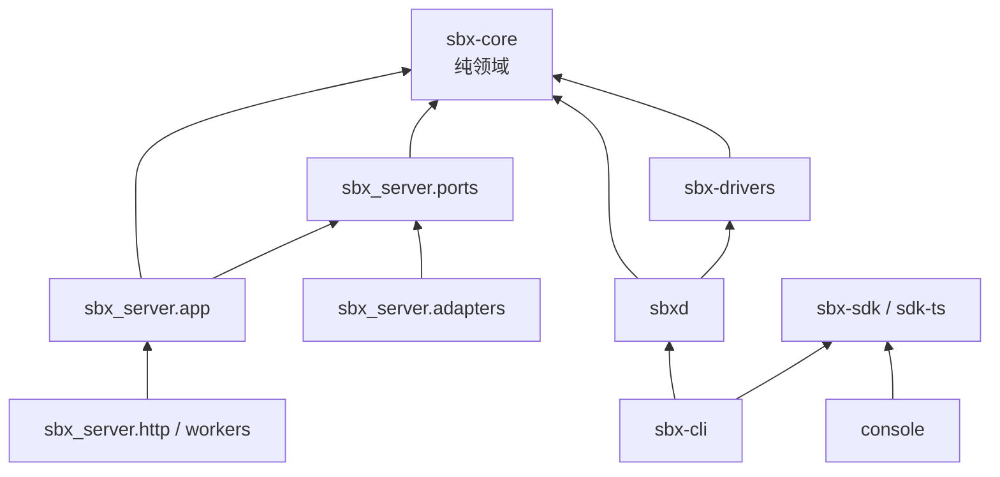

# 08 · 代码目录树与分层规则

## 技术选型

| 部分 | 选择 | 理由 |
|------|------|------|
| 控制面 | Python 3.12 + FastAPI + SQLAlchemy Core/asyncpg | 延续团队栈；Driver/sbxd 共享类型 |
| 持久化 | **Postgres 唯一真相源**（事件、状态、队列、调度、lease 计数）；对象存储（S3 兼容 / Modal Volume / 本地目录）存 raw/artifact/checkpoint | 去掉 Modal Dict 与文件 store 双轨 |
| 队列/调度 | Postgres `SKIP LOCKED` job 表 + `LISTEN/NOTIFY` | 少一个基础设施；后期可换 |
| Thread actor | 行级 lease（`thread_leases`，带 fencing token） | Substrate 风格的“多 actor 少 worker” |
| sbxd + Drivers | Python 包，打进 Machine 镜像；BYO runner 用 `uv tool install sbx` | 与现有 runner 代码知识连续 |
| Console | React + TS + Vite（保留 `console/` 技术栈，重写数据层） | |
| SDK | Python（手写薄层 + OpenAPI 生成模型）、TypeScript（同） | |
| 契约 | OpenAPI 3.1（代码生成）+ JSON Schema（事件、manifest、sbxd 协议） | 契约即测试夹具 |

## 目录树

```text
sbx/                                   # 仓库根（替换现有 control/ runtime/ src/ web/ broker/ 布局）
├── contracts/                         # 唯一真相源：机器可读契约（CI 校验生成物一致）
│   ├── openapi.yaml                   # /v1 公共 API（由 server 生成后提交）
│   ├── events/                        # 每个事件 type 的 JSON Schema + envelope.schema.json
│   ├── sbxd-protocol/                 # 控制面 ↔ sbxd 帧定义
│   ├── driver-manifest.schema.json
│   ├── plugin-manifest.schema.json
│   ├── errors.yaml                    # 单一错误目录（code, http_status, retryable, doc）
│   └── driver-conformance/            # Driver 一致性测试场景描述
│
├── packages/                          # Python workspace（uv workspace）
│   ├── sbx-core/                      # 纯领域：零 I/O 依赖
│   │   └── sbx_core/
│   │       ├── ids.py                 # 前缀 ULID
│   │       ├── thread/                # Thread 聚合、状态机、命令、领域事件
│   │       ├── turn/
│   │       ├── machine/               # Machine 状态机（不含 executor 实现）
│   │       ├── project/
│   │       ├── connection/            # Connection、路由算法（纯函数）、cooldown 策略
│   │       ├── mode/                  # Mode 解析、冻结规则
│   │       ├── changeset/             # ChangeSet / Delivery / Review 规则（independent, stale）
│   │       ├── automation/            # schedule 计算
│   │       ├── extension/             # plugin/skill/tool/mode 注册模型与优先级
│   │       ├── events/                # 事件信封、类型（从 contracts 生成）
│   │       └── errors.py              # 从 contracts/errors.yaml 生成
│   │
│   ├── sbx-server/                    # 控制面应用 + 适配器
│   │   └── sbx_server/
│   │       ├── app/                   # 应用层：用例
│   │       │   ├── commands/          # create_thread, send_message, cancel_turn, fork, ship, …
│   │       │   ├── queries/           # 列表/详情/搜索读模型
│   │       │   ├── actors/            # ThreadActor（lease + 命令处理循环）
│   │       │   ├── router.py          # Mode → (driver, connection) 选择（调用 core 纯函数 + 槽位仓储）
│   │       │   ├── machines.py        # MachineManager（ensure_active / idle pause / reconcile）
│   │       │   ├── observers/         # git/changeset/delivery 观察
│   │       │   └── policies/          # authz、org 策略、配额
│   │       ├── ports/                 # 抽象接口（Protocol）
│   │       │   ├── repositories.py    # ThreadRepo, TurnRepo, EventLog, ConnectionRepo, …
│   │       │   ├── executor.py        # Executor Protocol（见 05）
│   │       │   ├── vault.py
│   │       │   ├── blobstore.py
│   │       │   ├── jobs.py
│   │       │   └── integrations.py    # GitHub、Slack
│   │       ├── adapters/
│   │       │   ├── postgres/          # 仓储、事件日志、job 队列、lease
│   │       │   ├── blob/              # s3 / modal_volume / local_fs
│   │       │   ├── vault/             # pg_envelope / hashicorp
│   │       │   ├── executors/
│   │       │   │   ├── modal/
│   │       │   │   ├── local/
│   │       │   │   └── runner/        # BYO runner 作为 executor
│   │       │   └── integrations/
│   │       │       ├── github/        # App、PR、checks（含原 broker 客户端）
│   │       │       └── slack/
│   │       ├── http/                  # FastAPI：路由仅做 解析→command/query→序列化
│   │       │   ├── v1/                # threads, projects, connections, catalog, …
│   │       │   ├── auth/              # cookie 登录页、API key、principal 解析
│   │       │   ├── stream/            # SSE、WS 多路复用、terminal/fs 代理
│   │       │   ├── hooks.py           # POST /v1/hooks/{token}
│   │       │   └── internal/sbxd.py   # sbxd WS 网关
│   │       ├── workers/               # 后台进程入口：dispatcher, scheduler, webhook, reaper, plugin-host
│   │       ├── plugin_host/           # control 运行时插件沙箱
│   │       ├── legacy/                # 迁移期翻译器（/v1/agents、/api/v2 …）带删除日期
│   │       └── settings.py            # 部署 profile：local | selfhost | hosted
│   │
│   ├── sbxd/                          # Machine 守护进程
│   │   └── sbxd/
│   │       ├── main.py                # 模式：machine | runner | embedded(local CLI)
│   │       ├── protocol/              # 帧编解码、重连、本地事件缓冲（磁盘）
│   │       ├── worktree/              # clone、分支、trailer、checkpoint、restore
│   │       ├── lifecycle/             # pre_clone / setup / resume 脚本执行
│   │       ├── turns/                 # TurnRunner：lease HOME、spawn、translate、writeback
│   │       ├── mcp/                   # sbx MCP 工具服务器
│   │       ├── services/              # services.yaml、端口代理、tmux 终端
│   │       ├── observe/               # git 观察
│   │       └── redact.py              # secret 遮蔽
│   │
│   ├── sbx-drivers/                   # Driver SDK + 内置 drivers（sbxd 依赖它，控制面只读 manifest）
│   │   └── sbx_drivers/
│   │       ├── base/                  # Driver Protocol、TranslateState、family 基类
│   │       │   ├── jsonl_exec.py
│   │       │   ├── stream_json.py
│   │       │   ├── acp.py
│   │       │   └── text.py
│   │       ├── codex/                 # driver.yaml, driver.py, fixtures/, tests/
│   │       ├── antigravity/
│   │       ├── grok/
│   │       ├── opencode/
│   │       ├── devin/
│   │       ├── claude/                # 由现有实验 adapter 晋级
│   │       ├── fake/                  # 测试用 fake CLI driver（取代 tests/fakes 中散落的假件）
│   │       └── conformance/           # 一致性测试 runner
│   │
│   ├── sbx-sdk/                       # Python SDK（sbx.Sbx, execute()）
│   └── sbx-cli/                       # `sbx` CLI（本地执行、runner、threads、connections、server 部署）
│
├── sdk-ts/                            # @sbx/sdk TypeScript（execute()、threads、events client）
├── console/                           # React console（只依赖 @sbx/sdk）
│   └── src/
│       ├── app/                       # 路由、布局、providers
│       ├── features/
│       │   ├── threads/               # 列表(feed)、详情、时间线渲染（按 item.kind）
│       │   ├── composer/              # mode/project/executor 选择、steer/queue
│       │   ├── machine/               # Changes、Files、Terminal、Ports 面板
│       │   ├── review/                # ChangeSet/Delivery/Review/Merge
│       │   ├── connections/           # 登录流程、优先级、状态
│       │   ├── projects/
│       │   ├── automations/
│       │   └── settings/
│       ├── data/                      # 基于 SDK 的 query/stream 缓存（唯一数据层）
│       └── ui/                        # 设计系统组件
│
├── plugins/
│   └── official/                      # 官方 plugin：review、ship-flows、github-events、operator
├── images/                            # Machine 镜像定义：base + 每个 driver 的 layer
├── deploy/                            # selfhost（Modal 部署 / docker compose）、hosted（VPS + Postgres）
├── apps/broker/                       # 可选：公共 GitHub App 安装中转（原 broker/）
├── migrations/                        # Postgres schema 迁移
├── docs/                              # 设计与运维文档（本目录迁入 docs/architecture/）
├── docs-site/                         # 用户文档站（按新模型重写）
└── tests/
    ├── e2e/                           # console + server + local executor + fake driver
    ├── integration/                   # server + postgres(testcontainers) + local executor
    └── contract/                      # openapi/事件 schema 与实现一致性
```

## 依赖方向（CI 用 import-linter 强制）



规则：

1. `sbx-core` 不 import 任何 I/O 库（无 fastapi/sqlalchemy/modal/httpx）。
2. `app` 只依赖 `ports`，不依赖 `adapters`；装配在 `http/` 与 `workers/` 的 composition root。
3. `sbx_server` **不 import `sbx_drivers` 的运行时代码**，只读取 manifest（作为数据）。
4. `adapters/executors/*` 不 import Driver；`sbx_drivers` 不 import `modal`。
5. Console 与 CLI 只通过公开 SDK 访问服务器（console 不再有 hosted/self-hosted 两套 API 客户端）。
6. `legacy/` 只能依赖 `app/commands|queries`，任何模块不得依赖 `legacy/`。

## 部署 profile

| profile | 状态 | executor | 鉴权 | 用途 |
|---------|------|----------|------|------|
| `local` | Postgres（docker）或 SQLite（仅测试） | local | 单用户 dev key | 开发/CI |
| `selfhost` | Postgres（Modal 部署时用 Neon/外部 PG 或 Modal 上的 PG） | modal / runner | API keys + console 登录 | 现在的 self-host 用户 |
| `hosted` | Postgres | modal（用户自带 Modal Integration）/ runner | email/GitHub 登录 + API keys | 现在的 hosted 产品 |

三者同一代码路径，差异只在 `settings.py` 装配。
