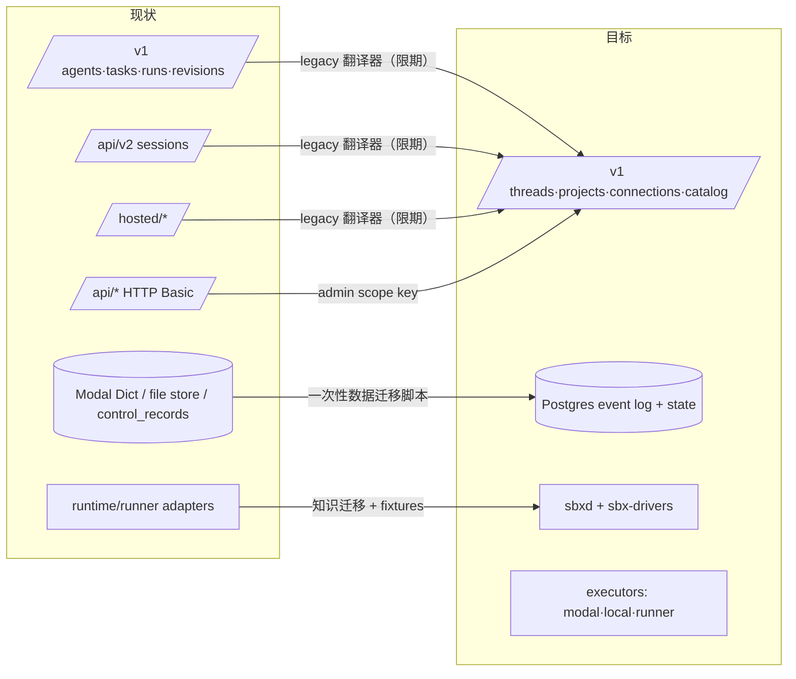

# 09 · 迁移方案

## 策略：并行重建 + 一次切换，而不是在旧代码上渐进改造

旧系统（`control/`、`runtime/`、`src/sbx`、`web/`、`console/` 的 hosted/v2 数据层）冻结新功能，只修 P0。新系统在同仓库新目录（`packages/`、`contracts/`、`sdk-ts/`）中从零构建，直到达到对等后切换。旧代码中可复用的是**知识**（CLI 参数、翻译规则、凭证路径、重试分类、fixtures），而非模块结构。



## 阶段

| 阶段 | 内容 | 退出标准 |
|------|------|----------|
| **M0 契约** | `contracts/`：errors、events schema、driver/plugin manifest schema、sbxd 协议、OpenAPI 草案；`sbx-core` 领域模型与状态机（纯单测） | 状态机表驱动测试覆盖所有迁移；schema 有示例与校验 |
| **M1 执行内核** | `sbx-drivers` base + `fake` + `codex`；`sbxd` machine 模式（worktree、turn、lease HOME、事件缓冲）；local executor | `sbxd` 在本地用 fake/codex fixtures 跑通首轮/续轮/中断/凭证失效；conformance 套件通过 |
| **M2 控制面最小闭环** | Postgres 仓储、事件日志、ThreadActor、Router、MachineManager、`/v1/threads` + events SSE、API key 鉴权 | `sbx -rx` 在 local executor 上：创建→流式→续写→取消→重启控制面后续读不丢事件 |
| **M3 Modal + 快照** | modal executor（create/pause/resume/snapshot）、`.agents/setup|resume`、checkpoint/rebuild、idle pause | Modal 上 thread 休眠后唤醒继续对话；强制销毁后 rebuild 继续对话 |
| **M4 Connections** | Vault、Connection CRUD、登录流程（upload / device code）、slots/cooldown、CAS 回写、Check Access | 同 driver 两个账号并发与限流切换的集成测试；凭证不出现在任何响应/日志（扫描测试） |
| **M5 全部 Driver** | antigravity、grok、opencode、devin（ACP 基类）、claude；镜像 layer | 每个 driver 通过 conformance；真实 CLI 冒烟（需凭证，手动门禁） |
| **M6 交付与审查** | git 观察器、ChangeSet、ship behaviors、GitHub integration（迁入 broker 客户端）、review mode + output_schema、merge 门禁 | 复刻现 `test_hosted_workflow` 场景：编码→draft PR→独立 review→修复→re-review→merge |
| **M7 扩展** | plugin registry、skills 物化、sbx MCP 工具（threads/files/artifacts/schedule）、automations、webhook inbox | 跨 CLI agent-to-agent e2e（fake drivers）；webhook 至少一次 + 去重测试 |
| **M8 Console + SDK + CLI** | 新 console（只用 SDK）、Python/TS SDK、`sbx` CLI、runner 模式 | Playwright e2e 覆盖：登录、连接订阅、新建 thread、流式、Changes/Terminal、ship、review |
| **M9 切换** | 数据迁移脚本、legacy 翻译器、docs-site 重写、部署 profile | 灰度：selfhost → hosted；旧 API 流量 < 阈值 |
| **M10 删除** | 删除旧目录与翻译器 | 见删除清单 |

M1 与 M0 后半可并行；M5/M6/M7 在 M4 后可并行交给不同 agent。

## 数据迁移

| 旧数据 | 新数据 | 规则 |
|--------|--------|------|
| Agent / Session / Task | Thread（`origin=legacy`） | 保留 id 映射表 `legacy_ids`；`finished` → `idle` |
| Run + events.jsonl | Turn + thread_events | Codex 形状事件经 `legacy_codex` 翻译器重放；raw 迁入对象存储 |
| Revision / Review / Delivery | ChangeSet / Review / Delivery | head/base/PR 元数据直接映射 |
| Account（credential blob） | Connection + Vault | 重新加密；状态置 `unverified` 并批量 Check Access |
| Workflow binding | Thread labels `workflow:<id>`、`task:<id>`、`role:<r>`；parent 关系 | |
| Artifacts | Artifact（blob 迁移） | sha256 校验 |
| API keys | ApiKey | 哈希原样迁移，用户无需换 key |
| Live sandboxes | 不迁移 | 切换前排空：停止接收新 turn，等待运行中 turn 结束 |

回滚：切换窗口内旧系统保持只读可启动；新系统写入的 thread 不回灌旧系统（接受此限制，窗口控制在 1 周）。

## 兼容翻译器（`sbx_server/legacy/`）

- 只翻译 **请求/响应形状**，内部全部调用新 commands/queries；不复制旧业务逻辑。
- 覆盖：`/v1/agents*`、`/v1/tasks*`、`/v1/runs*`、`/api/v2/sessions*`。`/hosted/*` 与 `/api/*` 不提供（console 同步切换；operator 改用 admin key）。
- 每个响应带 `Deprecation` 与 `Sunset` 头；默认在切换后 60 天删除。

## 删除清单（M10）

```text
control/                      # 全部（含 api_v1、api_v2、hosted_*、store、Modal Dict 状态）
runtime/                      # runner 与 adapters（知识已迁入 sbx-drivers / sbxd）
src/sbx/                      # 旧 CLI/SDK（由 packages/sbx-cli、sbx-sdk 取代）
broker/                       # 迁为 apps/broker
web/                          # legacy 前端
console/src/hosted, console/src/prototype, console/src/api   # 旧数据层与双 API 客户端
docs/contracts/               # 旧冻结契约（归档到 docs/archive/）
spike/
tests/fakes, tests/unit (旧)  # 由 drivers/fake 与新测试取代
```

## 风险与取舍

| 风险 | 缓解 |
|------|------|
| 事件统一走控制面网关增加延迟（取消 hosted direct-connect） | sbxd 批量（≤50ms）+ NOTIFY；必要时网关横向扩展；衡量 p95 < 300ms |
| CLI 会话目录在 checkpoint 中可能很大 | 只归档当前 `driver_session_ref` 对应文件；Driver manifest 声明会话路径 |
| 订阅 CLI 条款变化 / 登录方式变化 | Driver 包独立版本，manifest 声明 login_flows；conformance + 真实冒烟门禁 |
| CLI 能力差异导致 UI 复杂 | 一切按 `capabilities` 降级；console 不出现 driver 名判断 |
| 一次切换风险高 | M9 灰度：先 selfhost 内部部署、再 hosted；翻译器保底 |
| Postgres 承担队列/事件/状态的单点 | 先单实例 + 备份（现有 hosted 已依赖 PG）；schema 设计允许按 thread_id 分区 |
| BYO runner 安全 | runner 仅出站；只执行其所有者可见 thread；共享需显式授权；审计 |

## 给实现 agent 的工作包建议

每个工作包 = 一个 PR，对应上表阶段的一个子项；任何工作包都必须：

1. 先更新 `contracts/`（若涉及契约），再写实现；
2. 新增的 driver/executor 必须通过 conformance 套件；
3. 不得在 `sbx_server` 中出现 driver 名字字符串常量（CI grep 检查）；
4. 测试不依赖云凭证（Modal/真实 CLI 冒烟单独标记、手动门禁）。
