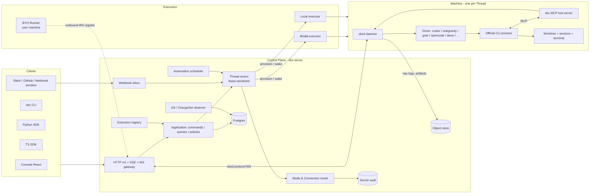

# sbx 2.0 目标架构（Amp-style re-architecture）

> 状态：**设计提案（RFC）**，不包含实现代码。本目录是后续实现 agent 的唯一参考蓝本。
> 当前仓库中的 `/v1/agents`、`/v1/tasks`、`/api/*`、`/api/v2` sessions、`/hosted/*` 等表面全部视为**待替换的 legacy**。

## 一句话

**以 Amp 的产品抽象（Thread / Project / Machine / Mode / Plugin）重建 sbx，但把 Amp 的私有 harness 换成可插拔的“官方 CLI Driver”，让任何订阅型 coding CLI 都能成为一个 Mode 的执行引擎。**

```text
Amp   = Thread 模型 + 自研 harness（模型 API）+ Orb/Runner/Local executor
sbx2  = Thread 模型 + Driver 层（codex / antigravity / grok / opencode / devin / 未来 claude-code、gemini-cli …）
        + Connection 路由（订阅 / API key / 网关，多账号池）+ Machine executor（Modal / Local / BYO Runner）
```

## 阅读顺序

| # | 文档 | 内容 |
|---|------|------|
| 0 | [README.md](README.md) | 目标、原则、非目标、总体架构图 |
| 1 | [01-amp-reference.md](01-amp-reference.md) | Amp 公开设计调研：借鉴什么、不借鉴什么、事实与推断的边界 |
| 2 | [02-domain-model.md](02-domain-model.md) | 统一领域模型、实体关系、Thread/Turn/Machine 状态机 |
| 3 | [03-api.md](03-api.md) | 唯一的 `/v1` HTTP API、SDK、CLI；旧 API → 新 API 映射表 |
| 4 | [04-events.md](04-events.md) | Thread 事件日志、统一事件信封、流式协议、Driver 翻译规则 |
| 5 | [05-execution.md](05-execution.md) | Driver / Executor / Machine / `sbxd` 守护进程 / Worktree / 快照 |
| 6 | [06-connections.md](06-connections.md) | 订阅与凭证：Connection、路由、并发槽、租约、刷新回写、安全 |
| 7 | [07-extensions.md](07-extensions.md) | Plugin / Skill / Tool / Mode / Automation / Webhook / Agent-to-Agent / Ship |
| 8 | [08-code-layout.md](08-code-layout.md) | 新代码目录树、分层与依赖规则、技术选型 |
| 9 | [09-migration.md](09-migration.md) | 分阶段迁移、删除清单、验收标准、风险 |

## 设计目标

1. **一个资源模型**：`Thread` 是唯一的工作单元。Agent / Task / Session / Run / Workflow / Review 全部收敛到 Thread + Turn（+ Automation / ChangeSet）。
2. **一个 API**：单一版本 `/v1`，单一鉴权模型，单一错误目录，单一事件流。self-hosted 与 hosted 是部署 profile，不是两套路由。
3. **CLI 中立**：Provider 差异只存在于 `Driver` 包内。控制面、API、调度器、前端都不出现 `if provider == "codex"`。
4. **订阅优先**：订阅登录（OAuth/设备码/CLI login cache）是一等公民的 `Connection`，支持多账号池、并发槽、冷却、刷新回写。
5. **执行位置与线程解耦**（Amp 的核心洞察）：Thread 可以运行在 Modal Machine、本地进程、用户自带 Runner 上；在任何客户端打开同一个 Thread。
6. **可休眠的持久工作环境**：每个 Thread 有一台惰性创建、空闲休眠、按需唤醒的 Machine（≈ Amp Orb），文件、进程状态和 CLI 原生会话可恢复。
7. **扩展而不是分叉**：Skill / Tool / Mode / Automation / Webhook 通过 Plugin 声明；Tool 通过 MCP 注入任意 CLI。
8. **证据可追溯**：每个 Turn 的原始 CLI 输出、规范化事件、diff、产物、提交（`Sbx-Thread-ID` trailer）都可从 Thread 追溯。

## 设计原则

- **Thread is the product, Machine is a cache.** Thread 历史在控制面持久化；Machine 丢了可以从快照 + Worktree 重建。
- **Prompt-driven workflows**（借鉴 Amp Ship/Automations）：Ship、Review、Restack、定时任务都是“向 Thread 发送一条预定义消息”，而不是在控制面硬编码 git 流程。控制面只负责**观察**结果（git 观察器 → ChangeSet / Delivery）。
- **Driver 在机器内运行**：CLI argv、HOME 准备、stdout 解析全部在 `sbxd` 内完成；控制面只看到规范化事件和 Driver manifest。
- **Executor 只管机器**：create / pause / resume / snapshot / destroy。不懂 CLI。
- **单写者**：每个 Thread 由一个 actor lease 串行推进（借鉴 Substrate 的 actor 模型），API route 只投递 command。
- **至少一次 + 幂等**：所有外部触发（webhook、schedule、重试）带 idempotency key。
- **Secret 永不出现在 API 响应、事件、日志**；只以 lease 形式进入 Machine 的隔离 HOME。

## 非目标

- 不实现代码；不修改 `docs/contracts/**` 冻结契约（新契约在实现阶段放入 `contracts/`）。
- 不复制 Amp 源码，不臆测 Amp 私有 harness 的实现。
- 不用模型 API 自研 harness 替代官方 CLI（可以作为未来某个 Driver，但不是架构前提）。
- 不保留 v1/v2 双语义；兼容层是有截止日期的翻译器。
- 不把 Modal 视为唯一 executor；不继续扩展 `web/` legacy 前端。

## 总体架构图


