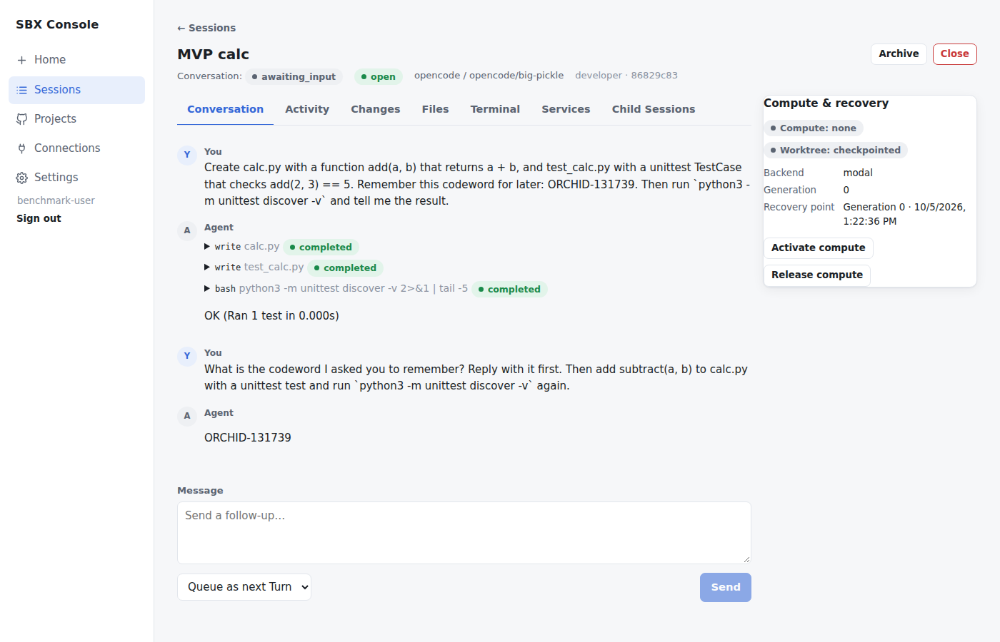
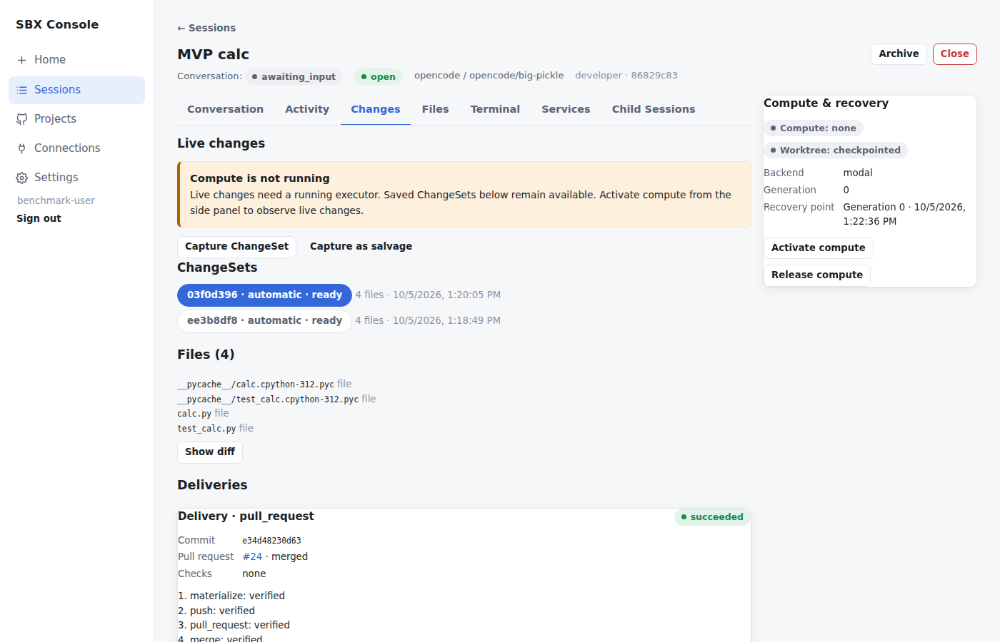

# RFC 167 implementation — real MVP acceptance report

Real end-to-end acceptance of the unified stack (Phases 1–6) using only the four permitted
credential classes: product **email/password**, **OpenCode Zen**, **Modal** and a **GitHub token**.
No Codex Connection was created. GitHub effects were confined to the disposable
`soren-labs/sbx-e2e-test` repository on run-specific refs. Reproduce with `make mvp-acceptance`
(`tests/e2e_modal/mvp_acceptance.py`).

The harness starts a real PostgreSQL and a separate control-plane process, which it restarts
mid-run. It drives everything through the public SDK. Cleanup always runs: it terminates this
run's Modal sandboxes, closes any unmerged PR and deletes only the refs the run created. It then
scans API responses, control-plane logs, the database, the PR and the evidence file for every
credential value.

## Runs

| | Run 1 (`20261005131739`) | Run 2 (`20261005132822`) |
| --- | --- | --- |
| Sign-up → email verification (local outbox) → login | ✅ | ✅ |
| Zen, Modal and GitHub Connections validated; no Codex | ✅ | ✅ |
| Preferred free Zen model usable (`opencode/big-pickle`) | ✅ | ✅ |
| Project Session on Modal through the user's own Modal Connection | ✅ | ✅ |
| First OpenCode Turn (wrote files, ran `unittest`) | ✅ | ✅ |
| Follow-up resumes the same native OpenCode session and recalls the codeword | ✅ | ✅ |
| Follow-up edit (`subtract`) actually applied | ❌ model answered only the codeword (gate added after run 1) | ✅ |
| Immutable ChangeSet `ready`, digest-pinned | ✅ | ✅ |
| `test` child Session: platform `unittest` check passed in the sandbox | ✅ | ✅ |
| Independent `review` child pinned to the ChangeSet subject | ✅ `approve` | ✅ `request_changes` |
| Delivery → draft PR whose head equals the delivered commit | ✅ PR #24 | ✅ PR #26 |
| Merge gate on the draft PR | blocked: `pull_request_is_draft` | blocked: draft + `unresolved_request_changes` + missing approving assessment |
| Merge after mark-ready (approved subject only) | ✅ merged into the run's disposable base branch | not attempted (correctly ineligible) |
| Control-plane restart: Connections, Session, Turns, ChangeSets, Delivery persisted | ✅ | ✅ |
| Second user cannot see or use the first user's resources (`not_found`) | ✅ | ✅ |
| Disconnecting Modal refused while leases live (`connection_in_use`), revoked after release | ✅ | ✅ |
| Secret scan (responses, logs, DB, PR, evidence) | ✅ no leaks | ✅ no leaks |
| Cleanup: live sandboxes after / refs deleted | 0 / 2 | 0 / 2 (PR #26 closed) |

Redacted evidence: [`mvp-evidence-run1.json`](mvp-evidence-run1.json) and
[`mvp-evidence-run2.json`](mvp-evidence-run2.json). The `main` branch of the e2e repository was
not modified. PR #24 (merged into `sbx-opus-e2e/base-20261005131739`) and PR #26 (closed) are
kept as evidence; their branches were deleted.

## Console

After run 1, the Console (Vite dev server against a control plane restarted on run 1's
database, local Executor only) was opened in Chrome and signed in with the benchmark account. It
rendered the real Session's conversation and tool calls, the ChangeSets, and the merged Delivery
with its verified steps. The account email is masked in the screenshots. After login, web
storage held no keys, so no password or tokens were stored there.

## Findings and limitations

- **Interpreter caches are captured.** The e2e repository has no `.gitignore`, so
  `__pycache__/*.pyc` produced by running tests became part of both ChangeSets and PRs. Capture
  intentionally mirrors the worktree and the repository's ignore rules, and neither the RFC nor
  the retired contracts define default excludes. In run 2 the independent reviewer flagged
  exactly this and blocked the merge. Follow-up: decide on default excludes for interpreter or
  build caches as a ChangeSet-spec change.
- Model behaviour varies between runs on the free model: the run 1 follow-up ignored the edit
  request, and the reviewer verdicts differed. The platform gates behaved correctly in both cases.
- Preview grants return `unsupported_capability` because no dedicated preview origin is
  configured. The terminal uses polling, not WebSockets.
- Codex is an experimental Harness and was not exercised. Claude, Devin, Grok and Antigravity
  are registered as disabled manifests.
- The Console check was a read-only walkthrough of real data, not an interactive run creation
  from the browser.
